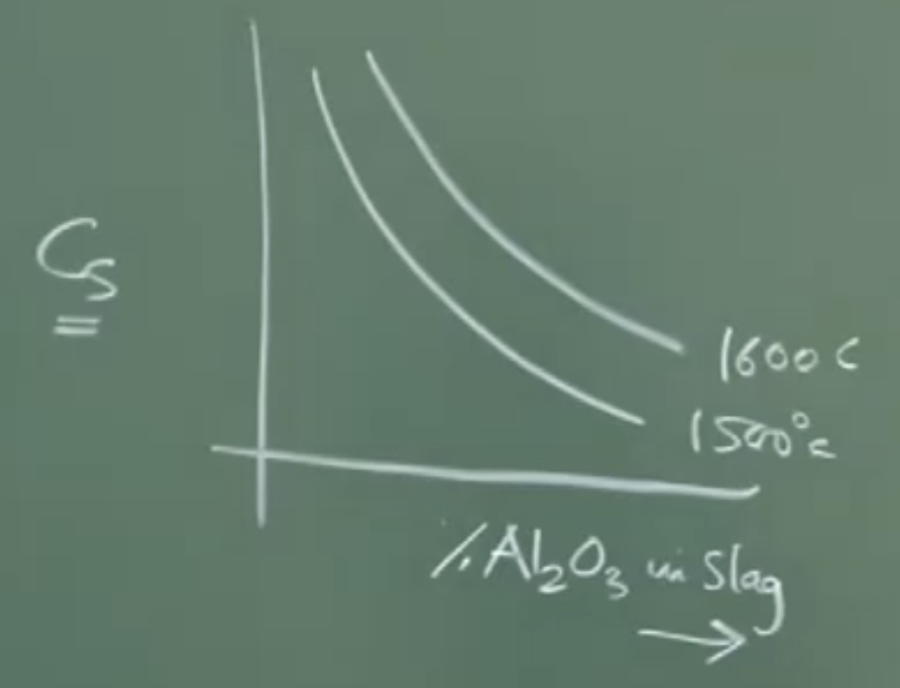

# **Lecture 14: Pre-treatment of Hot Metal**

Not able to understand 25:00 lecture ladle and torpedo

## **1. Introduction to Pre-treatment**

Pre-treatment refers to refining actions performed on hot metal (pig iron) after it is tapped from the blast furnace but before it is charged into a steelmaking furnace (e.g., BOF/LD converter).

### **Necessity of Pre-treatment**

1. **Chemical Consistency:** Blast furnace operations often lead to fluctuations in hot metal composition due to temperature variations in the hearth and bosh regions. Pre-treatment "conditions" the feed to a consistent specification. [[04:43](http://www.youtube.com/watch?v=nZoEcUdfZos&t=283)]
    
2. **Economic Efficiency:** High silicon or sulfur levels in the converter increase the consumption of lime (flux) and prolong refining time. [[12:03](http://www.youtube.com/watch?v=nZoEcUdfZos&t=723)]
    
3. **Quality Control:** Elements like Sulfur (S) and Phosphorus (P) are detrimental to mechanical properties and must be reduced to ppm levels (e.g., 30 ppm S). [[10:49](http://www.youtube.com/watch?v=nZoEcUdfZos&t=649)]
    
4. **Slag-less Steelmaking:** If Si, S, and P are removed via pre-treatment, the converter only needs to remove Carbon (C). Since C escapes as gas ($CO$), this leads to "slag-less" or minimal slag steelmaking, improving maneuverability. [[17:12](http://www.youtube.com/watch?v=nZoEcUdfZos&t=1032)]
   
   
   CaO 
   slag Basicity blast furnace =1.1-1.2%
  $$[S] =  0.04 - 0.1 wt\% $$
    Desulphurization -> exothermic, required low temp 

---

## **2. De-siliconization (External)**

Silicon oxidation is highly exothermic. While it provides heat for steelmaking (autogenous process), excessive silicon leads to massive slag volumes and potential overheating.

### **Mechanism and Site**

- **Reagents:** Mill scale ($FeO$) or iron ore powders are used as oxidizing agents. [[23:55](http://www.youtube.com/watch?v=nZoEcUdfZos&t=1435)]
    
- **Reaction:**
    
    $$[Si]_{hot metal} + 2(FeO)_{scale} \rightarrow (SiO_2)_{slag} + 2[Fe]_{liquid}$$
    
- **Site:** Most commonly performed in the **Blast Furnace Runner (Trough)**. The kinetic energy of the falling stream and entrained air bubbles provides the vigorous stirring (churning) required for this slag-metal reaction. [[21:18](http://www.youtube.com/watch?v=nZoEcUdfZos&t=1278)]
    
- **Thermodynamics:** At $\sim 1350^\circ C$, oxygen has a higher affinity for Silicon than Carbon. Thus, Si is removed preferentially without significant carbon loss. [[26:14](http://www.youtube.com/watch?v=nZoEcUdfZos&t=1574)]
    

---

## **3. De-sulphurization (External)**

Sulfur removal is best achieved under **reducing conditions** and **high basicity**. While the Blast Furnace is reducing, its basicity is limited (1.1–1.2) to maintain slag fluidity. Pre-treatment allows for targeted removal using stronger reagents. [[05:40](http://www.youtube.com/watch?v=nZoEcUdfZos&t=340)]

### **Fundamental Reaction**

The molecular form of the reaction is:

$$[FeS] + [C] + (CaO) \rightarrow (CaS) + [Fe] + \{CO\}$$

**Conceptual Interpretation:** * **Reducing Environment:** The presence of Carbon (reducing agent) is essential to remove oxygen and drive the reaction forward. [[33:22](http://www.youtube.com/watch?v=nZoEcUdfZos&t=2002)]
and Basic enviroment + rxn is exothermic 
- **Basicity:** High $CaO$ content (Basic slag) is required to fix the sulfur as $CaS$. [[30:52](http://www.youtube.com/watch?v=nZoEcUdfZos&t=1852)]
    
thermodynamically rxn exothermic -- require low temp but kinetically slag fluidity high temp as rxn at slag metal interface transport 
### **Thermodynamic Analysis**

To analyze the efficiency, we use the **Sulfur Partition Coefficient ($L_s$)**:

$$L_s = \frac{(\% S)_{slag}}{[\% S]_{metal}}$$

The logarithmic relationship derived in the lecture is:

$$\log L_s = \log K_2 + \log C_s + \log f_s - \log a_o$$

- **$C_s$ (Sulfide Capacity):** A property of the slag representing its ability to hold sulfur. It increases with higher basicity and temperature. [[42:21](http://www.youtube.com/watch?v=nZoEcUdfZos&t=2541)]
    
- **$f_s$ (Activity Coefficient of S):** Increased by the presence of Carbon. High $f_s$ helps "push" sulfur out of the metal. [[45:33](http://www.youtube.com/watch?v=nZoEcUdfZos&t=2733)]
    
- **$a_o$ (Oxygen Activity):** Must be kept low (reducing environment) to maximize $L_s$. [[46:26](http://www.youtube.com/watch?v=nZoEcUdfZos&t=2786)]
    

### **Board Work: Diagram of BF Tapping and Runner**

The instructor sketched the tapping process to show where reagents are added:

Plaintext

```
       BLAST FURNACE
      |              |
      |  Slag Layer  |
      |______________|
      |  Hot Metal   |  <-- Tap Hole
      |______________| /
                      /
         ____________/  (BF Runner/Trough ~10° Tilt)
        /  .  .  .  .  /
       /  Vigorous    / <--- Reagent Addition (Mill scale/CaO)
      /   Stirring   /
     /______________/
            |
      ______|______
     |             |
     | Torpedo Car | (Transfer Vessel)
     |_____________|
```

---

## **4. Important Remarks / Instructor Notes**

- **Indian Context:** Indian coke has high ash content but lower sulfur than foreign coke. However, the unfavorable $SiO_2/Al_2O_3$ ratio in Indian ore makes sulfur removal in the BF difficult without increasing Silicon too much. Therefore, external pre-treatment is vital for Indian plants. [[09:53](http://www.youtube.com/watch?v=nZoEcUdfZos&t=593)]
    
- **Reagents:** Common de-sulphurizing agents include $Mg$ (magnesium), $CaO$ (lime), and sometimes $CaF_2$ (fluorspar) to increase fluidity. Note that $CaF_2$ is being phased out due to environmental concerns. [[48:12](http://www.youtube.com/watch?v=nZoEcUdfZos&t=2892)]
    
- **Kinetics:** De-sulphurization is a **first-order mass transfer controlled reaction**. The rate depends on the interfacial area ($A$) and the mass transfer coefficient ($k$): [[51:13](http://www.youtube.com/watch?v=nZoEcUdfZos&t=3073)]
    
    $$\text{Rate} = k \cdot A \cdot (C_{bulk} - C_{interface})$$
    

---

**Watch the video for visual derivations:** [https://youtu.be/nZoEcUdfZos](https://www.google.com/search?q=https://youtu.be/nZoEcUdfZos)


# AUDIO TRANSCRIPT NOTES

### Pretreatment of Hot Metal: Desiliconization and Desulfurization

**Introduction & Necessity of Pretreatment**

- **Purpose:** Hot metal tapped from the blast furnace undergoes pretreatment before entering the steelmaking furnace (like a BOF).
    
- **Why pre-treat?**
    
    - **Blast Furnace Fluctuations:** The hearth and bosh temperatures in a blast furnace fluctuate, leading to inconsistent hot metal composition (especially silicon and sulfur). Pretreatment "conditions" the feed to a consistent, predictable specification (e.g., controlling variance to within 50-100 ppm), which is crucial for efficient and economic 24/7 steelmaking.
        
    - **Silicon Control:** High silicon in hot metal is problematic in steelmaking. Silicon oxidation is highly exothermic. While some heat is needed for an autogenous process, excess silicon generates too much heat, requires massive amounts of lime flux to neutralize the resulting silica, and generates an unmanageable volume of slag. Silicon in blast furnace hot metal can range from 0.4% to 2.5%, but steelmaking requires much less.
        
    - **Sulfur Control:** Sulfur removal requires a reducing atmosphere and a highly basic slag. The blast furnace has a reducing atmosphere but cannot maintain a highly basic slag (due to fluidity constraints and temperature limits). Conversely, steelmaking has a highly basic slag but an oxidizing atmosphere. Therefore, the blast furnace or a pretreatment stage is the _only_ viable place to remove sulfur. Final steel requires very low sulfur (e.g., 30 ppm), but Indian hot metal often has high sulfur due to the adverse silica-to-alumina ratio in iron ore (despite Indian coke having relatively low sulfur).
        
    - **Phosphorus Control (Optional but Beneficial):** If phosphorus is also removed during pretreatment, the hot metal entering the steelmaking furnace only requires decarburization.
        
    - **The Goal: Slag-less Steelmaking.** If Si, S, and P are removed via pretreatment, the steelmaking converter only needs to oxidize carbon (which escapes as CO gas). This results in "slag-less" or minimal-slag steelmaking, greatly improving process maneuverability and economics.
        

---

### 1. Desiliconization (Removal of Silicon)

- **Location:** Most commonly performed directly in the **blast furnace runner/trough** during tapping. It can also be done in transfer vessels (ladles or torpedo cars).
    
- **Mechanism:**
    
    - As molten metal flows through the runner, there is a huge amount of kinetic energy, turbulence, and air entrainment, providing excellent mixing.
        
    - **Mill scale** (iron oxide, FeO) is added to the flowing hot metal.
        
    - _Thermodynamics:_ At the tapping temperature (around 1350°C in India), oxygen has a much higher affinity for silicon than for carbon.
        
    - The FeO reacts predominantly with dissolved silicon: $2FeO + Si \rightarrow SiO_2 + 2Fe$.
        
    - Lime ($CaO$) powder can also be added to bind the resulting silica into a calcium silicate slag, which floats to the surface and is skimmed off.
        
- **Target:** Reduce silicon from blast furnace levels down to a favorable range of **0.6% to 1.0 wt%** for steelmaking.
    

---

### 2. Desulfurization (Removal of Sulfur)

- **Location:** Carried out in transfer vessels (ladles or torpedo cars).
    
- **Thermodynamic Requirements:**
    
    1. **Reducing Environment:** High oxygen potential severely hinders sulfur transfer to the slag. The presence of dissolved carbon in hot metal is beneficial as it consumes oxygen (forming CO), driving the desulfurization reaction forward.
        
    2. **High Basicity:** Requires a basic slag (rich in $CaO$ or $MgO$) to capture sulfur as $CaS$ or $MgS$.
        
    3. **High Temperature (Kinetic requirement):** While the reaction itself doesn't strongly depend on temperature for thermodynamic reasons, high temperatures are critical to maintain **slag fluidity**. Fluidity is essential for the mass transfer of sulfur across the slag-metal interface.
        
- **The Slag-Metal Reaction (Molecular):**
    
    $[FeS] + (CaO) + [C] \rightarrow (CaS) + [Fe] + \{CO(g)\}$
    
    _(Brackets [] indicate dissolved in metal, parentheses () indicate in slag)._
    

#### Thermodynamics of Desulfurization

The overall slag-metal reaction can be understood by combining a gas-slag reaction and a gas-metal reaction.

- **Sulfide Capacity ($C_S$):** A thermodynamic parameter indicating the slag's ability to absorb and hold sulfur.
    
    - Higher temperature increases $C_S$.
        
    - High lime content (basicity) increases $C_S$ and decreases the activity coefficient of sulfur in the slag.
        
- **Sulfur Partition Coefficient ($L_S$):** The ratio of sulfur in the slag to sulfur in the metal ($L_S = \frac{(\%S)_{slag}}{[\%S]_{metal}}$). It represents the efficiency of sulfur removal.
    
    - **To maximize $L_S$:**
        
        - Need high Sulfide Capacity ($C_S$) of the slag.
            
        - Need high activity coefficient of sulfur in the metal phase ($f_S$). (The high carbon content in hot metal naturally increases $f_S$, helping drive sulfur out of the metal).
            
        - Need **low** oxygen content in the melt (reducing environment).
            
- **Reagents Used:**
    
    - Magnesium ($Mg$): Highly reactive, exists as a gas at these temperatures, and reacts rapidly with sulfur.
        
    - Calcium Oxide ($CaO$ / Lime).
        
    - Calcium Fluoride ($CaF_2$ / Fluorspar): Historically added to increase slag fluidity, but being phased out due to environmental concerns.
        
    - Typical mixtures: 80% Mg / 20% CaO or 80% CaO / 15% Mg / 5% CaF2.
        

#### Kinetics of Desulfurization

- Desulfurization is a **first-order mass transfer controlled** reaction.
    
- The rate is primarily governed by transport within the melt phase to the slag-metal interface.
    
- **Rate Equation:** $Rate = k \cdot A \cdot (C_{bulk} - C_{interface})$
    
    - $k$ = mass transfer coefficient
        
    - $A$ = interfacial area (requires vigorous stirring to maximize)
        
    - $C_{bulk}$ = concentration of sulfur in the bulk metal
        
    - $C_{interface}$ = equilibrium concentration of sulfur at the interface
        
- Because the chemical reaction at the interface is very fast, it is assumed to be at equilibrium; the bottleneck is physically moving the sulfur through the liquid to the interface. This dictates the need for intense stirring/agitation during the process.
  
  
  # Detailed Part 2 
  
### **Lecture 14 & 15: Pretreatment of Hot Metal**

#### **1. Introduction & The Necessity of Pretreatment**

- **Context:** After hot metal is produced in the blast furnace, it must be refined into steel. Pretreatment involves conditioning this hot metal _before_ it enters the steelmaking furnace.
    
- **The Problem of Blast Furnace Fluctuations:** * Temperatures in the blast furnace's bosh and hearth regions fluctuate.
    
    - High hearth temperatures lead to excessively high Silicon (Si) content in the hot metal.
        
- **The Role of Silicon in Steelmaking:**
    
    - Steelmaking is an _autogenous_ process (self-heating). The oxidation of Carbon (C) and Silicon (Si) provides the necessary heat.
        
    - Oxidizing C to $CO_2$ releases ~395,000 kJ/mole. The Si-O bond is also extremely strong and releases a similar, massive amount of heat.
        
    - **Too much Si:** Causes the steelmaking converter (which holds 200–300 tons of metal) to generate "mind-boggling" amounts of heat, making the process uneconomical and damaging the reactor.
        
    - **Too little Si:** Results in insufficient heat for the steelmaking process. However, Si is rarely too low because blast furnaces operate at high temperatures and gangue always contains silica.
        
    - _Si Range:_ Hot metal Si usually varies widely (e.g., up to 2.5%), making pretreatment absolutely necessary to bring it down to a manageable, consistent level.
      
      Cost Effective low lime to add 
        
- **The Goal of Pretreatment:** To provide a consistent, tailor-made hot metal composition (e.g., controlling variance to $\pm 50$ or $100$ ppm) 24/7, 365 days a year. This guarantees maximum maneuverability and economic sustainability for the steelmaking process.
    

#### **2. The Challenge of Sulphur (S) Removal**

- **Blast Furnace vs. Steelmaking Environments:**
    
    - _Sulphur removal requires:_ A reducing environment AND a highly basic slag.
        
    - _Blast Furnace:_ Has the perfect reducing environment ($P_{O_2} \approx 10^{-19}$ atm), but CANNOT maintain a highly basic slag (basicity is limited to ~1.1 - 1.2 to keep the slag fluid at BF temperatures).
        
    - _Steelmaking:_ Has high basicity (3.5 - 4.0 due to high heat from C and Si oxidation allowing for massive lime additions), but has a highly oxidizing environment.
        
    - _Conclusion:_ The blast furnace is the _only_ logical site to remove sulphur, but it cannot do it perfectly. Steelmaking _cannot_ remove sulphur at all.
        
- **The Indian Context (Crucial Detail):**
    
    - _Indian Coke:_ Has very low sulphur compared to foreign coke, but extremely high ash content (20–25% vs. 7–8% for imported coke).
        
    - _Indian Iron Ore:_ Has an adverse Silica-to-Alumina ratio.
        
    - _The Catch-22:_ Attempting to drastically lower sulphur inside an Indian blast furnace requires raising the temperature, which inadvertently causes massive amounts of Silicon to transfer into the hot metal.
        
    - _Tapping Temperatures:_ Indian BFs tap at lower temperatures (~1350°C) to prevent this excess Silicon, whereas foreign BFs can tap at 1450°C–1475°C.
        
- **Sulphur Targets:**
    
    - Hot metal from the BF typically contains 0.04% to .10% Sulphur.
        
    - Final steel requires very low Sulphur (e.g., 30 ppm / 0.003%).
        

#### **3. Phosphorus & The "Slag-less" Steelmaking Concept**

- **Phosphorus Behavior:** * In the blast furnace (reducing environment), 100% of the phosphorus in the charge is reduced and goes straight into the hot metal.
    
    - Hot metal P can range up to 1.0% (or 0.1% to 0.08% / 800 ppm typically). Final steel requires ~20-30 ppm-- refine it to this limit .0030wt%.
        
    - Steelmaking easily removes phosphorus (requires oxidizing + basic conditions). However, removing P generates large volumes of slag because you must add massive amounts of lime (CaO) to fix it as calcium phosphate.
        
- **The "Slag-less" Dream:** * If you remove Silicon, Sulphur, and Phosphorus during _pretreatment_, the steelmaking reactor only has to remove Carbon.
    
    - Since Carbon oxidizes into $CO$ and $CO_2$ gases, it escapes the furnace without generating any liquid slag.
        
    - This leads to "slag-less" or minimal-slag steelmaking, which drastically improves process control and economics.
        

---

#### **4. Desiliconization (External Silicon Removal)**

- **Location:** Primarily carried out in the **Blast Furnace Runner/Trough** right as the metal is tapped, or subsequently in ladles/torpedo cars.
    
- **The Mechanics of the BF Runner:**
    
    - The runner is tilted at about 10 degrees.
        
    - Hot metal flows at an enormous rate (e.g., 50–100 tons/minute).
        
    - This flow creates violent churning, air entrainment, and intense kinetic mixing (compared by the professor to opening a tap fully into a bucket of water).
        
- **The Reagent (Mill Scale):**
    
    - **Mill Scale ($FeO$)** is added to the flowing hot metal. Mill scale is a friable waste product generated from the oxidation of solid steel later in the plant.
        
- **The Chemistry:**
    
    - Even though both Carbon and Silicon are present, at the tapping temperature of ~1350°C, Oxygen has a much higher thermodynamic affinity for Silicon than for Carbon (referencing the Ellingham diagram).
        
    - The $FeO$ melts easily and reacts with Si: $2FeO + Si \rightarrow SiO_2 + 2Fe$.
        
    - Lime ($CaO$) powder can also be added simultaneously to fix the resulting silica into a calcium silicate slag.
        
    - This newly formed slag is lighter, floats to the surface, and is skimmed off using a slag skimmer in the runner system.
        
- **Advantages:** It utilizes the existing kinetic energy and heat of the tapping process. No external stirring or heating is required.
    
- **Target:** Reduces Si to a highly favorable range of **0.6% to 1.0 wt%**.
    

---

#### **5. Desulfurization (External Sulphur Removal)**

- **Location:** Carried out in transfer vessels (cylindrical Ladles or Torpedo Cars).
    
- **The Reaction (Molecular Form):**
    
    $[FeS] + (CaO) + [C] \rightarrow (CaS) + [Fe] + CO(g)$
    
    - _Without Carbon:_ The reaction between FeS and CaO is nearly thermally neutral.
        
    - _With Carbon:_ The carbon removes oxygen as $CO$ gas, making the reaction **exothermic**.
        
- **Role of Temperature:** * While the thermodynamics are not heavily reliant on temperature, high temperatures are **kinetically mandatory** to keep the slag highly fluid. Fluidity is required because this is a slag-metal interface reaction.
    
- **The Reaction (Ionic Form):**
    
    $[S] + (O^{2-}) \rightleftharpoons (S^{2-}) + [O]$
    
    - If Carbon is present, it continuously removes the $[O]$ (as $CO$ gas), forcing the reaction forward. If no carbon is present, oxygen builds up and pushes the reaction backward.
        
- **Thermodynamic Derivation:**
    
    The professor combined a Gas-Slag reaction and a Gas-Metal reaction to derive the Slag-Metal parameters.
    
    ***Gas - Slag rxn: 
    
    $$\{ \frac{1}{2}S_2\} + (O^{2-})  \rightarrow \{\frac{1}{2}O_2 \} + (S^{2-})$$
    $$ K_2 = \sqrt{\frac{p_{O_2}}{p_{S_2}}} * \frac{(a_{S^{2-}})}{(a_{O^{2-}})}$$
    $$ = \sqrt{\frac{p_{O_2}}{p_{S_2}}} * \frac{(wt\% S )(f_{S^{2-}})}{(a_{O^{2-}})}$$
    
    ***Gas - Metal Reaction : 
	    $$[S] + \{\frac{1}{2}O_2 \}  \rightarrow \{\frac{1}{2}S_2 \} + [O] $$
	    $$K_1 = \sqrt{\frac{p_{S_2}}{p_{O_2}}} \cdot \frac{[h_O]}{[h_S]}$$
	    $\text{since dilute solution henry's law}$
				    $$=  \sqrt{\frac{p_{S_2}}{p_{O_2}}} \cdot \frac{[h_O]}{[wt\%S][f_s]}$$ $\text{solving}$
	    
	    $$ K_2 = \frac{(a_S^{2-})}{K_1 (a_O^{2-})}  \cdot \frac{[h_O]}{[wt\%S][f_s]}$$
	     $$ = \frac{(wt\% S )(f_{S^{2-}})}{K_1 (a_O^{2-})}  \cdot \frac{[h_O]}{[wt\%S][f_s]}$$
	      
    - **Sulfide Capacity ($C_s$):** Defines the slag's intrinsic ability to absorb sulphur. It is a function of slag basicity, temperature, and the activity coefficient of sulfide ions in the slag. (Unit = weight percentage). Higher temperatures slightly increase $C_s$.
      
    - 
      $$C_s = [\frac{K_1(a_O^{2-})}{(f_S^{2-})}] $$
        
    - **Sulphur Partition Coefficient ($L_s$):** The measure of efficiency.
        
        $$L_s = \frac{\text{Weight \% Sulphur in Slag}}{\text{Weight \% Sulphur in Metal}}  =  \frac{(wt\% S )}{[wt\%S]}$$
        
        $$L_S = K_2 \cdot C_S \cdot \frac{[f_S]}{[h_O]}$$
        
- **How to Maximize Desulfurization ($L_s$):**
	    - As we want more sulphur to be in slag
    Derived from the equation: $\log(L_s) = \log(K_2) + \log(C_s) + \log(f_s) - \log(h_o)$
    
    1. **Maximize $C_s$:** Requires high basicity (lots of Lime/$CaO$) to lower the activity coefficient of sulphur in the slag.
        
    2. **Maximize $f_s$:** The activity coefficient of sulphur in the metal must be high (meaning the metal "wants to let go" of the sulphur). The high Carbon content naturally present in hot metal drastically increases $f_s$.
        
    3. **Minimize $h_o$:** The dissolved oxygen content must be as low as possible (a heavily reducing environment).
       
    **Good desulfurization needs:**
	- Hungry slag (**high $C_S$​**)
	- Sulphur-uncomfortable metal (**high $f_S$​**)
	- Very little oxygen (**low $h_O$​**)
        
- **Reagents Used:**
    
    - **Magnesium ($Mg$):** Exists as a gas at these temperatures. Reacts extremely fast: $Mg(g) + [S] \rightarrow [MgS]$.
        
    - **Lime ($CaO$):** Reacts with S to form $CaS$.
	    $(CaO)+\{Mg\} \rightarrow (MgO) +[Ca]$
	    
    - **Fluorspar ($CaF_2$):** Used to increase slag fluidity.
        
    - _Typical mixtures:_ 80% Mg / 20% CaO or 80% CaO / 15% Mg / 5% $CaF_2$. Note: Fluorides are being phased out globally due to severe environmental concerns regarding slag disposal.
 
	 **Desulfurization is also carried out either in ladle or torpeodo        

	  
- **Kinetics of Desulfurization:**
    
    - It is a **First-Order Mass Transfer Controlled Reaction**.
        
    - The bottleneck is not the chemical reaction at the interface (which is practically instantaneous and at equilibrium), but rather the physical transport of sulphur through the melt phase to the interface.
        
    - **Rate Equation:** $Rate = k_m \cdot A \cdot (C_{bulk} - C_{interface})$
        
        - $k$ = Mass transfer coefficient.
            
        - $A$ = Interfacial area.
            
        - $C_{bulk}$ = Sulphur concentration in the bulk metal.
            
        - $C_{interface}$ = Sulphur concentration at the equilibrium interface.
            
    - **Conclusion:** To speed up the process, you must maximize $A$ (by using fine reagent powders to create massive surface area) and maximize $k$ (by ensuring intense, vigorous stirring of the melt in the ladle).
      
    