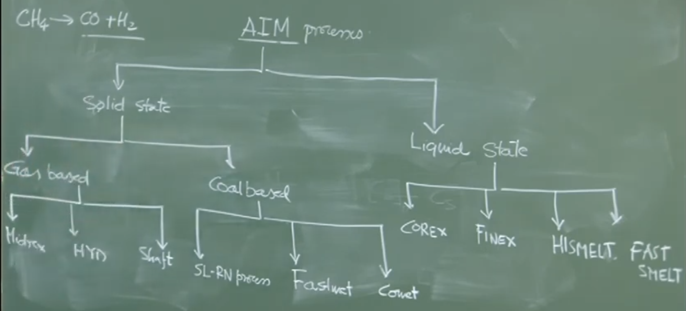

# **Lecture 15: External Desulphurization (Kinetics) & Alternative Iron Making**

## **1. External Desulphurization: Thermodynamics Recap & Kinetics**

### **1.1 Thermodynamic Recap**

In the previous lecture, the concept of **Sulphide Capacity ($C_S$)** and the **Sulphur Partition Coefficient ($L_S$)** was introduced.

- **Sulphide Capacity ($C_S$):** A measure of the slag's ability to hold sulphur.
    
    - **Effect of Temperature:** Temperature has a weak influence on $C_S$. However, $C_S$ generally increases slightly with temperature.
        
    - **Effect of Composition:** $C_S$ decreases as the percentage of Alumina ($Al_2O_3$) in the slag increases.
        
- **Partition Coefficient ($L_S$):**
    
    $$L_S = \frac{(\%S)_{slag}}{[\%S]_{metal}}$$
    
    - $L_S$ is favored by high $C_S$ and high activity of sulphur in metal ($f_S$).
        
    - $L_S$ is **adversely affected** by high oxygen potential ($h_O$).
        
    - _Instructor Note:_ Steelmaking is not a favorable site for desulphurization because the dissolved oxygen content is high (up to 500 ppm), which lowers $L_S$.
        

### **1.2 Kinetics of Desulphurization**

The desulphurization reaction is a **slag-metal interface reaction**:

$$CaO_{(slag)} + \underline{S}_{(metal)} + \underline{C}_{(metal)} \rightleftharpoons (CaS)_{(slag)} + CO_{(gas)}$$

#### **A. Reaction Steps**

For the reaction to occur, the following transport steps must happen in series:

1. Transport of Sulphur ($\underline{S}$) from bulk metal to the interface (through the metal boundary layer).
    
2. Transport of Calcium Oxide ($CaO$) or Oxygen ions ($O^{2-}$) from bulk slag to the interface (through the slag boundary layer).
    
3. **Chemical Reaction** at the interface (exchange of bonds).
    
4. Transport of products (e.g., $CaS$) away from the interface.
    

#### **B. Rate Limiting Step**

- At high temperatures ($1300^\circ C - 1400^\circ C$), the **chemical reaction is very fast** and can be assumed to be at **equilibrium**.
    
- Experimental evidence suggests the process is controlled by **Mass Transport of Sulphur in the Metal Phase**.
    
- Therefore, the concentration of sulphur at the interface ($C_S^{eq}$) is determined by thermodynamic equilibrium, while the bulk concentration ($C_S^b$) drives the transport.
    

#### **C. Kinetic Derivation (Board Work)**

We apply Fick's First Law/Mass Transfer fundamentals to the metal phase.

1. **Rate Equation:**
    
    The rate of sulphur removal is proportional to the interfacial area ($A$) and the concentration driving force.
    
    $$-\frac{d[S]}{dt} = \frac{A}{V} k_m (C_S^b - C_S^{eq})$$
    
    - $C_S^b$: Concentration of sulphur in bulk metal (changing with time).
        
    - $C_S^{eq}$: Equilibrium concentration of sulphur at the interface (assumed constant/near zero for high efficiency).
        
    - $k_m$: Mass transfer coefficient in the metal phase ($m/s$).
        
    - $A$: Interfacial area ($m^2$).
        
    - $V$: Volume of the metal ($m^3$).
        
2. **Integrated Rate Law:**
    
    Assuming $C_S^{eq}$ is constant and boundary conditions:
    
    - At $t=0$, $C_S^b = C_S^i$ (Initial concentration).
        
    - At $t=t$, $C_S^b = C_S^t$.
        
    
    Integrating the first-order equation:
    
    $$\int_{C_S^i}^{C_S^t} \frac{dC_S}{C_S^b - C_S^{eq}} = -\frac{A k_m}{V} \int_{0}^{t} dt$$
    
    $$\ln \left( \frac{C_S^b - C_S^{eq}}{C_S^i - C_S^{eq}} \right) = -\left( \frac{A k_m}{V} \right) t$$
    
    **Final Exponential Form:**
    
    $$\frac{C_S^b - C_S^{eq}}{C_S^i - C_S^{eq}} = \exp(-k_{rate} \cdot t)$$
    
    _Where $k_{rate} = \frac{A k_m}{V}$ is the overall rate constant ($s^{-1}$)._
    

### **1.3 Process Parameters & Technology**

To maximize the desulphurization rate, we must maximize the exponent factor $\frac{A k_m}{V}$. Since $V$ (volume of hot metal) is fixed, we focus on increasing $A$ and $k_m$.

#### **A. Increasing Mass Transfer Coefficient ($k_m$)**

- $k_m$ depends on fluid velocity (Reynolds number). Higher velocity $\to$ thinner boundary layer $\to$ higher $k_m$.
    
- **Stirring Methods:**
    
    - **Gas Stirring:** Less effective energy transfer per unit input.
        
    - **Mechanical Stirring (KR Process):** Uses a **propeller** (star-shaped cross-section) immersed in the ladle. It creates vigorous agitation, significantly increasing $k_m$.
        
    - _Comparison:_ The KR process (impeller) is hydrodynamically superior to gas stirring for this application.
        

#### **B. Increasing Interfacial Area ($A$)**

- **Powder Injection:** Reagents ($CaO$, $Mg$, $CaF_2$) are injected as fine powders.
    
- This creates an enormous surface area ($A$) for reaction compared to a simple planar slag-metal interface.
    
- **Reagent Mix:** Typical mix is ~80% $CaO$ + 20% $Mg$ (or similar variations with $CaF_2$).
    

#### **C. Reactors: Ladle vs. Torpedo Car**

| **Feature**     | **Ladle**                                        | **Torpedo Car**                              |
| --------------- | ------------------------------------------------ | -------------------------------------------- |
| **Geometry**    | Cylindrical, favorable $L/D$ ratio for stirring. | Long, shallow. Poor surface-to-volume ratio. |
| **Stirring**    | Efficient (Gas or Impeller/KR).                  | Mixing is difficult; "dead zones" may exist. |
| **Thermal**     | Better thermal efficiency.                       | Higher temperature drop due to shape.        |
| **Application** | Widely used for KR process.                      | Used but less efficient for deep stirring.   |

---

## **2. Alternative Iron Making**

### **2.1 Motivation**

Why do we need alternatives to the Blast Furnace (BF)?

1. **Coke Scarcity:** BF relies on **metallurgical coke**, which is expensive and produced from scarce coking coal. Alternative routes aim to use **non-coking coal**.
    
2. **Scrap Scarcity:** Steelmaking (BOF/EAF) requires coolants. Historically, scrap steel was used. With high-efficiency continuous casting, in-house scrap generation is low. **DRI (Direct Reduced Iron)** serves as a necessary coolant and virgin iron source (diluting residuals).
    

### **2.2 Classification of Alternative Iron Making**

Processes are categorized by the state of the product (Solid vs. Liquid) and the fuel used (Gas vs. Coal).

#### **A. Solid State Production (DRI / Sponge Iron)**

Product is solid, porous iron (hence "Sponge Iron").

- **Gas-Based Processes:**
    
    - _Reductant:_ Reformed Natural Gas ($CO + H_2$).
        
    - _Processes:_ **Midrex**, **HyL**.
        
    - _Location in India:_ West Coast (Gujarat/Maharashtra) due to availability of natural gas (e.g., Essar/ArcelorMittal Nippon Steel).
        
- **Coal-Based Processes:**
    
    - _Reductant:_ Non-coking coal.
        
    - _Process:_ **Rotary Kiln (SL/RN Process)**.
        
    - _Location in India:_ Eastern India (Odisha/Jharkhand) due to proximity to coal mines.
        
    - _Note:_ India is the largest producer of coal-based DRI in the world.
        

#### **B. Liquid State Production (Smelting Reduction)**

Product is liquid hot metal (similar to BF pig iron) but uses coal directly.

- **Processes:**
    
    - **Corex**
        
    - **Finex** (Popularized by POSCO)
        
    - **HIsmelt** (High Intensity Smelting)
        
    - **Romelt**
        
- _Advantage:_ Eliminates the need for coke ovens and sintering plants.
    

---

### **3. Instructor's Important Remarks**

- **Temperature Drop in Desulphurization:** Although the reaction $Mg + S \to MgS$ is exothermic, the overall process causes a temperature drop. This is due to the addition of cold solids ($CaO$), heat loss to the ladle/stirrer, and the high operating temperature ($1300^\circ C+$).
    
- **Silicon vs. Phosphorus:** Pretreatment mainly focuses on **Silicon (Desiliconization)** and **Sulphur (Desulphurization)**. Dephosphorization is rare in pretreatment (mostly done in Japanese plants for specific high-P ores) and is usually handled during primary steelmaking.
    
- **DRI as Coolant:** DRI acts as a substitute for scrap in the Basic Oxygen Furnace (BOF) to balance heat. It typically contains Fe, some FeO (unreduced), and gangue. The unreduced oxides consume heat, making it an effective coolant.
  
  
# V2 Detailed 
# Lecture 15: External Desulphurization and Alternative Ironmaking

## 1. Thermodynamic Recap of External Desulphurization

This lecture begins with a review of the thermodynamics of external desulphurization (pretreatment of hot metal), focusing on the conditions required for optimal sulphur removal before steelmaking.

### Key Concepts

- **Sulphide Capacity ($C_S$):** This parameter measures a slag's intrinsic ability to absorb and hold sulphur.
    
    - **Effect of Temperature:** The professor clarified a graph from the previous lecture, stating that while $C_S$ does increase slightly at higher temperatures (e.g., comparing curves at $1500^{\circ}C$ and $1600^{\circ}C$), the influence is relatively weak because the equilibrium constant is not a strong function of temperature.
        
    - **Effect of Composition:** The graph illustrates that $C_S$ decreases as the percentage of alumina ($Al_2O_3$) in the slag increases. A basic slag is required for high $C_S$.
        
- **Sulphur Partition Coefficient ($L_S$):** This is the ratio defining the efficiency of sulphur removal, calculated as:
    
    $$L_S = \frac{\text{Weight \% Sulphur in Slag}}{\text{Weight \% Sulphur in Metal}}$$
    
    - **Factors enhancing $L_S$ (better desulphurization):**
        
        - High Sulphide Capacity ($C_S$) of the slag.
            
        - High activity coefficient of sulphur in the metal ($f_S$).
            
        - High activity coefficient of sulphide in the slag.
            
    - **Factors hindering $L_S$:**
        
        - High oxygen potential (dissolved oxygen) in the metal.
            
- **Why Blast Furnaces are better for Desulphurization than Steelmaking:**
    
    - Steelmaking operates under a highly oxidizing environment. The significant amount of dissolved oxygen present during steelmaking (400-500 ppm or more) actively drives the partition coefficient down, making it extremely difficult to transfer sulphur from the metal to the slag. Therefore, steelmaking is not a favorable site for sulphur removal.
        

### The Desulphurization Reaction

- **Molecular Form:**
    
    $$[FeS] + (CaO) + [C] \rightarrow (CaS) + \{CO(g)\} + [Fe]$$
    
    - The professor notes that while this reaction is only weakly exothermic, desulphurization is practically favored at higher temperatures due to _kinetic_ reasons (improved slag fluidity).
        
- **Ionic Form:**
    
    $$[S] + (O^{2-}) \rightleftharpoons (S^{2-}) + [O]$$
    
    - Carbon dissolved in the melt removes the resulting oxygen as $CO$ gas, driving the reaction forward.
        

---

## 2. Kinetics of External Desulphurization

The lecture then transitions to the kinetics, explaining _how fast_ the desulphurization process occurs and what limits that speed.

### The Kinetic Model

Desulphurization is modeled as a **slag-metal interface reaction**. The process involves several steps in series:

1. Transport of sulphur ($[S]$) across the metal boundary layer to the interface.
    
2. Transport of calcium oxide ($(CaO)$) across the slag boundary layer to the interface.
    
3. Chemical rearrangement (the actual reaction) at the interface.
    
4. Transport of products ($(CaS)$, $CO$) away from the interface.
    

**The Rate-Limiting Step:**

At the high temperatures characteristic of this process ($1300^{\circ}C - 1400^{\circ}C$), chemical reactions are extremely fast. Experimental evidence shows that the **slowest step is the mass transport of sulphur through the melt phase boundary layer** to the interface.

- Because the chemical reaction is so fast, it is assumed to be at equilibrium at the interface itself.
    
- Therefore, the concentration of sulphur right at the interface ($C_{s,\text{equilibrium}}$) is practically zero, as any sulphur arriving is instantly converted to sulphide.
    

### The First-Order Rate Equation

Since melt-phase mass transfer controls the rate, the process follows first-order kinetics:

$$\text{Rate} = -\frac{d[C_{s,bulk}]}{dt} \times V = k_m \cdot A \cdot (C_{s,bulk} - C_{s,equilibrium})$$

Where:

- $V$ = Volume of the melt phase
    
- $k_m$ = Mass transfer coefficient (melt phase)
    
- $A$ = Interfacial area between slag and metal
    
- $C_{s,bulk}$ = Concentration of sulphur in the bulk metal (the driving force)
    
- $C_{s,equilibrium}$ = Concentration of sulphur at the interface ($\approx 0$)
    

Integrating this equation from $t = 0$ (initial concentration $[C_{s}]_i = [C_{s}]_b$) yields:

$$\frac{[C_{s}]_b - C_{s}^{equilibrium}}{[C_{s}]_i - C_{s}^{equilibrium}} = \exp(-kt)$$

_Where $k = \frac{k_m \cdot A}{V}$ is the overall rate constant._

- As time approaches infinity, the bulk concentration approaches the theoretical equilibrium concentration.
    

### Process Optimization: Maximizing the Rate Constant ($k$)

Since the volume ($V$) of the ladle or torpedo car is fixed, process engineers must maximize $k_m$ and $A$ to achieve rapid desulphurization.

1. **Maximizing Interfacial Area ($A$):**
    
    - Instead of relying on the flat top surface, reagents (like solid magnesium powder or calcium oxide) are **injected** deep into the melt.
        
    - This creates millions of fine particles/bubbles, generating an enormous reaction interface area ($A$) as they rise through the liquid.
      
      A is not vessel area
        
2. **Maximizing Mass Transfer Coefficient ($k_m$):**
    
    - $k_m$ is highly dependent on fluid velocity and turbulence (Reynolds number).
        
    - **Vigorous stirring is mandatory.**
        
    - **The KR Process (Impeller Stirring):** This popular ladle process uses a massive, star-shaped refractory propeller. When rotated, it transfers immense kinetic energy to the melt, creating violent agitation and a very high $k_m$. The professor notes this mechanical stirring is generally more efficient than simple gas bubbling for a given energy input.
        

### Ladle vs. Torpedo Car Desulphurization

- **Ladle (e.g., KR Process):** Better L/D (length-to-diameter) ratio. The deeper bath allows for more efficient mechanical or gas stirring.
    
- **Torpedo Car:** Shallower bath. Prone to "dead zones" far from the injection point that are poorly stirred. It also suffers from more temperature drop due to an adverse surface-area-to-volume ratio.
    
- **Temperature Drop:** External desulphurization _always_ causes a temperature drop in the hot metal. Even if the reaction $Mg + S \rightarrow MgS$ is exothermic, it is not enough to compensate for the heat absorbed by melting the solid reagents (like $CaO$), the vaporization of $Mg$, and the physical heat losses to the stirring equipment and vessel walls.
    

_Pretreatment summary: While phosphorus removal is sometimes done (mostly in Japan for high-P ores), standard pretreatment globally focuses on Silicon and Sulphur control to provide a consistent feed for "slag-less" steelmaking._

---

## 3. Introduction to Alternative Ironmaking (AIM)

The final segment introduces the concept of producing iron outside of the traditional Blast Furnace route.

### Motivation for Alternative Ironmaking

Despite the Blast Furnace producing >90% of the world's liquid hot metal, alternative processes are necessary due to two primary drivers:

1. **The Crisis of Metallurgical Coke:**
    
    - Blast furnaces heavily rely on high-quality, metallurgical-grade coke for structural support, heat, and reduction.
        
    - Good coking coal is depleting rapidly globally, making it scarce and extremely expensive.
        
    - Indian coking coal is of poor quality (23-25% ash, mostly silica), requiring expensive blending with imported coal to reduce ash content to acceptable levels (~11-14%).
        
    - _Goal:_ To develop **coke-less** or **coal-based** ironmaking processes that can utilize lower-grade, non-coking coals.
        
2. **The Need for Solid Coolants in Steelmaking:**
    
    - Steelmaking reactions (oxidizing C, Si, and Fe) generate immense heat. If the temperature gets too high, the process must be cooled.
        
    - Historically, plant-generated steel scrap was dumped in to cool the melt.
        
    - Modern plants are so efficient that very little internal scrap is generated.
        
    - _Solution:_ **Direct Reduced Iron (DRI)** or "sponge iron" (solid, partially reduced iron ore) can be used as an effective, pure coolant in steelmaking converters when scrap is unavailable.
        

### Classification of Alternative Ironmaking Processes

AIM processes are classified by the **state of the product** (Solid vs. Liquid) and the **type of reductant** (Gas vs. Coal).

#### 1. Solid State Production (Produces DRI / Sponge Iron)

The product is solid, porous iron (oxygen has been removed without melting the ore). Typical temperatures are $900^{\circ}C - 1100^{\circ}C$.

- **Gas-Based Processes:**
    
    - Utilizes reformed natural gas (e.g., Methane converted to $CO$ and $H_2$).
        
    - _Examples:_ **Midrex** (most popular globally), HYL, Shaft processes, 
        
    - _Location:_ Feasible only where natural gas is abundant and cheap (e.g., West Coast of India, like Essar/AMNS in Gujarat).
        
- **Coal-Based Processes:**
    
    - Utilizes non-coking coal directly.
        
    - _Example:_ **SL/RN Process** (Rotary Kiln),  FASTMET, COMET..
        
    - _Location:_ Ideal near coal mines (e.g., Eastern India). India is the world's largest producer of coal-based DRI.
        

#### 2. Liquid State Production (Produces Liquid Hot Metal)

The product is liquid iron, similar to blast furnace output, but produced without coke ovens.

- _Examples:_ **COREX** (uses coal/coke breeze), **FINEX** (uses fine ore and coal), HIsmelt, Romelt.
    

_The next lecture will delve into the specific mechanics of the SL/RN, Midrex, and COREX processes._