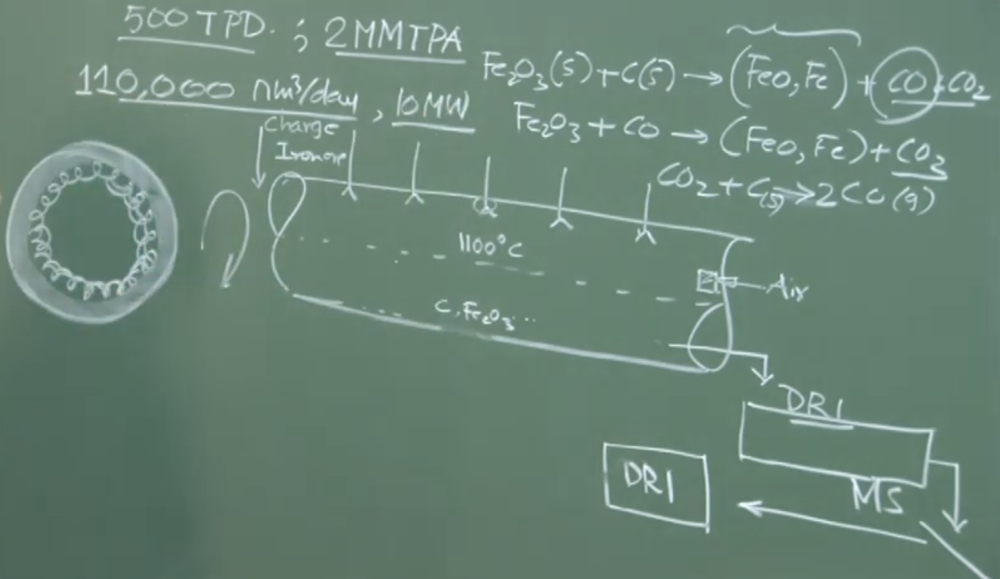
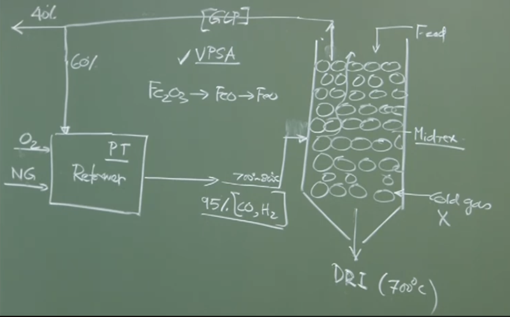
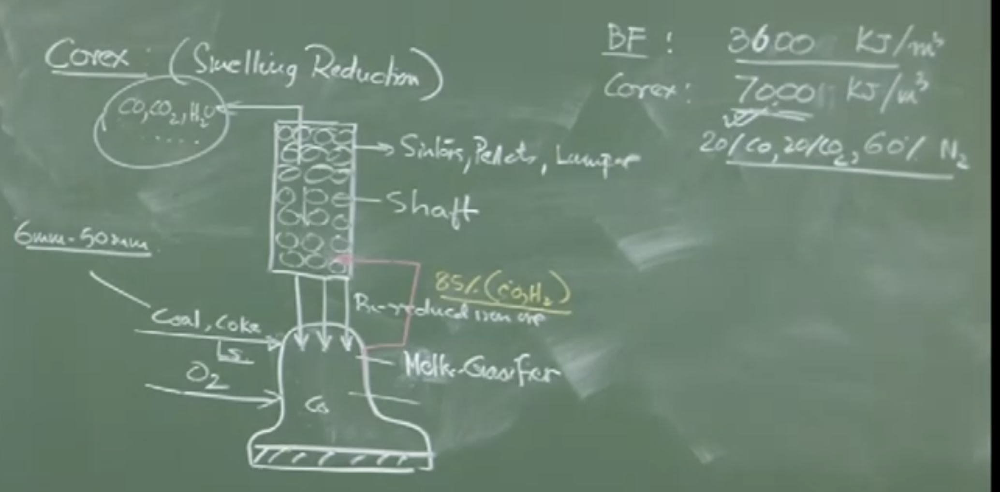

# **Lecture 16: Alternative Iron Making Processes**

## **1. Classification of Alternative Iron Making**

Alternative iron making processes are categorized based on the **state of the product** (Solid vs. Liquid) and the **reductant used** (Coal vs. Gas).

|**Process Name**|**Reductant**|**Product State**|**Product Name**|
|---|---|---|---|
|**SL/RN (Rotary Kiln)**|Coal|Solid|Sponge Iron / DRI|
|**Midrex**|Natural Gas|Solid|Sponge Iron / DRI|
|**Corex**|Coal|Liquid|Liquid Hot Metal|

> **Note:** "DRI" stands for Direct Reduced Iron. "Sponge Iron" refers to the porous nature of the solid product caused by the removal of oxygen.

---

## **2. SL/RN Process (Rotary Kiln)**

**Type:** Coal-based, Solid-state reduction.

### **2.1 Raw Materials**

- **Iron Ore:** Lump ore (Hematite).
    
- **Reductant/Fuel:** Non-coking Coal.
    
- **Flux:** Limestone (to absorb sulfur and gangue).
    
- **Air:** Injected for combustion.
    

### **2.2 Reactor & Operation**

- **Reactor:** A long, slightly inclined rotating cylinder (Kiln).
    
- **Temperature:** $1000^\circ\text{C} - 1100^\circ\text{C}$ (Maintained in the solid-state reduction zone, below the melting point to prevent fusion).
    
- **Flow:** Counter-current. Solids move down the slope; gases move up.
    

### **2.3 Chemical Reactions**

The process relies on the **Boudouard Reaction** (gasification of carbon) to regenerate the reducing gas ($CO$).

1. **Combustion (Heat Generation):**
    
    $$C + O_2 \rightarrow CO_2 + \text{Heat}$$
    
2. **Boudouard Reaction (Reductant Generation):**
    
    $$C_{(solid)} + CO_{2(gas)} \rightarrow 2CO_{(gas)} \quad (\text{Endothermic})$$
    
3. **Reduction of Iron Ore:**
    
    $$Fe_2O_3 + 3CO \rightarrow 2Fe + 3CO_2$$
    
    $$Fe_2O_3 + 3H_2 \rightarrow 2Fe + 3H_2O$$
    
    _(Note: H₂ comes from the volatile matter in coal)_
    

### **2.4 Product Characterization: Degree of Metallization**

The product is not 100% pure iron. It contains metallic Iron ($Fe_{met}$) and unreduced Iron Oxide ($FeO$).

- **Total Iron ($Fe_{total}$):** $Fe_{met} + Fe$ in oxides.
    
- **Degree of Metallization:**
    
    $$\text{Degree of Metallization (\%)} = \frac{Fe_{metallic}}{Fe_{total}} \times 100$$
    
- Alternatively defined by oxygen removal:
    
    $$\text{Metallization} \propto \frac{O_{initial} - O_{final}}{O_{initial}}$$
    

### **2.5 Operational Issues**

- **Accretion (Ring Formation):** If the temperature exceeds the operating range, the gangue (silica) and iron oxides may form a semi-solid sticky mass. This adheres to the refractory lining, forming "rings" that block material flow.
    
- **Re-oxidation:** Hot DRI ($\sim 1000^\circ\text{C}$) reacts instantly with air if exposed.
    
    - _Solution:_ The product is passed through a **Water-Cooled Rotary Cooler** to bring the temperature down to room temperature before discharge.
        
- **Separation:** A **Magnetic Separator** is used to separate magnetic DRI from non-magnetic waste (char, ash, spent limestone).
    

### **2.6 Energy Recovery**

- **Waste Gas:** The kiln generates huge volumes of gas containing $CO$ and sensible heat.
    
- **Power Generation:** This gas is combusted in a boiler to generate steam for electricity.
    
    - _Example:_ A 500 TPD (Tons Per Day) plant generates ~10 MW of power.
        
    - _Economics:_ Plants sell surplus power to the grid, often making the unit self-sufficient.
        

---

## **3. Midrex Process**

**Type:** Gas-based, Solid-state reduction.

**Prevalence:** Dominant in regions with abundant natural gas (e.g., West Coast of India, Middle East).

### **3.1 Gas Reforming**

Natural Gas ($CH_4$) is reformed to produce reducing gases ($CO + H_2$).

- **Steam Reforming:**
    
    $$CH_4 + H_2O \rightarrow CO + 3H_2$$
    
- **dry/CO2 Reforming:**
    
    $$CH_4 + CO_2 \rightarrow 2CO + 2H_2$$
    

_Instructor Note:_ The reformer adjusts pressure and temperature to ensure the output gas is ~95% ($CO + H_2$).

### **3.2 Reactor (Shaft Furnace)**

- **Input:** Iron Ore Pellets/Lump fed from the top.
    
- **Gas Injection:** Hot reducing gas ($\sim 900^\circ\text{C}$) injected from the middle/bottom.
    
- **Zone:**
    
    - **Reduction Zone (Top):** Gases move up, reducing the ore.
        
    - **Cooling Zone (Bottom):** Cool gas can be injected to discharge cold DRI, **OR** the DRI is discharged hot.
        

### **3.3 Hot Charging**

- **Concept:** Instead of cooling DRI to room temperature and reheating it in the Steel Shop (EAF), discharge **Hot DRI (~600-700°C)** and feed it directly into the Electric Arc Furnace (EAF).
    
- **Benefit:** Saves substantial energy (sensible heat of DRI is utilized).
    

---

## **4. Corex Process**

**Type:** Coal-based, **Smelting Reduction** (Liquid Iron).

**Key Feature:** Replaces the Blast Furnace (BF) but uses **non-coking coal** and **pure oxygen**.

### **4.1 Process Configuration (Two-Stage)**

The Corex plant consists of two physically separate reactors:

1. **Reduction Shaft (Top Unit):**
    
    - Fed with Iron Ore / Pellets.
        
    - Reduces iron oxide to **solid DRI** using hot off-gases from the lower unit.
        
    - _Note:_ No coal/oxygen is added here; only reduction gas enters.
        
2. **Melter-Gasifier (Bottom Unit):**
    
    - Fed with **Non-coking Coal** and **Oxygen**.
        
    - Receives hot DRI from the Reduction Shaft.
        
    - **Functions:**
        
        1. **Melting:** Melts the DRI into liquid iron and slag.
            
        2. **Gasification:** Coal + Oxygen generates intense heat and highly reducing gas ($>95\% CO + H_2$).
            
        3. **Final Reduction:** Completes any remaining metallization.
            

### **4.2 Comparison of Off-Gas (BF vs. Corex)**

The Corex off-gas is much richer in fuel value because it lacks nitrogen (Pure $O_2$ is used, unlike Air in BF).

|**Parameter**|**Blast Furnace Gas**|**Corex Gas**|
|---|---|---|
|**Nitrogen ($N_2$)**|High (~50-60%)|Negligible|
|**Calorific Value**|Low (~800-900 kcal/Nm³)|High (~1600-1800 kcal/Nm³)|
|**Energy Content**|~3,600 kJ/m³|~7,000 kJ/m³|

### **4.3 Economics & Jindal Model**

- **Cost of Hot Metal:** To compete with the Blast Furnace (approx. ₹20/kg historically), Corex plants must utilize the high-energy export gas.
    
- **Power Generation:** The "Corex Gas" is used to run power plants.
    
    - _Example:_ JSW Steel (Bellary) and Jindal Power Limited use Corex gas to generate massive amounts of electricity, which is a major revenue stream ensuring the process's economic viability.
        

---

## **5. Summary Comparison**

|**Feature**|**SL/RN (Rotary Kiln)**|**Midrex**|**Corex**|
|---|---|---|---|
|**Input Fuel**|Non-coking Coal|Natural Gas|Non-coking Coal|
|**Oxidant**|Air|N/A (Reforming)|Pure Oxygen|
|**Product**|Solid DRI (Cool)|Solid DRI (Cool or Hot)|Liquid Hot Metal|
|**Main Reactor**|Rotating Cylinder|Shaft Furnace|Shaft + Melter-Gasifier|
|**Key By-product**|Steam/Power (Waste Heat)|None (Recycled gas)|Export Gas (High CV) for Power|
|**Indian Context**|Eastern India (Coal belt)|West Coast (Gas availability)|JSW Bellary (Power integration)|

# V2: Detailed 

# Lecture 16: Alternative Ironmaking Processes (Solid & Liquid State)

## 1. Introduction and Classification of Alternative Ironmaking (AIM)

The lecture continues the discussion on Alternative Ironmaking (AIM) processes. The professor categorizes these processes based on two main criteria:

1. **State of the Product:** Does the process produce Solid Iron (Sponge Iron/DRI) or Liquid Iron (Hot Metal)?
    
2. **Type of Reductant Used:** Does the process use Coal or Gas (Natural Gas) as the primary reductant?
    

The professor selects one representative process from three main categories to discuss in detail:

- **Solid Iron + Coal-Based:** SL/RN Process (Rotary Kiln Process) (DRI).
    
- **Solid Iron + Gas-Based:** Midrex Process (DRI).
    
- **Liquid Iron + Coal-Based:** COREX Process (Liq Iron) (patented by Voestalpine, a famous solution provider to the iron and steel industry).
    

---

## 2. Solid State Ironmaking: Understanding DRI & Metallization

Before detailing the specific processes, the professor explains the nature of the solid product, known as **Sponge Iron** or **Direct Reduced Iron (DRI)**.

- **Temperature:** Because the goal is to produce _solid_ iron, the operating temperatures in these reactors ($1000^{\circ}C - 1100^{\circ}C$) are much lower than the Bosh or Hearth of a Blast Furnace. The temperature is kept deliberately low to drive out oxygen without melting the iron or causing the gangue to fuse into a sticky mass (which would cause severe operational problems).
    
- **The Product:** Complete (100%) reduction is rarely achieved or even desired in these solid-state processes. The final product is a mixture of unreduced iron oxide ($FeO$) and free metallic iron ($Fe$).
    
    - **Metallic Fe:** The free iron that has been successfully reduced.
        
    - **Total Fe:** The sum of the Metallic Fe and the iron still bound in the $FeO$.
        
- **Degree of Metallization:** This is the critical quality parameter used when buying/selling DRI in the market. It indicates how successfully the oxygen was removed from the original ore (e.g., $Fe_2O_3$).
    
    - _Concept:_ If you start with 100 kg of pure $Fe_2O_3$, it contains 70 kg of Iron and 30 kg of Oxygen. The goal is to drive out as much of that 30 kg of oxygen as possible.
        
    - _Calculation:_ It is based on the ratio of the final oxygen content to the initial oxygen content. A final oxygen content of zero means 100% metallization.
      
      $$\text{Degree of Metallisation or \% Metallisation } = (1 - \frac{\text{Final Oxygen}}{\text{Initial Oxygen} })* 100 $$
        
    - _Practical Target:_ Extracting 60% to 70% of the initial oxygen is generally considered a good, acceptable DRI product. Pushing the temperature higher to get 100% metallization is dangerous because it leads to "incipient fusion" (melting), which ruins the process.
        

---

## 3. The SL/RN Process (Rotary Kiln)

This is a **Coal-Based, Solid-State** ironmaking process.

### Raw Materials

- **Iron Ore:** Lump iron ore (Hematite).
    
- **Reductant/Fuel:** Non-coking coal.
    
- **Flux:** Limestone (to absorb unwanted gangue materials like silica).
    
- **Oxidant:** Air (introduced for combustion).
    

### Reactor Design and Operation

- **The Kiln:** The reactor is a long, refractory-lined, marginally inclined rotating cylinder.
    
- **Flow:** It is a gravity-induced, counter-current reactor. Solid charge (Ore, Coal, Limestone) is fed from the higher end and travels downward due to the rotation and incline. Air is introduced (often with a burner for initial ignition) and gases travel upward.
    
- **Residence Time:** The incline and rotation speed are carefully controlled to ensure the material spends enough time in the kiln to facilitate the necessary solid-state reactions. It cannot be a fast process.
    
- **Temperature:** Maximum temperature is around $1100^{\circ}C$ at 1 atm pressure.
    

### Chemical Reactions

Because it is a low-temperature process (compared to a Blast Furnace raceway), a mix of reactions occurs:

- **Combustion:** Carbon (from coal) + Air $\rightarrow CO$ and $CO_2$. Both gases can coexist at these temperatures.
    
- **Direct Reduction:** Solid Carbon reacting directly with the iron ore.
    
- **Indirect Reduction:** $CO$ gas reducing the iron ore (e.g., forming $FeO$ or $Fe$ and $CO_2$).
    
- **Solution Loss (Boudouard) Reaction:** The $CO_2$ produced can react with Carbon to regenerate $CO$ ($CO_2 + C \rightarrow 2CO$).
    

### Operational Challenges: Accretion (Ring Formation)

- **The Problem:** If the temperature gets slightly too high, "incipient fusion" occurs. Iron oxides and lime combine with silica to form a semi-solid, sticky mass.
    
- **Accretion:** This sticky mass deposits on the refractory walls of the rotating kiln. Because the refractory is also made of oxides, there is a natural chemical attraction.
    
- **Result:** A "ring" of solid material builds up inside the kiln, reducing the available cross-sectional area for material flow. In extreme cases, it can completely choke the reactor, stopping flow entirely. Therefore, strict temperature control is vital.
    

### Product Handling and Separation

- **Cooling Chamber:** The hot DRI exits the kiln at roughly $1000^{\circ}C$. If exposed to the atmosphere, it would instantly re-oxidize (the $Fe$ and $FeO$ would grab oxygen from the air). Therefore, it must pass through a sealed, water-cooled chamber to drop its temperature close to room temperature before exposure to air.
    
- **Magnetic Separation:** The cooled output is a mix of DRI, unused coal char, and flux/slag. It is passed through a Magnetic Separator (MS).
    
    - _Magnetic fraction:_ The valuable DRI (metallic $Fe$ and magnetic $FeO$).
        
    - _Non-magnetic fraction:_ Coal char, lime, silica, and refractory dust (waste).
        

### Economics and Energy Recovery (The "Steel & Power" Model)

- **Off-Gas:** A standard 500 Tons/Day plant (~2 Million Metric Tons/year) produces massive volumes of off-gas (~110,000 $Nm^3$/day).
    
- **Gas Quality:** Because the rotary kiln is much shorter and less efficient than a Blast Furnace, the exit gas contains a significant amount of unreacted Carbon Monoxide ($CO$).
    
- **Power Generation:** This CO is combusted to $CO_2$ in a boiler to harness its chemical heat (Combusting $CO \rightarrow CO_2$ yields 282,000 kJ/mole). The heat generates steam to run turbines, easily generating ~10 Megawatts of electricity.
    
- **The Business Model:**
    
    - This 10 MW is more than enough to run the entire DRI plant (rotary motors, cooling water pumps, etc.).
        
    - The **surplus power** is a major revenue stream. It can be sold to the external power grid.
        
    - If the DRI plant is "captive" (part of an integrated steel mill like JSPL or Essar), this cheap, in-house electricity is used to run their power-hungry Electric Arc Furnaces (EAF).
        
    - _Market Strategy:_ Depending on market prices, a company might choose to halt steel production and just make DRI while selling the highly profitable electricity to the grid. Modern companies (like Jindal Steel and Power Limited - JSPL) operate as dual entities (Steel + Power) utilizing this exact synergy.
        

### Geographic Location in India

- **Eastern India (Durgapur, Asansol, Jamshedpur, Raniganj, Jharia):** These areas are heavily populated with Coal-Based Rotary Kiln plants. Why? Because they are in close proximity to coal mines, iron ore deposits, and river water (Damodar river) needed for cooling.
    
- **West Coast (Gujarat):** Coal is not abundant here, so coal-based plants are rare. Instead, this region utilizes Gas-Based plants (like the Midrex process at Essar/AMNS) because natural gas is readily available via pipelines.
    

---

## 4. The Midrex Process (Gas-Based DRI)

This is a **Gas-Based, Solid-State** ironmaking process.

### Raw Materials

- **Iron Ore:** Iron ore Pellets are primarily used as the feed.
    
- **Reductant:** Natural Gas (Methane - $CH_4$).
    
- **No Coal/Coke:** Solid carbon fuels are not used.
    

### The Gas Reformer (Creating the Reductant)

Natural gas cannot be used directly; it must be "reformed" into a usable reducing gas ($CO$ and $H_2$).

- **Reforming Reactions (Homogeneous Gas-Gas Reactions):**
    
    - _Oxygen Reforming:_ $2CH_4 + O_2 \rightarrow 2CO + 4H_2$ (Exothermic)
      Pressure and temp have a huge role 
        
    - _Steam Reforming:_ $CH_4 + H_2O \rightarrow CO + 3H_2$ (Endothermic)
      
      $CO + H_2O \rightarrow CO_2 + H_2$
        
    - _Carbon Dioxide Reforming:_ $CH_4 + CO_2 \rightarrow 2CO + 2H_2$
      
      
    _Relative proportion of $CO, H_2, CO_2,\ \& \ H_2O$ in reformed gas effectively controlled by controlling tempr as well as composition of stream-air mixture. 
    
- **Operation:** A separate unit called the "Gas Reformer" controls temperature and pressure to drive these reactions. ~~The goal is to produce a hot gas mixture that is roughly **95% Carbon Monoxide ($CO$) and Hydrogen ($H_2$)**.~~  
    

### Reactor Design and Operation

- **The Shaft:** The Midrex reactor is a vertical Shaft Furnace (similar to the upper stack of a Blast Furnace).
    
- **Flow:** Counter-current flow. Iron ore pellets are fed from the top; the hot reducing gas (from the reformer) is injected near the bottom.
    
- **Temperature:** Because the gas entering is already hot ($700^{\circ}C - 800^{\circ}C$), and reduction reactions occur, the bed temperature reaches $900^{\circ}C - 1000^{\circ}C$. No external heat source (like burning coal) is needed inside the shaft.
    
- **Reduction:** The ascending $CO$ and $H_2$ effectively reduce the descending iron ore pellets into DRI.
    

### Gas Recycling and Economics

- **Top Gas (Spent Gas):** The gas exiting the top of the shaft contains unreacted $CO$, $H_2$, plus the products of reduction ($CO_2$ and $H_2O$), and dust.
    
- **Recycling Loop:**
    
    1. The spent gas goes through a Gas Cleaning Plant to remove dust particulates.
        
    2. $CO_2$ is removed using processes like **Vacuum Pressure Swing Adsorption (VPSA)**.
        
    3. This leaves a clean gas still rich in $CO$.
        
    4. Roughly **60% of this clean gas is fed back into the Gas Reformer** to be mixed with fresh natural gas, making the process highly efficient. The remaining 40% can be used for external power generation.
        

### Hot Charging (Energy Recovery)

- **The Problem:** Taking cold DRI ($25^{\circ}C$), heating it to $1600^{\circ}C$ in an Electric Arc Furnace (EAF) to make steel requires massive amounts of electrical energy. Conversely, taking hot DRI out of the Midrex shaft and cooling it down to room temperature to prevent oxidation wastes massive amounts of heat.
    
- **The Solution:** Modern Midrex plants (especially those integrated with a steel mill) do not cool the DRI.
    
- **Operation:** The DRI is discharged at the bottom of the shaft in a "red hot" condition ($600^{\circ}C - 700^{\circ}C$) directly into sealed transport lines.
    
- **Benefit:** It is fed directly into the Electric Arc Furnace while still hot. The EAF now only has to heat the material from $700^{\circ}C$ to $1600^{\circ}C$, resulting in mind-boggling energy savings for a 2 million ton/year plant. This is a prime example of making steelmaking "green" by minimizing heat loss.
    

---

## 5. The COREX Process (Smelting Reduction)

This is a **Coal-Based, Liquid-State** ironmaking process. It is designed to produce liquid hot metal identical to a Blast Furnace, but without the need for expensive metallurgical coke.

### Reactor Design (Two-Stage System)

The COREX process separates the two main functions of a Blast Furnace into two distinct, physically separate reactors stacked on top of each other:

1. **Top Unit: The Reduction Shaft.** (Function: Pre-reduce the iron ore).
    
2. **Bottom Unit: The Melter Gasifier.** (Function: Final melting, slag formation, and generating the reducing gas).
    

### Operation of the Melter Gasifier (Bottom Unit)

- **Inputs:** Non-coking Coal (small particles, 6mm to 50mm), a very small amount of coke, Pure Oxygen, and Limestone powder.
    
- **Mechanics:** Pure oxygen is injected into the coal bed, creating intense combustion and enormous heat. Because there is no Nitrogen (unlike the air blast in a BF), the combustion is incredibly intense and efficient.
    
- **Melting:** The pre-reduced iron (falling from the shaft above) hits this intense heat and instantly melts into liquid iron. Slag is also formed.
    
- **Gas Generation:** The combustion produces a massive volume of extremely hot, highly concentrated reducing gas, consisting of roughly **95% ($CO$ + $H_2$)**.
  
  _Oxygen blown in melter-gasifier --> result coal burns rapidly intense reducing gas 95% CO  + $H_2$.
  This reducing gas reacts with descending, pre-reduced iron mass, exchanging heat & mass btw phases facilitating production of carbon-rich liq iron. 
  Hot reducing gas exiting melter-gasifier contains (80-85% by vol) CO 
    

### Operation of the Reduction Shaft (Top Unit)

- **Inputs:** Iron-bearing materials (Sinters, Pellets, Lump Ore).
    
- **Mechanics:** The intense $CO/H_2$ gas generated in the Melter Gasifier flows up into the Reduction Shaft.
    
- **Reduction:** This hot, intensely reducing gas easily reduces the iron ore into solid, pre-reduced iron (DRI) within the shaft.
    
- **Hot Charging:** The pre-reduced solid iron is continuously discharged directly down into the Melter Gasifier below (in a sealed manner) to be melted.
    

### The Economics of COREX Gas (The Jindal Example)

The economic viability of the COREX process hinges entirely on how the plant utilizes its off-gas.

- **Blast Furnace Gas vs. COREX Gas:**
    
    - _BF Gas:_ Diluted with ~60% Nitrogen. Calorific value = **3,600 kJ/m³**.
        
    - _COREX Gas:_ Contains NO Nitrogen. Extremely rich in CO. Calorific value = **7,000 kJ/m³** (nearly double that of BF gas).
        
- **The Problem:** Hot metal from a traditional Blast Furnace is very cheap (e.g., Rs. 19-20 / kg). The COREX process is expensive to run (pure oxygen, high-pressure equipment). If COREX only sells hot metal, it cannot compete with the Blast Furnace.
    
- **The Solution:** The COREX plant must capture the high-energy spent gas exiting the top of the Reduction Shaft and use it to generate electricity.
    
- **Real-World Example:** JSW (Jindal South West) Steel in Bellary (Toranagallu). They operate a massive 22-million-ton steel plant using COREX. Right next to the steel plant is "Jindal Power Limited." The power plant does not run on thermal coal or hydro; it runs entirely on the high-calorific spent gas generated by the COREX process. Selling this power makes the overall COREX operation economically competitive.