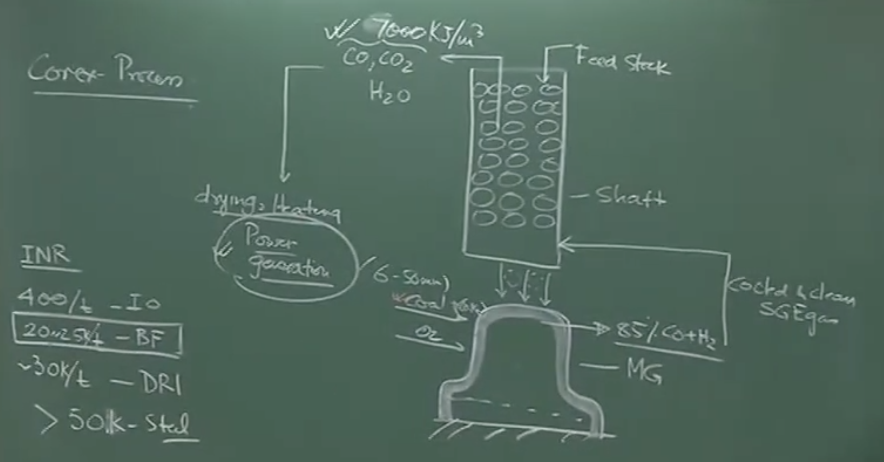
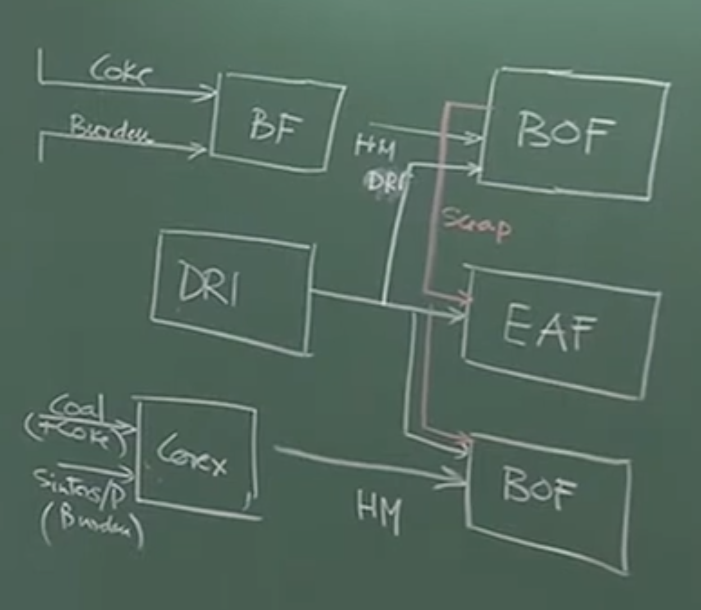
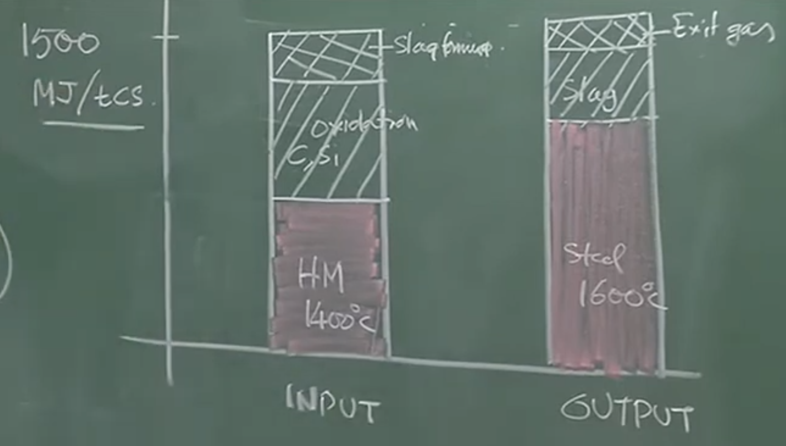

# LECTURE 17: Alternative Ironmaking (COREX) & Introduction to Steelmaking

## 1. Conclusion of Ironmaking: The COREX Process

### _Schematic Overview of the COREX Process_

The COREX process is an alternative ironmaking technology that utilizes a two-stage reactor system:

1. **Shaft Furnace (Top):** For pre-reduction of iron ore.
    
2. **Melter Gasifier (Bottom):** For final melting and gasification.
    

_Instructor Notes / Physical Interpretation:_

The feed entering the Melter Gasifier includes coal (fine particles 6–50 mm size, potentially mixed with coke), pure oxygen, and pre-reduced pellets/DRI from the shaft furnace above. An intense agitation is set up due to the pure oxygen and high temperature, creating an intensely reducing environment [[01:54](http://www.youtube.com/watch?v=ywAO_k36bBQ&t=114)]. The gas generated here consists of roughly **85% (CO + H₂)**.

### _Gas Flow and Energy Recovery_

- **Cooling the Gas:** The highly hot Smelter Gasifier Exit Gas (SGE) must be cooled and cleaned before entering the shaft furnace. If not cooled, the gas would transfer too much heat, causing premature melting/fusion of the descending solid column in the shaft [[03:07](http://www.youtube.com/watch?v=ywAO_k36bBQ&t=187)].
    
- **Top Gas Calorific Value:** The spent gas exiting the top of the shaft furnace still contains a very large proportion of CO (30-40%), CO₂, and H₂O [[03:28](http://www.youtube.com/watch?v=ywAO_k36bBQ&t=208)].
    
- **Comparison:** The COREX exit gas has a calorific value of **~7,000 kJ/m³**, significantly higher than Blast Furnace (BF) gas, which is roughly **3,000 to 4,000 kJ/m³** [[03:44](http://www.youtube.com/watch?v=ywAO_k36bBQ&t=224)].
    

### _Process Economics and Sustainability_

_Conceptual Explanation:_

The COREX process can only compete economically with a traditional Blast Furnace if the high-calorific exit gas is captured and used. Most COREX plants (like JSW and Essar in India) utilize this exit gas for power generation. Without selling this generated power, COREX cannot match the low production cost of blast furnace hot metal [[07:40](http://www.youtube.com/watch?v=ywAO_k36bBQ&t=460)].

**Price Comparison (Approximate Indian Rupee per Ton) [[06:49](http://www.youtube.com/watch?v=ywAO_k36bBQ&t=409)]:**

- **Iron Ore:** ~₹500 / ton (₹0.5 / kg)
    
- **Blast Furnace Hot Metal:** ~₹20,000 - ₹25,000 / ton (₹20 - ₹25 / kg)
    
- **DRI (Direct Reduced Iron):** ~₹30,000 / ton
    
- **Steel:** >₹50,000 / ton (Special grades can reach ₹200,000 / ton)
    

### _Advantages of COREX over Blast Furnace [[09:16](http://www.youtube.com/watch?v=ywAO_k36bBQ&t=556)]_

1. **Eliminates Coke Ovens:** Relies primarily on non-coking coal, which is abundant. Eliminating the coke oven battery drastically reduces massive capital expenditures and space requirements.
    
2. **Environmental Friendliness:** Without coke making and sinter plants, the overall carbon footprint is lower. The generated CO is fully utilized for power generation rather than requiring additional thermal coal [[12:08](http://www.youtube.com/watch?v=ywAO_k36bBQ&t=728)].
    
3. **Similar Product Quality:** Produces hot metal of comparable chemistry and temperature to the blast furnace, ensuring no deterrent effect on downstream steelmaking.
    

---

## 2. Integration of Ironmaking and Steelmaking Routes

_Board Work / Structural Flowchart [00:13:06 - 00:16:06]:_

Plaintext

```
[Coke Ovens] -----> (Coke) --------+
                                   |
[Sinter/Pellet] --> (Burden) -----> [BLAST FURNACE] ----> (Hot Metal) ----> [BOF]
                                                                              ^
[Coal + Iron Ore] -> [COREX] ---------------------------> (Hot Metal) --------|
                                                                              |
[Gas/Coal] --------> [DRI Plant] -> (DRI) ------------------------------------+ (Used as scrap supplement/coolant)
                                      |
                                      +-----------------------------------> [EAF / Induction Furnace]
```

_Important Remarks:_ As modern steel plants become more efficient, internal scrap generation has decreased. Therefore, **DRI is increasingly used as a scrap substitute** or as a coolant in the Basic Oxygen Furnace (BOF) when the melt temperature spikes. DRI is also beneficial for minor composition "trim" adjustments because it retains some oxygen [[17:14](http://www.youtube.com/watch?v=ywAO_k36bBQ&t=1034)].

---

## 3. Introduction to Steelmaking

Iron is merely an intermediate product; it must be converted into steel to achieve significant engineering value and a massive jump in market price [[25:43](http://www.youtube.com/watch?v=ywAO_k36bBQ&t=1543)]. Steelmaking is fundamentally an **oxidizing refining process** designed to eliminate impurities (C, Si, Mn, P) that have a high affinity for oxygen [[29:01](http://www.youtube.com/watch?v=ywAO_k36bBQ&t=1741)].

### _Composition Changes: Hot Metal vs. Crude Steel_

_Board Extraction & Correction (Weight Percentages) [00:26:10 - 00:28:53]:_

|**Parameter**|**Blast Furnace Hot Metal**|**Crude Steel (After 1st Refining)**|
|---|---|---|
|**Carbon (C)**|~4.3%|~1.1% (Medium Carbon Grade)|
|**Silicon (Si)**|0.4% – 2.5%|~0% (Virtually completely removed)|
|**Manganese (Mn)**|0.2% – 0.4%|~0.1%|
|**Sulfur (S)**|~0.02% (Average)|~0.01% – 0.02% (Very little removal under oxidizing conditions)|
|**Phosphorus (P)**|Max 0.1%|~0.04% (400 ppm)|
|**Oxygen (O)**|~0%|**~0.06% (600 ppm) -> Problematic**|
|**Temperature**|~1400 °C|~1600 °C|

_Conceptual Explanation:_

While oxygen injection successfully drives out C, Si, Mn, and P, the inevitable trade-off is that **dissolved oxygen enters the liquid steel**. This necessitates secondary steelmaking (deoxidation and trimming) to reduce total combined impurities down to ~100 ppm for finished steel [[30:10](http://www.youtube.com/watch?v=ywAO_k36bBQ&t=1810)].

---

## 4. Thermal Economics of Primary Steelmaking

Primary steelmaking operates without any external fuel source. It is an **autogenous process**—it sustains its own temperature requirements entirely through sensible heat and the chemical heat of internal exothermic reactions [[39:11](http://www.youtube.com/watch?v=ywAO_k36bBQ&t=2351)].

### _Heat Balance (Per Ton of Crude Steel) [00:32:21 - 00:35:42]_

Total Heat Input Required: **~1,500 MJ / ton of steel**

**Heat Input Breakdown:**

- **50% - 55%:** Sensible heat from Hot Metal (charged at 1400°C).
    
- **35% - 40%:** Exothermic oxidation of metalloids (primarily Silicon and Carbon).
    
- **~10%:** Slag forming reactions and post-combustion.
    

**Heat Output Breakdown:**

- Sensible heat of Liquid Steel at 1600°C.
    
- Sensible heat of Liquid Slag (Slag rate is ~30%, so ~300 kg of slag per ton of steel).
    
- Sensible heat of Exit Gases.
    

_Physical Interpretation:_

If the hot metal lacks an adequate supply of Carbon and Silicon, the generated exothermic heat will be too small. Consequently, it will be impossible to raise the temperature from 1400°C to 1600°C or maintain a highly fluid slag. This is why the specific metalloid content of incoming hot metal is tightly controlled [[36:20](http://www.youtube.com/watch?v=ywAO_k36bBQ&t=2180)].

_Tapping Temperature:_ Because all the internal carbon fuel is burned away during primary steelmaking, the metal will steadily lose heat during the 20–50 minutes of secondary refining. To counteract this, crude steel is tapped slightly hotter (e.g., 1620°C) than pure iron's melting point (1539°C) [[38:28](http://www.youtube.com/watch?v=ywAO_k36bBQ&t=2308)].

---

## 5. History and Classification of Steelmaking

Before the 1850s, primitive "wrought iron" (essentially carbon-less steel) was produced by mixing solid iron with FeO to oxidize the carbon, then aggressively hammering out the entrapped slag [[40:48](http://www.youtube.com/watch?v=ywAO_k36bBQ&t=2448)]. Modern bulk steelmaking began with **Sir Henry Bessemer** (1850–1860) who commercialized the first pneumatic process (blowing air through molten iron) [[41:31](http://www.youtube.com/watch?v=ywAO_k36bBQ&t=2491)].

### _Acidic vs. Basic Steelmaking [00:42:09 - 00:46:39]_

Modern steelmaking categorizes reactor processes based on the refractory lining and flux chemistry used to handle specific impurities.

**1. Acidic Steelmaking (Obsolete today):**

- **Condition:** Used only when low-phosphorus iron ore was available.
    
- **Chemistry:** Primarily targets only **Silicon** removal. Phosphorus cannot be eliminated.
    
- **Refractory Lining:** Acidic (Siliceous / Silica-based bricks).
    
- **Flux:** No Lime (CaO) is added. If a basic flux like lime were added, it would chemically attack and dissolve the acidic silica lining.
    

**2. Basic Steelmaking (Standard Modern Practice):**

- **Condition:** Handles standard hot metal containing significant Phosphorus.
    
- **Chemistry:** Simultaneously removes **Silicon** and **Phosphorus**.
    
- **Flux:** Massive additions of Lime (CaO) are required to chemically "fix" oxidized phosphorus as _Calcium Phosphate_ and silicon as _Calcium Silicate_, trapping them in the slag.
    
- **Refractory Lining:** Must be Basic (MgO / Magnesia or Alumina based) so that the massive additions of basic lime flux do not eat away the furnace lining.

# V2: Detailed 

# Lecture 17: Conclusion of Alternative Ironmaking (COREX) & Introduction to Steelmaking

## 1. Conclusion of Ironmaking: The COREX Process

The lecture begins by wrapping up the final alternative ironmaking process, COREX, a coal-based liquid iron production technology.

### Reactor Schematic & Operation

The COREX process utilizes a two-stage reactor system:

1. **Shaft Furnace (Top Unit):** Where pre-reduction occurs.
    
2. **Melter Gasifier (Bottom Unit):** Where final melting, slag formation, and reducing gas generation occur.
    

- **Feed Materials:**
    
    - _Into the Shaft:_ Iron-bearing materials like sinters, pellets, or lump iron ore.
        
    - _Into the Melter Gasifier:_ Coal (fine particles, 6 to 50 mm in size), possibly mixed with some coke, and pure oxygen. Also, the pre-reduced iron mass descending from the shaft.
        
- **Internal Environment (Melter Gasifier):**
    
    - The injection of pure oxygen creates an intense agitation/mixing with the coal.
        
    - This generates a very high temperature and an intensely reducing environment.
        
    - _Reactions:_ Because conditions are both thermodynamically and kinetically favorable (due to rapid mixing and high heat), spontaneous production of molten liquid iron and liquid slag occurs, mirroring the reactions in the blast furnace hearth.
        
- **Gas Generation & Flow:**
    
    - The combustion in the Melter Gasifier produces a highly concentrated, extremely hot reducing gas containing almost **85% Carbon Monoxide ($CO$) and Hydrogen ($H_2$)**.
        
    - Before this hot gas (Smelter Gasifier Exit Gas - SGE) is introduced into the Shaft Furnace above, it **must be cooled and cleaned**.
        
    - _Why cool it?_ If uncooled, the gas would transfer too much heat to the descending solid burden in the shaft, causing premature melting/fusion (sticking) of the iron ore before it is properly reduced.
        

### The Value of COREX Off-Gas (Spent Gas)

The spent gas exiting the top of the Shaft Furnace is a highly valuable byproduct.

- **Composition:** Contains a very large proportion of $CO$, $CO_2$, and $H_2O$. The $CO$ content alone can be 30% to 40%.
    
- **Calorific Value:** The COREX exit gas has a calorific value of approximately **7,000 kJ/m³**.
    
    - _Comparison:_ This is roughly double the energy density of Blast Furnace gas (which sits at about 3,000 to 3,600 kJ/m³ because it is heavily diluted with nitrogen).
        
- **Utilization:** Because of its high energy content, this spent gas is mostly used for drying, heating, and **power generation**.
    

### Economics & Viability of COREX

The professor breaks down the raw material and production costs to explain the economic challenge of the COREX process.

- **Cost Comparison (Approximate Historical INR Values):**
    
    - Iron Ore: Rs. 0.4 to 0.5 per kg (Rs. 400-500/ton).
        
    - Hot Metal (Blast Furnace): Rs. 20 to 25 per kg.
        
    - DRI/Sponge Iron: Rs. 30 per kg.
        
    - Finished Steel: Rs. 50+ per kg (specialty steels can be Rs. 200+/kg).
        
- **The Core Issue:** Hot metal produced by the highly efficient Blast Furnace is very cheap (~Rs. 20/kg). For COREX to be competitive, it must produce hot metal at a similar price.
    
- **The Solution (Power Generation):** Selling only hot metal from COREX is not economically viable. The process _only_ competes with the Blast Furnace if the chemical heat/calorific value of the exit gas is captured and sold as electricity.
    
    - _Examples:_ This is why plants utilizing COREX (like JSW Steel or Essar/AMNS at Hazira) invariably have adjacent power plants (e.g., JSW Power, Essar Power) operating as major revenue streams.
        

### Advantages of the COREX Process

1. **Uses Coal instead of Coke:** Eliminates dependence on scarce, expensive metallurgical coking coal.
    
2. **Eliminates the Coke Oven Plant:** Since it can run without coke (or with minimal coke), a standalone COREX plant does not require the massive capital expenditure (CAPEX) or land area needed to build and operate a Coke Oven battery.
    
3. **Synergy with Existing Plants:** If built in an integrated plant that already has a Blast Furnace and Coke Oven, COREX can utilize the waste "coke breeze" (small coke particles) generated during coke handling.
    
4. **Quality Parity:** Produces liquid hot metal of the exact same grade and consistency as a Blast Furnace, meaning downstream steelmaking processes do not need to be altered.
    
5. **Environmentally Friendly:** Lower carbon footprint compared to the Blast Furnace route because it eliminates the highly polluting coke-making and sinter-making steps, and utilizes its $CO$ directly for power generation rather than burning additional thermal coal.
    

---


## 2. The Flow of Materials in Modern Steel Plants


The professor maps out how different iron products feed into various steelmaking reactors.

- **Blast Furnace (BF):** Fed by coke, sinters, pellets, and lump ore. Produces Hot Metal.
    
- **COREX:** Fed by coal, some coke, sinters, and pellets. Produces Hot Metal.
    
- **Basic Oxygen Furnace (BOF):** The primary steelmaking converter.
    
    - _Primary Feed:_ Hot metal from the BF or COREX.
        
    - _Secondary Feed (Coolants):_ Steel Scrap and DRI.
        
- **Electric Arc Furnace (EAF):**
    
    - _Primary Feed:_ DRI (Gas-based or Coal-based) and Steel Scrap.
        
- **Induction Furnace (IF):** A major technology in India (producing 25-30% of Indian steel). Originally used just for remelting scrap, but because scrap is expensive/scarce, it now relies heavily on DRI.
    

### The Role of DRI / Sponge Iron

Since modern steel plants are highly efficient, they generate very little internal steel scrap. DRI has become the vital substitute.

- **In the BOF:** Used as a coolant. If the oxidation of impurities raises the melt temperature too high, solid DRI is added to cool the bath.
    
- **In the EAF / IF:** Used as the primary iron feedstock.
    
- **Composition Adjustment:** Because DRI contains some unreduced oxygen, it can be used for minor "trim" adjustments of final steel chemistry in secondary ladle metallurgy.
    

---

## 3. Transition to Steelmaking: Objectives and Value Addition

### Iron as an Intermediate Product

Iron (hot metal/pig iron) from a Blast Furnace or COREX is an intermediate product, not a final engineering material.

- **Value Addition:** Selling hot metal yields Rs. 20/kg. Converting it to standard structural steel yields Rs. 50-60/kg. Converting it to high-end specialty steel (for aerospace, nuclear reactors) can yield 4 to 5 times that amount.
    

### Composition Comparison: Hot Metal vs. Crude Steel vs. Finished Steel

The primary goal of steelmaking is composition adjustment. The professor contrasts typical compositions (by weight %):

| **Element**        | **Hot Metal (Pig Iron)** | **Crude Steel (After Primary Refining)**      | **Finished Steel**  |
| ------------------ | ------------------------ | --------------------------------------------- | ------------------- |
| **Carbon (C)**     | ~4.3%                    | ~0.1% --> 0.02% (e.g., medium carbon steel)   | Varies (0% to ~1%+) |
| **Silicon (Si)**   | 0.4% to 2.5%             | ~0%                                           | Trace               |
| **Manganese (Mn)** | 0.2% to 0.4%             | ~0.1%                                         | Trace               |
| **Sulfur (S)**     | ~0.02% (Average)         | 0.01% to 0.02% (Cannot remove in steelmaking) | ~0.003% (30 ppm)    |
| **Phosphorus (P)** | Max 0.1% (1000 ppm)      | ~0.04% (400 ppm)                              | ~0.002% (20 ppm)    |
| **Oxygen (O)**     | Trace / None             | **~0.06% (600 ppm)**                          | Minimal             |
| **Temperature**    | $\approx 1400^{\circ}C$  | $\approx 1600^{\circ}C$                       | > $1600^{\circ}C$   |

- **The Oxidizing Trade-off:** Primary steelmaking is an oxidizing process. You successfully drive out C, Si, Mn, and P by injecting oxygen. The "price you pay" is that you contaminate the steel with dissolved Oxygen (~600 ppm), which must be removed later.
    
- **Total Impurities:** Finished high-quality steel requires all combined impurities to be around (~0.01%) 100 ppm. This requires **Secondary Steelmaking** (ladle refining) after the primary converter.
    

---

## 4. The Thermal Economics of Steelmaking (Autogenous Process)

Primary steelmaking (in a BOF) is an **Autogenous** process, meaning it requires zero external heat or fuel (no gas burners, no electrical arcs).

### Heat Balance


- **Heat Inputs (Total ~1500 MJ / ton of crude steel):**
    
    1. **Sensible Heat of Hot Metal (50-55%):** The hot metal enters at $1400^{\circ}C$.
        
    2. **Oxidation of Metalloids (35-40%):** The burning of dissolved Silicon and Carbon generates massive exothermic heat.
        
    3. **Other Reactions (10%):** Slag formation reactions and post-combustion of gases above the bath.
        
- **Heat Outputs / Sinks:**
    
    1. **Sensible Heat of Steel:** Raising the metal temperature from $1400^{\circ}C$ to the tapping temperature of $1600^{\circ}C - 1620^{\circ}C$. (Note: Pure iron melts at $1539^{\circ}C$; dissolved carbon lowers this liquidus temperature slightly).
        
    2. **Sensible Heat of Slag:** About 30% of the output weight is liquid slag, which drains a massive amount of heat.
        
    3. **Exit Gases:** Hot gases escaping the vessel.
        

### Why Metalloids are Critical

If the hot metal does not contain adequate Silicon and Carbon, the 35-40% heat input from oxidation is lost. Without this chemical heat, the process cannot raise the steel to $1600^{\circ}C$ or maintain a fluid slag without freezing the bath.

- Once Carbon and Silicon are gone, the primary heating source is gone. Therefore, any subsequent secondary steelmaking steps (which take 20-50 minutes) will suffer a continuous temperature drop unless tapped at a slightly higher temperature (e.g., $1620^{\circ}C$) or supplied with external electrical arcing (Ladle Furnaces).
    

---

## 5. History and Classification of Steelmaking Processes

### Historical Context

- **Primitive Steel:** Wrought iron (carbon-less iron) was made by melting solid iron, mixing it with iron oxide ($FeO$) to oxidize the carbon, and mechanically hammering out the entrapped slag. (e.g., Damascus swords).
    
- **Modern Bulk Steelmaking:** Began around 1850-1860 when **Sir Henry Bessemer** commercialized the first pneumatic process (blowing air through molten iron).
    

### Acidic vs. Basic Steelmaking

Modern steelmaking categorizes reactor processes based on the refractory lining and flux chemistry used to handle specific impurities.

**1. Acidic Steelmaking (Obsolete today):**

- _Condition:_ Used only when low-phosphorus iron ore was available.
    
- _Chemistry:_ Primarily targets only **Silicon** removal. Phosphorus cannot be eliminated.
    
- _Flux:_ No Lime ($CaO$) is added.
    
- _Refractory Lining:_ Must be **Acidic** (Siliceous / Silica-based bricks). If a basic flux like lime were added, it would chemically attack and dissolve the acidic silica lining, destroying the vessel.
    
- _Example:_ The original Bessemer process.
    

**2. Basic Steelmaking (Standard Modern Practice):**

- _Condition:_ Handles standard hot metal containing significant Phosphorus.
    
- _Chemistry:_ Simultaneously removes **Silicon** and **Phosphorus**.
    
- _Flux:_ Massive additions of **Lime ($CaO$)** are required to chemically "fix" oxidized phosphorus as Calcium Phosphate and silicon as Calcium Silicate, trapping them in the slag.
    
- _Refractory Lining:_ Must be **Basic** (MgO / Magnesia or Alumina-based bricks). A basic lining is required to withstand the corrosive effects of the highly basic lime flux.