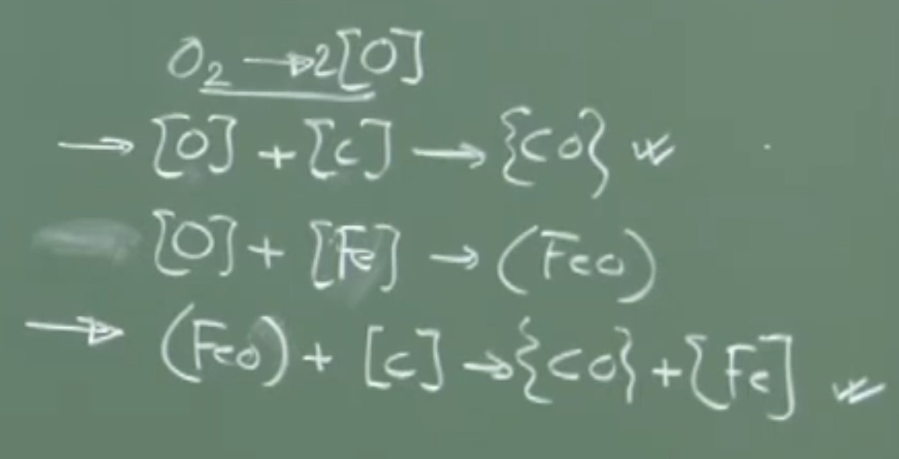
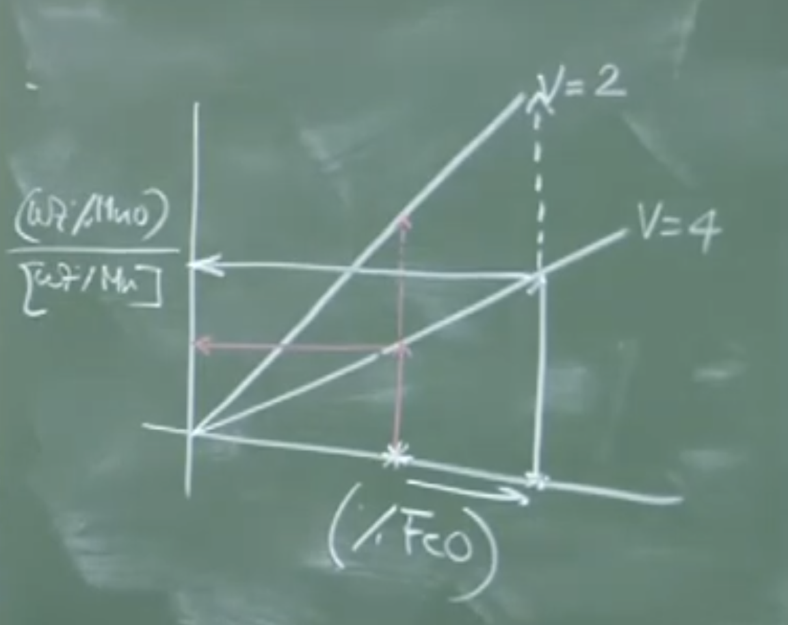
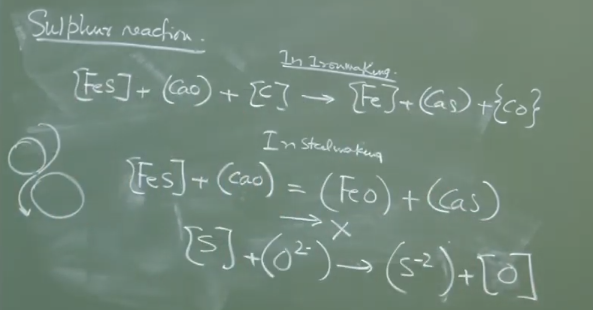

# **Lecture 19: Steelmaking Reactions (Thermodynamics and Kinetics)**

## **1. Introduction to Steelmaking Reactions**

Hot metal (pig iron) contains several principal impurities: **Carbon (C), Silicon (Si), Manganese (Mn), Phosphorus (P), and Sulfur (S)**.

Primary steelmaking is an **oxidizing refining process** designed to drive these elements out of the molten metal (with the exception of Manganese, which is highly desirable, and Sulfur, which cannot be removed under oxidizing conditions).

---

## **2. The Carbon-Oxygen Reaction**

The Carbon-Oxygen ($C-O$) reaction is the most dominant and fundamental reaction in steelmaking. When oxygen is injected (via top lance or bottom tuyeres), several reaction pathways are thermodynamically possible at $1600^\circ\text{C}$ and $1\text{ atm}$ total pressure.


_Double Tick are Prominent once_
### **A. Possible Reaction Pathways**

1. **Oxygen Dissolution (Gas-Metal Reaction):**
    
    $$\frac{1}{2}O_2(g) \rightleftharpoons [O]$$
    
2. **Dissolved C and O Reaction (Homogeneous Melt Reaction):**
    
    $$[C] + [O] \rightleftharpoons CO(g)$$
    
3. **Direct Gas-Metal Oxidation:**
    
    $$\frac{1}{2}O_2(g) + [C] \rightleftharpoons CO(g)$$
    
4. **Iron Oxidation (Gas-Metal Reaction):**
    
    $$\frac{1}{2}O_2(g) + [Fe] \rightleftharpoons (FeO)$$
    
5. **Slag-Metal Reaction (FeO Reduction by Carbon):**
    
    $$(FeO) + [C] \rightleftharpoons CO(g) + [Fe]$$
    

_Conceptual Explanation:_ While all of these reactions are thermodynamically possible, direct gas-metal collision (Reaction 3) is statistically remote because the melt is $\sim 95\%$ iron atoms and only $\sim 4\%$ carbon atoms. The **dominant mechanisms** for decarburization are **Reaction 2** (reaction between dissolved species) and **Reaction 5** (slag-metal interface reaction).

### **B. Thermodynamics of the C-O Equilibrium**

Assuming gas-metal equilibrium for the reaction $[C] + [O] \rightleftharpoons CO(g)$:

$$K_{eq} = \frac{p_{CO}}{[\%C] \cdot [\%O]}$$

At a fixed temperature ($1600^\circ\text{C}$) and pressure ($p_{CO} \approx 1\text{ atm}$):

$$[\%C] \times [\%O] = \text{Constant}$$
$$ = 2.4 \times 10^{-3}  \, (1600^\circ C , P_{CO} = 1atm) $$

_(Note: At $1600^\circ\text{C}$, literature often sets this constant around $2.0 \times 10^{-3}$ to $2.5 \times 10^{-3}$ depending on conditions)._

### **C. Slag-Metal Equilibrium for Carbon and FeO**

If we extend the hypothesis to a **slag-metal equilibrium** based on Reaction 5 ($(FeO) + [C] \rightleftharpoons \{CO(g)\} + [Fe]$):

$$K_{eq,2} = \frac{p_{CO}}{[wt\%C] \cdot (wt\%FeO)}$$

By rearranging and substituting typical steelmaking values ($T = 1600^\circ\text{C}$, $\gamma_{FeO} = 1.3$, $p_{CO} \approx 1.5\text{ atm}$), we get an empirical relationship:

$$[\%C] \times (\%FeO) \approx 1.25$$

_Physical Interpretation:_

- **Early Blow (High Carbon):** When carbon is high (e.g., $4\%$), the dissolved oxygen $[O]$ and slag iron oxide $(\%FeO)$ are forced to be very low. Carbon actively reduces any $FeO$ that forms.
    
- **Late Blow (Low Carbon):** As carbon drops to very low levels, dissolved oxygen and $(\%FeO)$ must exponentially rise to maintain equilibrium.
    

### **D. Endpoint Control and Overblowing**

- **Endpoint Control:** The goal of steelmaking is to precisely hit the target carbon concentration (e.g., from $4.3\% \to 0.05\%$) without over-oxidizing the bath.
    
- **Overblowing:** If oxygen injection continues _after_ the target carbon is reached, the lack of carbon causes the oxygen to rapidly react with iron.
    
    - **Consequences:** Massive amounts of $FeO$ form. Since $Fe \to FeO$ is highly exothermic, the bath temperature skyrockets. This destroys refractory linings, results in severe metallic yield loss, and floods the slag with $FeO$.
        

---

## **3. The Silicon-Oxygen Reaction**

Silicon has a much higher thermodynamic affinity for oxygen than carbon does (sits much lower on the Ellingham diagram).

### **A. Reaction Mechanism**

$$[Si] + 2[O] \rightleftharpoons (SiO_2)$$

$$(SiO_2) + 2(CaO) \rightleftharpoons (2CaO \cdot SiO_2)$$

_Important Remarks / Instructor Notes:_

- **Activity of Silica:** In a basic steelmaking environment (basicity $V = 3.5 \text{ to } 4.0$), massive amounts of lime ($CaO$) are added. $CaO$ (a strong base) heavily interacts with $SiO_2$ (a strong acid) to form calcium silicate. This drops the chemical activity of silica ($a_{SiO_2}$) to near zero.
    
- **Kinetics:** Because $a_{SiO_2} \to 0$, the forward reaction is highly favored. **Silicon is completely eliminated ($0\%$) within the first 2-3 minutes of the oxygen blow.**
    

### **B. Slag Generation (Board Calculation)**

To illustrate the massive slag volume generated by Silicon:

- **Assumptions:** A 300-ton converter, Hot metal contains $0.4 -  2.0\% \text{ Si}$.
    
- **Mass of Si:** $300 \text{ tons} \times 0.01 = 3 \text{ tons of } Si$.
    
- **Mass of $SiO_2$ Formed:** Molar mass $Si = 28$, $SiO_2 = 60$.
    
    $3 \text{ tons} \times (60/28) \approx 6.4 \text{ tons } SiO_2$.
    
- **Flux Required:** For a Basicity ($V = \%CaO / \%SiO_2$) of 4:
    
    $CaO \text{ needed} = 4 \times 6.4 \approx 25 \text{ tons of Lime}$.
    
- **Total Slag Output:** $6.4 \text{ tons } SiO_2 + 25 \text{ tons } CaO = \sim 31 \text{ tons}$ of basic slag generated purely from just $1\% \text{ Si}$ oxidation!
    

---

## **4. The Manganese-Oxygen Reaction**

Unlike Carbon and Silicon, **Manganese is a highly desirable element in steel** (it provides solid solution hardening). Our objective is to **prevent** its oxidation and retain it in the metal bath.

### **A. Reaction Mechanisms**

$$[Mn] + (FeO) \rightleftharpoons (MnO) + [Fe]  \rightarrow eqn-1$$ 

_As FeO content of Slag increases activity of FeO increase --> rxn left to right, so Mn oxidation promoted on later parts of refining period only when Carbon content goes down oxygen in bath increase FeO in slag increases_ 

$$(MnO) + [C] \rightleftharpoons [Mn] + CO(g) \rightarrow eqn - 2$$
$$[Mn] + [O] \rightleftharpoons (MnO)$$

### **B. Slag Basicity and Manganese Retention**

Manganese Oxide ($MnO$) is a basic oxide(More than FeO), but it is _less_ basic than Calcium Oxide ($CaO$).

- _Conceptual Analogy:_ Think of $CaO$ and $MnO$ as two "criminals" competing for space in the slag. $CaO$ is the "bigger criminal." When $CaO$ is added to the slag, it forcefully displaces $MnO$, drastically raising the activity coefficient of $MnO$ ($\gamma_{MnO}$).
    
- Because $\gamma_{MnO}$ is high, $MnO$ becomes "restless" in the slag and is driven back into the metal phase as dissolved $[Mn]$.
  
$$ K_{eq,1} = \frac{(\gamma_{MnO})(wt\ \%Mno)}{(\gamma_{FeO})(\%FeO)[wt\ \%Mn]}$$

### **C. Manganese Partition Coefficient ($L_{Mn}$)**

The partition of Mn between slag and metal is defined as:

$$L_{Mn} = \frac{(\%MnO)}{[\%Mn]}$$

Using the equilibrium of $[Mn] + (FeO) \rightleftharpoons (MnO) + [Fe]$, we find:

$$L_{Mn} = K'_{eq,1} \cdot (\%FeO)$$
_K_' as merged activity coefficent

This means higher $FeO$ in the slag drives Manganese _into_ the slag (bad for retention).

For reaction 2:
$$ K_{eq,2} = \frac{\{P_{CO}\}[wt\ \% Mn]}{\gamma_{MnO}(wt\ \%MnO)[wt\ \% C]}$$
$$\frac{(wt\ \%MnO)}{[wt\ \%Mn]} = \frac{\{P_{CO}\}}{\gamma_{MnO} \cdot K_{eq,2}\cdot [wt\ \% C]}$$

 $[wt \ \%C]$ is high in intial stage, so Mn oxidation is limited due to high carbon content in bath. During later half carbon content goes down, $\gamma_{MnO}$ is has increased bcz of progressively dissolution of lime in slag phase 
 
 Also $[wt\ \%C] \cdot (\% FeO) = Const(1.25)$
 
 $$\frac{[wt\ \%Mn]}{(wt\ \%MnO)} = 0.4 \cdot [wt\ \% C]$$
 
 $\Delta G= -RTlnK_{eq,2}$, fixing temp and pressure 
 #### **Board Graph: Manganese Partition vs. FeO and Basicity (V)**



```
       (%MnO)
 L_Mn = ------
       [%Mn]
         ^
         |
         |         /  V = 2 (Low Basicity = High Mn Loss)
         |        /
         |       /
         |      /        /  V = 4 (High Basicity = Better Mn Retention)
         |     /        /
         |    /        /
         |   /        /
         |  /        /
         | /        /
         |/________/___________________ (%FeO) in Slag
```

_Physical Interpretation of the Graph:_

1. As $(\%FeO)$ increases (which happens at the end of the blow when carbon is low), Manganese is lost to the slag.
    
2. For a given $(\%FeO)$, increasing the slag basicity from $V=2$ to $V=4$ significantly lowers the $L_{Mn}$ ratio, successfully keeping more Manganese in the molten steel.
    

---

## **5. The Sulfur Reaction Under Steelmaking Conditions**

In Ironmaking (Blast Furnace), desulfurization is highly effective due to the reducing environment.

- **Ironmaking Desulfurization:** $[FeS] + (CaO) + [C] \rightarrow [Fe]+(CaS) + CO(g)$ (Carbon removes the oxygen, driving the reaction forward).
    

### **Why Desulfurization Fails in the BOF**

In the Basic Oxygen Furnace, the environment is intensely **oxidizing**.

As carbon is depleted, dissolved oxygen and $(\%FeO)$ skyrocket.

- **The Competing Reaction:**
    
    $$(CaS) + (FeO) \rightleftharpoons (CaO) + [Fe] + [S]$$
    
- _Thermodynamic Reality:_ Calcium has a stronger affinity for oxygen than it does for sulfur. In the presence of high $FeO$ and dissolved $[O]$, any $CaS$ that manages to form will instantly exchange its sulfur for oxygen, driving the sulfur right back into the liquid steel.
    

_Instructor Note:_ **Desulfurization is practically impossible during primary steelmaking.** No matter how high you push the basicity ($V=4$), the oxidizing environment strictly prevents sulfur removal. To produce ultra-low sulfur steel, sulfur must be removed either during **Hot Metal Pretreatment** or in **Secondary Steelmaking** (Ladle Metallurgy) under neutral/reducing conditions.

# V2: Detailed 

# Lecture 19: Thermodynamics and Kinetics of Steelmaking Reactions

## I. Introduction and Context

The core objective of oxidizing refining (steelmaking) is to drive out principal impurities—Carbon (C), Silicon (Si), Phosphorus (P), and Sulfur (S)—from hot metal.

- **Manganese (Mn) Exception:** Unlike other elements, Mn is desirable for solid-solution hardening and is not strictly treated as an impurity to be eliminated.
    
- **Primary Routes Discussed:** Modern steelmaking is dominated by the **Basic Oxygen Steelmaking (BOS)** converter (top-blown or bottom-blown) and the **Electric Arc Furnace (EAF)**.
    

---

## II. The Carbon-Oxygen (C-O) Reaction

This is the principal reaction in steelmaking, responsible for **decarburization**. Oxygen is injected (via lance or tuyeres) and dissolves into the melt, initiating several reactions.

### A. Reaction Mechanisms

All these reactions occur simultaneously under steelmaking conditions (high temperature, near 1 atmospheric total pressure):

1. **Gas-Metal Dissolution:** Gaseous oxygen dissolves into the liquid iron.
    
2. **Melt Phase Reaction:** Dissolved oxygen reacts directly with dissolved carbon:
    
    $$[C] + [O] \rightarrow CO(g)$$
    
3. **Slag-Metal Interface Reaction:** Because iron is highly abundant (95%+), oxygen also reacts with iron to form iron oxide in the slag phase. This $(FeO)$ can then react with dissolved carbon at the slag-metal interface:
    
    $$[C] + (FeO)_{slag} \rightarrow CO(g) + Fe(l)$$
    

### B. Thermodynamics & Equilibrium

Experimental observations show that the C-O reaction operates very close to equilibrium.

- **Constant Inverse Relationship:** At 1600°C and a fixed $P_{CO}$ (e.g., 1 atm), there is a strict inverse relationship between dissolved carbon and oxygen:
    
    $$[wt\% C] \times [wt\% O] = 1.24 \times 10^{-3}$$
    
- **Slag-Metal Equilibrium:** Assuming equilibrium extends to the slag phase, a similar inverse relationship exists between carbon in the melt and FeO in the slag. At 1600°C, with $\gamma_{FeO} = 1.3$ and $P_{CO} \approx 1.5$ atm:
    
    $$[wt\% C] \times [wt\% FeO]_{slag} \approx 1.25$$
    

### C. Overblowing and End-Point Control

- **Refining Progression:** During the initial phase, high carbon content suppresses oxygen dissolution and FeO formation. As carbon is depleted towards the end of refining, the melt's dissolved oxygen increases sharply, causing a massive spike in $(FeO)$ formation in the slag.
    
- **The Danger of Overblowing:** If oxygen blowing continues after reaching the target end carbon (e.g., aiming for 0.05 wt% C), rampant exothermic $(FeO)$ formation occurs. This leads to:
    
    - Severe spikes in bath temperature.
        
    - Significant yield losses (iron lost to slag).
        
    - Damage to refractory linings and shortened converter life.
        
- **End-Point Control:** The precision with which a steelmaker reaches the exact target carbon without overblowing dictates the profitability and efficiency of the process.
    

---

## III. The Silicon-Oxygen (Si-O) Reaction

Silicon has a higher affinity for oxygen than carbon does.


Shutterstock

Explore

### A. Reaction Mechanism

Silicon is oxidized and removed to the slag as silica:

$$[Si] + 2[O] \rightarrow (SiO_2)_{slag}$$

### B. The Role of Slag Basicity

- **Basic Environment:** Steelmaking operates with highly basic slag (Basicity ratio or V-ratio $\approx$ 3.5 to 4), primarily through the addition of lime (CaO).
    
- **Activity Reduction:** $SiO_2$ is a strong acidic oxide. It readily combines with the basic $CaO$ to form stable calcium silicates. This fixes the silica and drops the activity coefficient ($a_{SiO_2}$) to near zero.
    
- **Spontaneous Completion:** Because the activity of silica is virtually eliminated by the basic slag, the Si oxidation reaction strongly favors the forward direction.
    

### C. Mass Balance Example (300-Ton Converter)

- **Hot metal Si content:** Typically 0.4% to 2.0%.
    
- **For 1 wt% Si in 300 tons of melt:** You have 3 tons of pure Si.
    
- **Oxidation:** 3 tons of Si produces $\approx$ 6 tons of $SiO_2$ (using molecular weights: 60/28).
    
- **Flux Addition:** To maintain a basicity of 4, you must add 24 tons of $CaO$ to neutralize the 6 tons of $SiO_2$.
    
- **Slag Generation:** Along with formed FeO, total slag volume rapidly grows from zero to 30–45 tons (about 15-20% of the melt weight).
    

### D. Kinetics

- **Extremely Rapid:** Due to the strong thermodynamics and basic slag, almost all silicon is completely eliminated (reaching $\approx$ 0 wt%) within the first **2 to 3 minutes** of oxygen blowing.
    
- _Note:_ Final steel may contain some silicon (e.g., 0.05%), but this is reintroduced intentionally later via deoxidation (e.g., using silico-manganese).
    

---

## IV. The Manganese-Oxygen (Mn-O) Reaction

Manganese is chemically similar to iron (adjacent on the periodic table, similar atomic weights 55/56) and forms ideal solutions in steel.

### A. Reaction Mechanisms

While we want to retain Mn, high temperatures and oxidizing environments make some oxidation inevitable:

$$[Mn] + [O] \rightleftharpoons (MnO)_{slag}$$

$$[C] + (MnO)_{slag} \rightleftharpoons CO(g) + [Mn]$$

### B. Slag-Metal Partitioning

The goal is to maximize Mn recovery in the melt and minimize its loss to the slag. The partition coefficient is represented as:

$$L_{Mn} = \frac{wt\% (MnO)_{slag}}{wt\% [Mn]_{metal}}$$

- **Influence of FeO:** Later in the blow, as $(FeO)$ in the slag increases, the tendency to oxidize Mn and push it into the slag also increases.
    
- **Influence of Basicity:** $MnO$ is a basic oxide. In a highly basic slag rich in $CaO$, the $CaO$ "outcompetes" $MnO$. This drastically increases the activity coefficient of $MnO$ ($\gamma_{MnO}$), making the slag hostile to it and driving Mn back into the metal.
    
- **Carbon's Role:** High carbon (early in the blow) prevents Mn oxidation. Low carbon (late in the blow) makes Mn oxidation highly critical.
    

---

## V. Sulfur Reaction (Desulfurization Limits)

**Key Takeaway:** Primary steelmaking is **not** the site for significant desulfurization.

### A. Why Desulfurization Fails in the Converter

In ironmaking (blast furnace), desulfurization relies on a reducing environment with solid carbon:

$$[FeS] + (CaO)_{slag} + [C] \rightarrow [Fe]+(CaS)_{slag} + CO(g)$$

However, in steelmaking:

1. **Low Carbon:** There is very little carbon available to drive the reducing reaction.
    
2. **High Oxygen/FeO:** The environment is intensely oxidizing. The abundance of dissolved oxygen and $(FeO)$ strongly opposes sulfur removal.
    
3. **Chemical Affinity:** Calcium has a much higher affinity for oxygen than sulfur. In an oxygen-rich environment, $(CaS)$ will readily revert back:
    
    $$(CaS)_{slag} + (FeO)_{slag} \rightarrow (CaO)_{slag} + (FeS)$$
    
    The sulfur is simply handed back to the iron.
    

### B. Conclusion on Sulfur

Even with highly basic slag (basicity of 4), sulfur reduction in the primary oxygen converter is minuscule. Proper desulfurization must occur in the blast furnace, during external hot metal pretreatment, or in secondary steelmaking operations where neutral/reducing atmospheres can be established.
