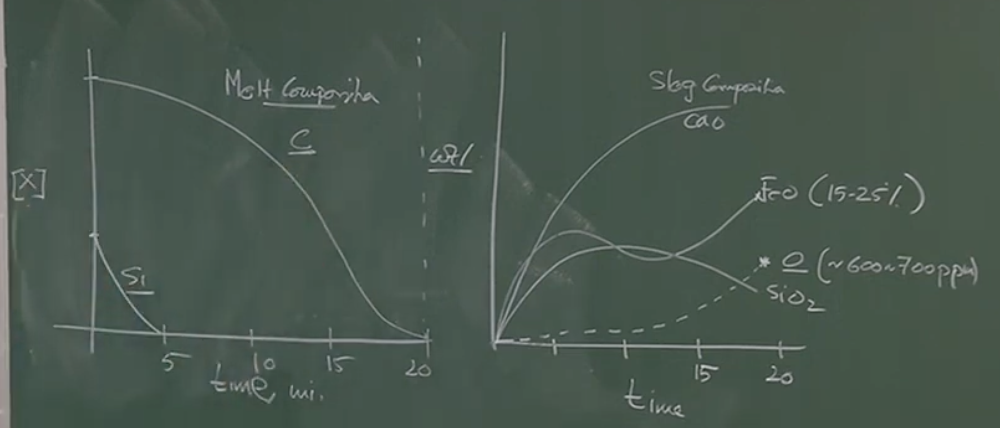
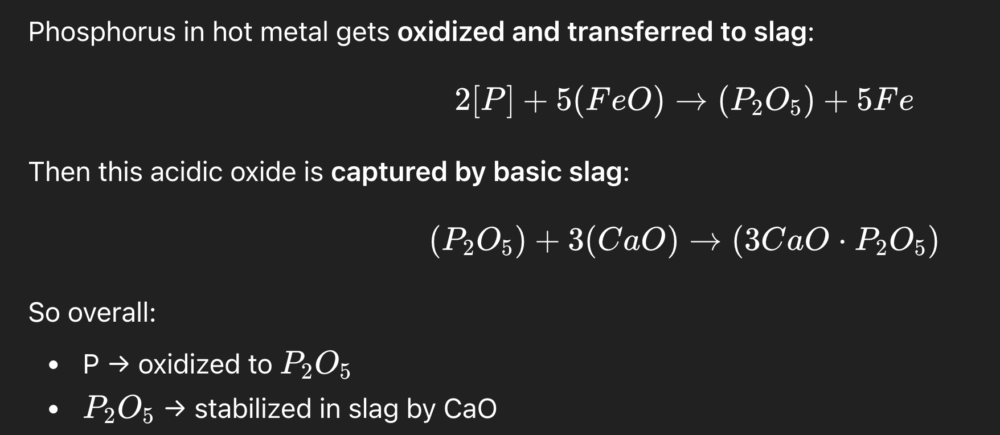
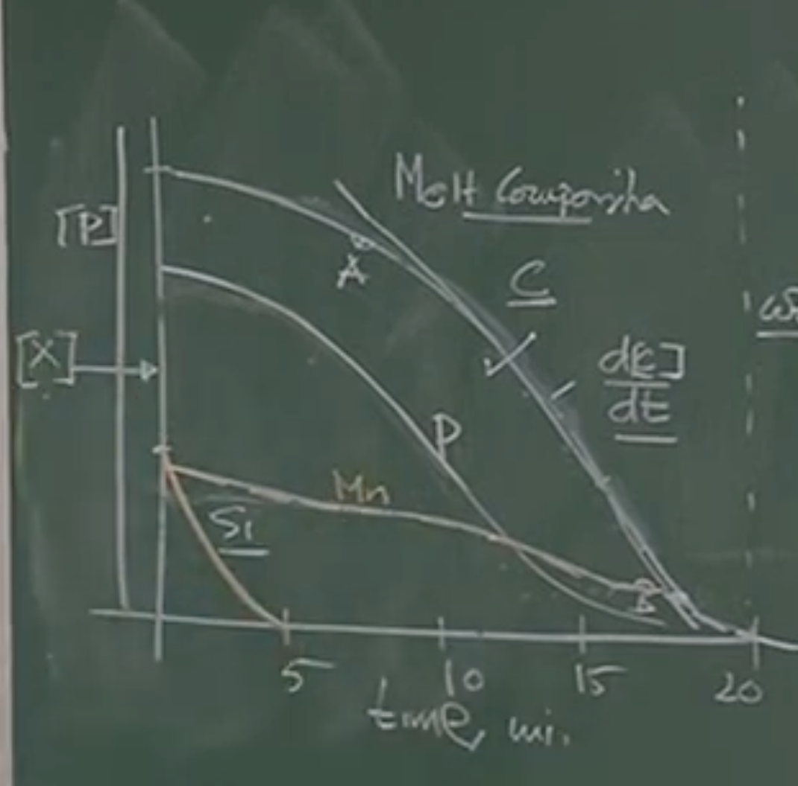
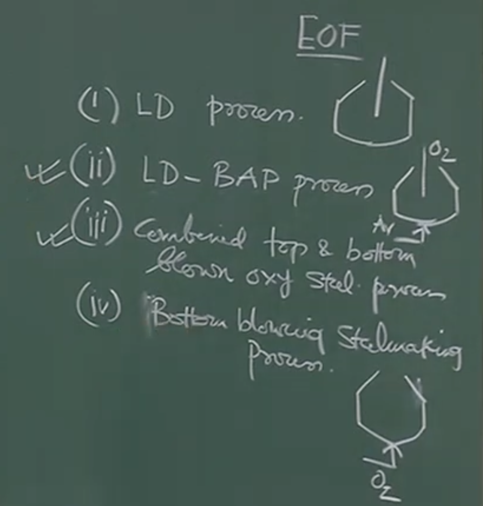
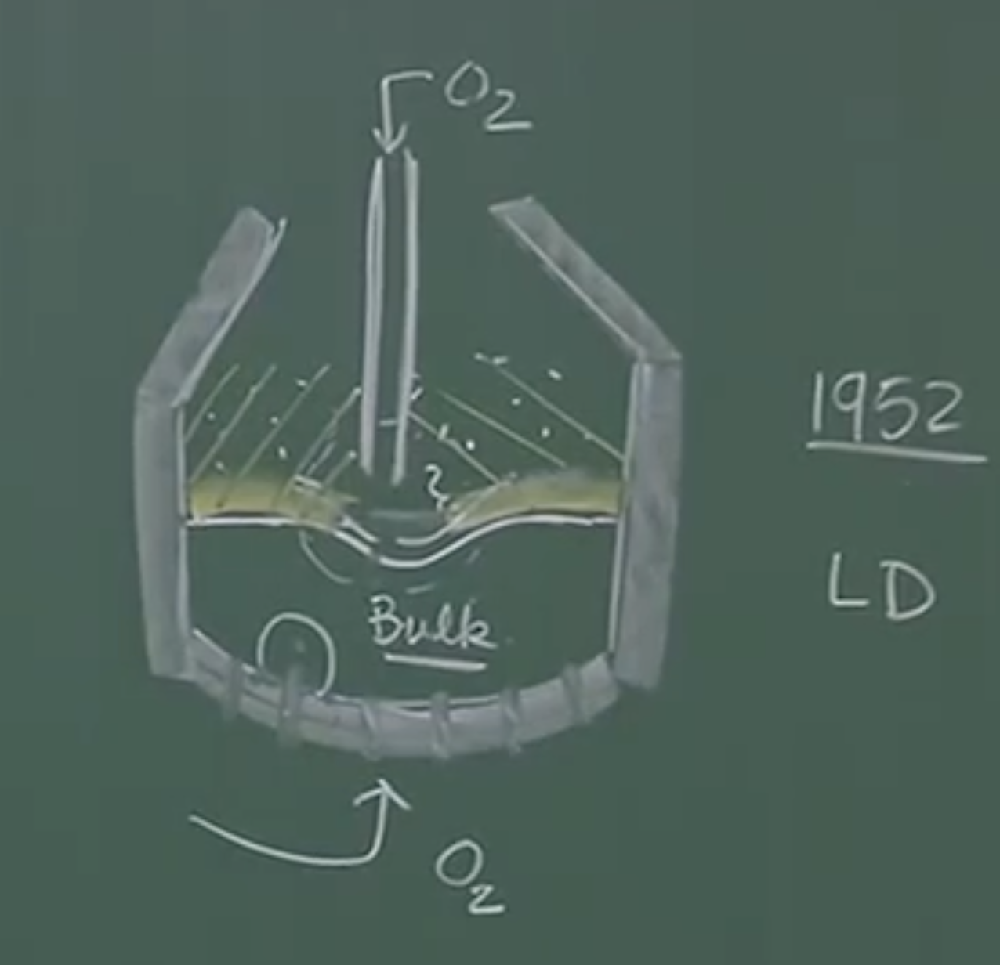
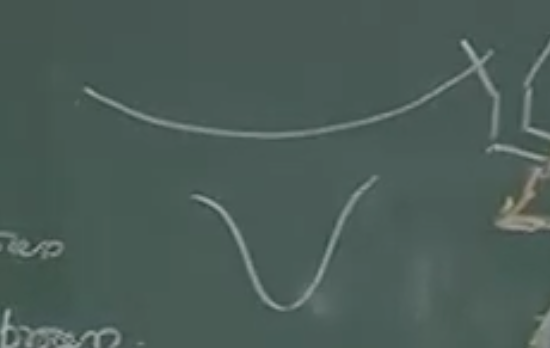

****# LECTURE NOTES: Oxygen Steelmaking (LD Converter Dynamics)

## 1. Historical Context and Development of Oxygen Steelmaking

### Conceptual Explanation

Even though bulk oxygen production was commercially viable by 1932, it took nearly 20 years to successfully implement it in steelmaking. Initial attempts to blow pure oxygen through the bottom tuyeres of the existing **Bessemer converter** ended in disastrous consequences.

- **The Problem:** The oxidation of metalloids is highly exothermic. Injecting pure O₂ from the bottom generated localized, intense heat that severely damaged the tuyeres and the surrounding basic refractory lining, necessitating relining on an almost weekly basis.
    
- **The Breakthrough (1952):** The paradigm shifted when operators realized they didn't need to submerge the injection lance. By utilizing a water-cooled lance positioned _above_ the liquid bath and blowing oxygen at supersonic speeds, they achieved rapid refining without destroying the refractories.
    
$Ṅ = k_mA \Delta C$
rate of transport can be improved by improving $k_m$ and _A_ 
But when $O_2$ injected from bottom vigorous stirring so enhanced area but from top lance at supersonic speed 
## 2. Major Versions of Oxygen Steelmaking Processes

Over the last 70 years, several variants of the process have been successfully commercialized.

1. **Classic Top-Blown Process (LD Process):** The dominant process globally.
    
2. **LD Bath Agitation Process:** Top-blown oxygen with a limited amount of inert gas (Argon) injected from the bottom to enhance bulk melt stirring.
    
3. **Combined Top and Bottom Blown Oxygen Process:** Oxygen injected from both the top lance and highly specialized bottom tuyeres.
    
4. **Pure Bottom Blowing (OBM/Q-BOP):** Modern bottom-blown processes using hydrocarbon-shrouded tuyeres to prevent localized refractory melting.
    
5. **Energy Optimizing Furnace (EOF):** Used primarily in specialty steel plants or mini-mills.
    

---

## 3. Major Components of an LD Steelmaking Shop

An LD steelmaking plant requires extensive supporting infrastructure beyond the vessel itself.

### Board Work: Components List

1. Pear-shaped refractory vessel (Converter)
    
2. Water-cooled retractable multi-hole oxygen lance
    
3. Sub-lance (for in-process sampling and sensing)
    
4. Gas cleaning plant (exhaust hood and suction)
    
5. O₂ supply plant
    
6. Raw material / feed handling facility (hoppers, chutes)
    
7. Product handling facility (ladles, slag pots)
    
8. Sensors and process control equipment
    
9. Centralized air-conditioned control room
    

### 3.1 The Converter Vessel and Refractory Lining

The LD converter is a pear-shaped vessel (typically 100 to 500 tons capacity). Because it is a shallow bath, the aspect ratio ($L/D$, where $L$ is bath depth and $D$ is diameter) is strictly maintained $\le 0.5$. Deep baths would result in a completely stagnant bottom zone.

**Visual Extraction: Cross-Section of Converter Wall**

Plaintext

```
[Inside of Vessel - 1600°C]
  |===|  Working Lining (Basic Refractory: Magnesite / Tar-bonded Dolomite)
  |===|  
  |---|  Cardboard / Asbestos / Glass Wool (Thermal expansion joints)
  |===|  Permanent / Semi-Permanent Lining
  |===|
  |###|  Steel Shell (Outer structure, ~300°C - 400°C)
[Outside Environment]
```

**Important Remarks / Instructor Notes:**

- **Wear Mechanisms:** Refractory wear is driven by thermal fatigue, hydrodynamic shear (from molten metal impact during charging), and predominantly **chemical degradation**.
    
- **Slag Attack:** Highly basic refractories (MgO, CaO) are used. If the slag becomes rich in $FeO$ (which is highly corrosive), it impregnates and rapidly dissolves the basic brick.
    
- **Thermal Resistance:** The expansion joints (asbestos/glass wool) provide vital contact thermal resistance, dropping the massive temperature gradient safely before it hits the steel shell.
    

### 3.2 The Oxygen Lance and Lance Sculling

The lance is a vertical, water-cooled steel tube terminating in a multi-hole convergent-divergent nozzle.

- **Lance Sculling (Protective Layer):** Due to the internal water cooling, the lance's outer surface is relatively cold. As an intensely agitated emulsion of slag and molten metal splashes against the lance, it solidifies. This forms a "skull" (solidified Fe, slag, and entrapped voids) that acts as a sacrificial, protective thermal barrier for the lance.
    
- **Sub-Lance:** Never to be confused with the O₂ lance. It is a sensor suite plunged into the bath to measure Temperature and Carbon content dynamically, without interrupting the blow.
    

---

## 4. Sequence of Operations (A Typical "Heat")

A single "heat" (batch) takes about 30 to 50 minutes, with actual blowing time being ~20 minutes.

1. **Inspection and Repair:** Visual/robotic inspection of the lining. Instantaneous sintering of any sprayed refractory.
    
2. **Scrap Charging:** The heavy steel scrap (density ~7800 kg/m³) is dumped into the tilted, empty converter first to protect the bottom lining from hot metal impact.
    
3. **Hot Metal Pouring:** Molten pig iron (density ~7200 kg/m³ due to 4.3% dissolved Carbon) is poured via ladle. Hot metal constitutes 70% to 90% of the metallic charge.
    
4. **Furnace Made Vertical & Blow Begins:** The vessel is rotated upright. Because the bath temp has dropped (to ~1380°C), **oxygen is blown immediately**. Solid fluxes cannot be added yet as they would extract too much heat.
    
5. **Flux Addition:** Once Si and Fe oxidize (within the first ~30 seconds), massive heat is generated. Solid fluxes (Lime, Dolomite) are dropped in to build the basic slag.
    
6. **Sampling:** Sub-lance checks chemistry and temp near the end-point.
    
7. **Tapping:** The vessel is tilted to pour the refined steel out of the tap hole into a ladle. It is tilted the opposite way to dump the slag into a slag pot.
    

---

## 5. Process Dynamics: Jet Impact and The Emulsion Phase

### Physical Interpretation: The Oxygen Jet

The oxygen passes through a convergent-divergent nozzle, generating a supersonic flow. However, as the jet exits the lance, it entrains surrounding high-temperature furnace gases. This expansion forces the jet to lose velocity. By the time it impacts the bath surface, the jet is **subsonic** (Mach 0.5 - 0.6), though it possesses a massive axial momentum.

### Board Work: Lance Height & Cavity Formation

Plaintext

```
     HARD BLOW (Lance Low)               SOFT BLOW (Lance High)
         ||||                                  ||||   
         |||| Lance                            |||| Lance 
         \  /                                  \  /   
          ||                                  /    \  <-- Jet spreading
      ____||____                          ___/______\___  Slag Layer
     /   \  /   \                         \            / 
    |     ||     |                         \__________/
    |_____\/_____| Metal                    Metal Bath
    Deep, narrow cavity                  Shallow, wide cavity
```

- **Hard Blow (Lance close to bath):** Used to penetrate the slag and expose the metal. Generates a deep cavity, minimizing surface oxidation but deeply mixing the bath.
    
- **Soft Blow (Lance high):** Maximizes the footprint of the oxygen jet on the surface. Used to quickly generate $FeO$ in the slag to rapidly dissolve the solid lime fluxes early in the blow.
    

### The Slag-Metal Emulsion Phase (The Core Driver of Reaction Rates)

The rate of mass transfer is given by:

$$Rate \propto k \cdot A \cdot \Delta C$$

Where $k$ is the mass transfer coefficient, $A$ is interfacial area, and $\Delta C$ is the concentration gradient.

- The top-blown jet does _not_ stir the bulk liquid well. Therefore, $k$ in the bulk is low.
    
- **The Secret to LD speed:** The immense shearing force of the jet tears the metal into millions of micro-droplets and throws them into the slag layer, creating a foaming **slag-metal-gas emulsion**. This increases the interfacial area ($A$) by a factor of over a million.
    

**Droplet Buoyancy and Emulsion Collapse:**

1. A metal droplet enters the slag. O₂ and Carbon diffuse into the droplet.
    
2. $C + O \rightarrow CO(g)$. A carbon monoxide bubble nucleates _inside_ the liquid metal droplet.
    
3. This internal bubble decreases the effective density of the droplet, making it buoyant. The droplet "floats" in the slag emulsion for 2 to 3 minutes.
    
    2-3 minutes residence time of droplet 
    
1. Once the Carbon is depleted, the CO bubble escapes. The droplet becomes pure, dense iron again, dropping out of the emulsion back into the bulk metal.
    
2. **Warning:** If bath carbon drops too low, CO gas generation stops, and the entire emulsion phase collapses, crashing the refining reaction rate.
    

---

## 6. Thermodynamics and Kinetics of Metalloid Oxidation

### Visual Extraction: Concentration vs. Time

Plaintext

```
wt%
4.5| \ * * * C (Carbon)
   |   \
   |    \
   |     \  
   |       \
   |-----\---\------------------- Mn (Manganese - initial drop, then reversion)
   |      * * \ * * * * * * * P (Phosphorus - removed concurrently with C)
   | \         \
   |   \        \
   |     \       \
 0 |_______\_______\_________________ Time (Mins)
           5       15       20
```
 
### Element-by-Element Analysis

- **Silicon (Si):** Oxidizes extremely rapidly in the first 3 to 5 minutes due to high chemical affinity for oxygen. Forms $SiO_2$, which is immediately locked into the slag by basic $CaO$. Si concentration drops monotonically to zero.
    
- **Carbon (C):** Oxidizes into $CO$ gas. Follows three distinct kinetic regimes (see Section 7).
    
- **Phosphorus (P):** _Unlike_ the Bessemer process, P removal in the LD process happens _concurrently_ with Carbon. Phosphorus removal requires: highly oxidizing conditions (high $FeO$), low temperatures (early blow), and high basicity (lots of $CaO$).
    
    
    
    
    - _Instructor Note:_ Operators must ensure P is completely removed _before_ Carbon levels drop and the emulsion collapses.
	
- **Manganese (Mn):** Initially oxidizes to $MnO$. However, near the end of the blow, bath temperatures shoot up, and the highly oxidized environment causes some $Mn$ to revert from the slag back into the metal.
     Mn more affinity to O then Fe ? 
- **Slag / Oxygen Evolution:** Towards the end of the blow (mins 15-20), there is no carbon left to consume the incoming oxygen. Consequently, dissolved Oxygen in the melt shoots up (to 600-700 ppm), and $FeO$ in the slag skyrockets (reaching 15-25%).
  
  Lime dissolved and started to replace FeO 
  $[\%C][\%FeO] = 1.25$
    

---

## 7. Decarburization Kinetics

The rate of carbon removal dictates the entire rhythm of the steelmaking heat.

### Visual Extraction: Decarburization Rate Curve

Plaintext

```
Rate (-dc/dt)
  |
  |         (Steady State)
  |       __________________
  |      /                  \
  |     /                    \  (Falling Rate Period)
  |    /                      \
  |   /                        \
  |  /                          \
  |_________________________________________ Time
     0         5                17     20
```

**The Three Stages of Decarburization:**

1. **Initial Acceleration:** Oxygen is forming $FeO$ and oxidizing $Si$. Slag is forming. Decarburization ramps up.
    
2. **Steady State Period (~Min 4 to Min 17):** The rate of Oxygen supply matches the rate of CO formation. The curve of C vs. Time is perfectly linear. The slope $(-dc/dt)$ is constant.
    
3. **Falling Rate Period (Min 17 to End):** Carbon concentration drops below a critical threshold. The reaction becomes mass-transfer limited by the diffusion of Carbon to the interface.
    

**Mathematical Derivation for the Falling Rate Period:**

The decarburization process becomes a first-order process with respect to Carbon.

$$- \frac{dc}{dt} = k(C - C_{eq})$$

Where:

- $C$ = instantaneous concentration of carbon in the melt.
    
- $C_{eq}$ = equilibrium carbon concentration (dictated by the dissolved oxygen level).
    
- $k$ = overall mass transfer rate constant.
    

**Process Control Application:**

To strictly control the "end point" of the heat (between min 17 and 20), plant engineers integrate this rate equation:

$$\int_{C_{17}}^{C_{desired}} \frac{dc}{C - C_{eq}} = - \int_{t_{17}}^{t_{end}} k \, dt$$

- The initial condition ($C_{17}$) is dynamically confirmed via sub-lance sampling.
    
- By knowing the specific rate constant ($k$) for their specific converter, the computer dynamically calculates exactly how many remaining seconds $t_{end}$ the oxygen must be blown to hit $C_{desired}$.
    
- **Crucial Warning:** Overblowing by even 1 or 2 minutes will cause $FeO$ to spike drastically (ruining yield), temperature to skyrocket, and drive **Phosphorus Reversion** (Phosphorus breaking out of the slag and polluting the clean steel). Precise end-point control is mandatory.
  
  
# Audio Version 

# Detailed Lecture Notes: Oxygen Steelmaking Process (LD Converter)

## 1. Historical Background & Development

- **Bulk Oxygen Availability:** Oxygen was commercially produced in bulk quantities around **1932**, but it took almost **20 years** to develop the oxygen steelmaking process.
    
- **Henry Bessemer's Idea:** Bessemer knew pure oxygen would yield extremely high-quality steel quickly due to faster refining rates from high oxygen content.
    
- **Initial Failures (Bottom Blowing):** Initial trials used existing pear-shaped Bessemer converters, injecting pure oxygen through bottom **tuyeres** (nozzles).
    
    - **Disastrous consequence:** Metalloid oxidation is highly exothermic. Intense localized heat completely damaged the bottom tuyeres and localized basic refractory lining.
        
    - Converters required relining on a weekly basis, making it not commercially viable.
        
    - Attempts to blow oxygen from the side or through submerged lances also failed due to intense heat destroying the refractories.
        
- **The Breakthrough (1952):** The solution was a **top-blown lance** kept _away_ from the liquid metal interface.
    
    - Oxygen was blown at near supersonic speeds (today, Mach number > 1).
        
    - Because the lance was not submerged and was far away from the walls, the heat was produced locally at the bath surface, saving the refractories and prolonging the lance's life.
        
    - This is known as the **Top-Blown LD Steelmaking Process**, which emerged as the globally dominant technology.
        

## 2. Variations of Oxygen Steelmaking


Since the 1960s, four main popular versions have developed:

1. **Classic LD Process:** Top-blown oxygen process.
    
2. **LD Bath Agitation Process:** Top-blown oxygen jet + a limited amount of **Argon** (not oxygen) injected from the bottom. This bottom inert gas is used specifically to stir the bulk liquid, expediting reaction rates and efficiency.
    
3. **Combined Top and Bottom Blown Oxygen Process:** Oxygen injected from both the top lance and specialized bottom tuyeres (redesigned to survive the heat).
    
4. **Pure Bottom Blowing Oxygen Process:** Oxygen injected purely from the bottom using modern sustainable tuyere technology.
    

- _Other minor processes:_ **EOF (Energy Optimizing Furnace)**, a Brazilian process used mostly in special steel plants or mini-mills (hardly a dozen plants use this).
    


## 3. Reaction Kinetics: Mass Transfer and The Emulsion Phase

- **Mass Transfer Rate Equation:** $Rate \propto k \cdot A \cdot \Delta C$
    
    _(Where $k$ = mass transfer coefficient, $A$ = interfacial area, $\Delta C$ = concentration gradient)._
    
- **The Paradigm Shift in Understanding:** People initially thought the fast reaction of LD was due to high localized heat or stirring. This was wrong.
    
- **The True Mechanism:** A supersonic top-blown jet does _not_ create good momentum transfer to stir the bulk ($k$ is low). Instead, the enormous shearing force tears the hot metal and slag into millions of suspended droplets.
    
- This creates a secondary bulk phase: the **Slag-Metal Emulsion** (or foamy slag).
    
- This emulsion phase increases the interfacial area ($A$) by a **million times** over a flat surface, leading to incredibly fast refining and decarburization.
    

## 4. Components of the LD Oxygen Steelmaking Plant

The plant involves much more than just the furnace. Major components include:

- **Pear-shaped Converter Vessel:** Typically **100 tons to 500 tons** capacity.
    
    - **Aspect Ratio ($L/D$):** The bath is shallow. Bath depth ($L$) divided by vessel diameter ($D$) is **maximum 0.5** (typically 0.35 to 0.4). If it were too deep, the bottom would be unmixed (quiescent).
        
- **Oxygen Lance:** A multi-hole, water-cooled retractable steel tube.
    
- **Sub-Lance:** A sensor plunged into the melt strictly for collecting samples and sensing temperature/carbon (not for blowing oxygen).
    
- **Gas Cleaning Plant:** A huge hood and suction system to aspirate off-gas and dust.
    
- **Oxygen Plant:** Required supply is **2 to 3 $Nm^3/min/ton$** of steel. (Note: $Nm^3$ undergoes massive volume expansion at 1600°C).
    
- **Raw Material/Feed Handling:** Automated hoppers and chutes for scrap, DRI, lime, and dolomite.
    
- **Product Handling:** Ladles for steel, slag pots for slag, scrap-carrying cars, cranes.
    
- **Control Room:** Air-conditioned room where engineers monitor lance height, blow time, O2 pressure, and hopper weights via load cells.
    
- _Plant Scale Context:_ A 3.5 million ton/year blast furnace produces ~10,000 tons/day. One 300-ton LD converter making 24 heats/day cannot handle this. Therefore, a plant usually has 3 to 5 converters operating simultaneously (with 1-2 down for relining).
    

## 5. Refractory Lining Details

All modern steelmaking is basic, meaning the lining must be basic to survive the basic slag.

- **Material:** **Magnesite** (mostly Magnesia extracted from seawater) and **Tar-bonded Dolomite** (Carbon Dolomite).
    
    - _Note:_ Pure phases (like pure alumina) are too expensive, so compromised mixtures are used. Refractories are zone-specific (different strengths for bottom vs. sides).
        
- **Layers:** 1. **Steel Shell** (water-cooled in places).
    
    2. **Permanent / Semi-Permanent Lining** (never exposed to molten metal).
    
    3. **Working Lining** (inspected and repaired often).
    
    4. **Expansion Joints:** Asbestos, cardboards, and glass wool between bricks. These adjust for thermal expansion/contraction and offer high **thermal contact resistance**, creating huge temperature drops to protect the outer steel shell (~1600°C inside to 300-400°C outside).
    
- **Refractory Wear Mechanisms:**
    
    1. **Thermal Degradation:** High temperatures and thermal fatigue (fluctuating temps).
        
    2. **Hydrodynamic Degradation:** Shear stress from metal impacting the walls/floor.
        
    3. **Chemical Degradation (Dominant):** Slag containing **$FeO$** is highly corrosive to basic basic refractories. $FeO$ impregnates the refractory and damages it.
        

## 6. Lance Dynamics & "Sculling"

- **Multi-Hole Lances:** Today's lances use 3, 4, or 6 holes to distribute oxygen over a larger area rather than a single hole.
    
- **Lance Sculling:** Because the lance is water-cooled, its surface is colder than the bath. When slag and metal droplets hit it, they re-solidify onto the lance, trapping gas voids. This solid layer is called the **"Skull"**, and it actually _protects_ the lance from the hostile environment.
    

## 7. Sequence of Operations: "A Typical Heat"

A standard heat takes **30 to 35 minutes** total, with exactly **20 minutes of blowing time**.

1. **Inspection:** Robotic arms scan the lining. Sintering of spray repair is instantaneous due to high heat.
    
2. **Scrap Charging (Vessel Tilted):** Scrap (pure iron, density ~7800 $kg/m^3$) is charged first to protect the bottom lining.
    
3. **Hot Metal Pouring (Vessel Tilted):** Hot metal from the blast furnace (density ~7200 $kg/m^3$ due to 4.3% C) is poured via ladle. Comprises **70% to 90%** of the charge. Poured at ~60 tons/min. (Temperature drops ~20-30°C during transport to ~1380°C).
    
4. **Blow Begins (Vessel Vertical):** Oxygen is blown _immediately_ while the vessel is still relatively cold. You cannot add solid fluxes yet because they consume heat.
    
5. **Flux Addition:** Within the first **30 seconds**, Si and Fe oxidize, rapidly raising the temperature. Solid additions (lime, dolomite, DRI) are added via chutes to form the slag.
    
6. **Sampling:** Sub-lance checks carbon and temp.
    
7. **Tapping:** Stop blow, tilt to tap metal out the tap hole into a ladle, then tilt reverse to dump slag into the slag pot.
    

## 8. Jet Behavior and Lance Height Adjustments

- **Gas Flow:** Passes through a convergent-divergent nozzle. Supersonic at the orifice.
    
- **Subsonic Impact:** The jet entrains surrounding gas, expands, and drops in velocity. By the time it hits the melt, it is **subsonic** (Mach 0.5 - 0.6) but still has massive momentum.
    
- **Lance Height Adjustments:**
    
    - **Hard Blow (Lance Low):** Deep cavity, highly concentrated impact area. Generates enormous amounts of droplets.
        
    - **Soft Blow (Lance High/Retracted):** Shallow cavity, wide surface area. Used early in the heat to rapidly form $FeO$ over a wide area, which helps dissolve the solid lime fluxes.
      
		 
		As in fig 2nd is Hard Blow

## 9. The Slag-Metal Emulsion Phase Mechanics

- When oxygen hits, droplets of metal and slag are sheared off and mixed.
    
- **Droplet Buoyancy:** Oxygen and Carbon dissolve into the metal droplet. Inside the droplet, $C + O \rightarrow CO$ gas. This internal CO bubble expands the droplet, lowers its density, and provides **buoyancy**, keeping it suspended in the emulsion for **2 to 3 minutes**.
    
- **Emulsion Collapse:** Once carbon is depleted, the CO bubble escapes. The droplet becomes heavy pure iron and falls back to the bath.
    
- **Crucial Rule:** The emulsion is completely sustained by the generation of CO gas. If bath Carbon drops below a critical threshold, CO generation stops, the emulsion collapses, and mass transfer rates plummet.
    

## 10. Chemical Kinetics & Element Oxidation Curves

- **Silicon (Si):** Oxidizes extremely fast in the **first 3 to 4 minutes**. Forms $SiO_2$, which is immediately locked up by the lime ($CaO$). Concentration drops monotonically to zero. No chance of reversion.
    
- **Phosphorus (P):** _Unlike_ the older Bessemer process (where P removes last due to N2 cooling), in the LD process, P is removed **concurrently** with Carbon.
    
    - _Requirements:_ High basicity, oxidizing slag ($FeO$), relatively low temp.
        
    - _Rule:_ Phosphorus MUST be entirely removed into the slag _before_ Carbon drops too low and the emulsion collapses.
        
- **Manganese (Mn):** Initially oxidizes and drops slightly. However, toward the end of the blow, highly oxidizing conditions and high temperatures cause Mn to revert from the slag back into the metal.
    
- **End of Blow (Mins 15-20):** * When Carbon drops near 1% to 0%, oxygen has no carbon to react with.
    
    - $FeO$ in the slag builds up extremely rapidly (**15-25% $FeO$**).
        
    - Dissolved oxygen in the melt shoots up to **600-700 ppm**.
        
    - Bath temperature skyrockets.
        
- **Overblowing Danger:** If you blow even 1 or 2 minutes past the end-point:
    
    - $FeO$ spikes causing massive **yield loss** (turning iron into slag).
        
    - High temps cause **Phosphorus Reversion** (P leaves the slag and re-contaminates the steel).
        

## 11. Decarburization Kinetics & End-Point Control

The carbon vs. time graph dictates the entire process. It has three stages:

1. **Initial Rate:** Increasing as slag forms.
    
2. **Steady State Decarburization:** (Roughly up to minute 16 or 17). The graph is a straight, linear slope. The rate of O2 supply perfectly matches CO formation.
    
3. **Falling Rate Period:** (Minutes 17 to 20). Decarburization rate continuously decreases. This is a first-order, mass transfer-controlled process.
    

**Mathematical Control (Dynamic Control Model):**

During the falling rate period, the rate equation is:

$$-\frac{dc}{dt} = k(C - C_{eq})$$

_(Where $C$ is current carbon, $C_{eq}$ is target equilibrium carbon, and $k$ is the rate constant)._

- **Static models** (run the day before) use material/enthalpy balances to calculate total lime and final temp, but _cannot_ predict exact blowing time.
    
- **Dynamic models** calculate the exact end-point. By sampling the carbon at $t=17$ minutes (e.g., $C = 0.4\%$), the computer integrates the rate equation to find the precise second to shut off the oxygen to hit the exact target carbon (e.g., $C_{eq}$) without overblowing.