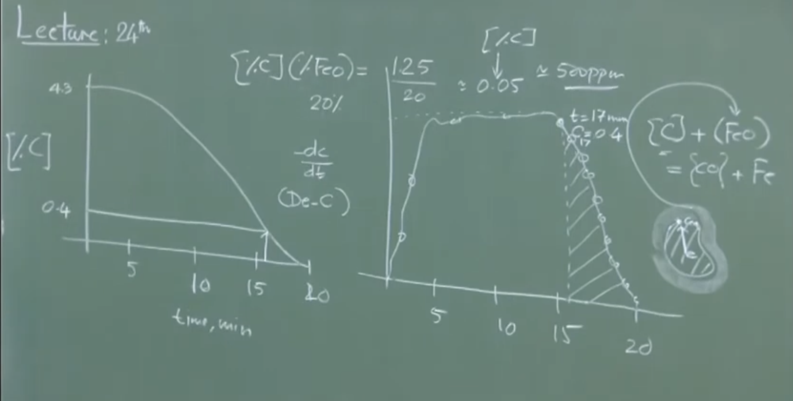
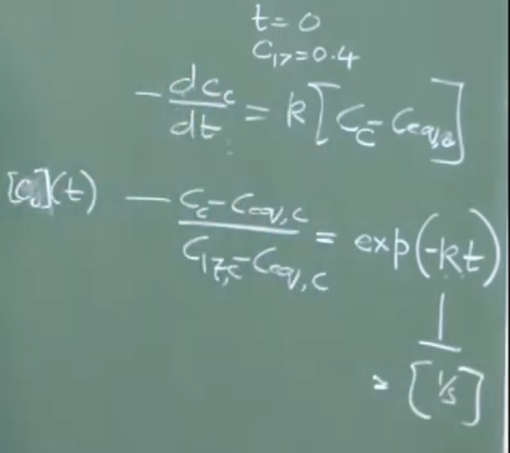
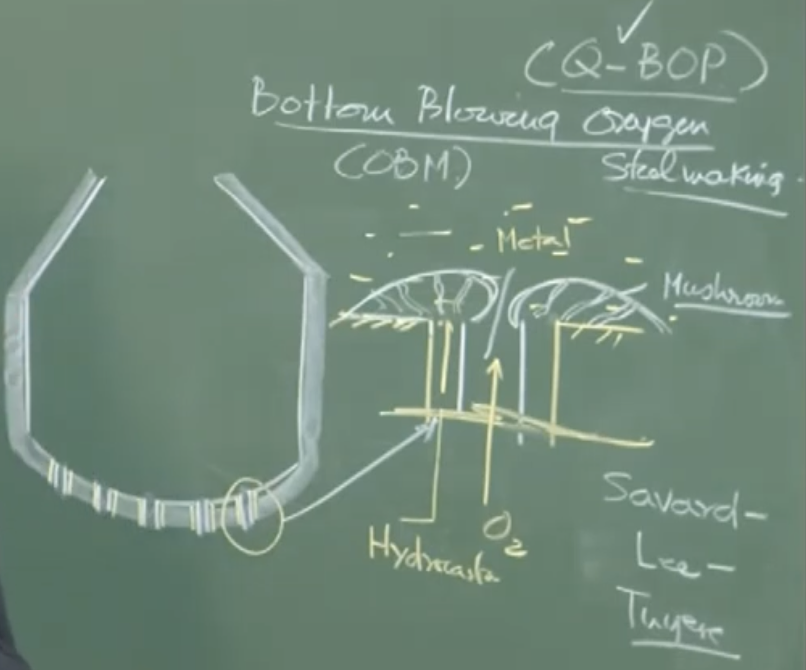
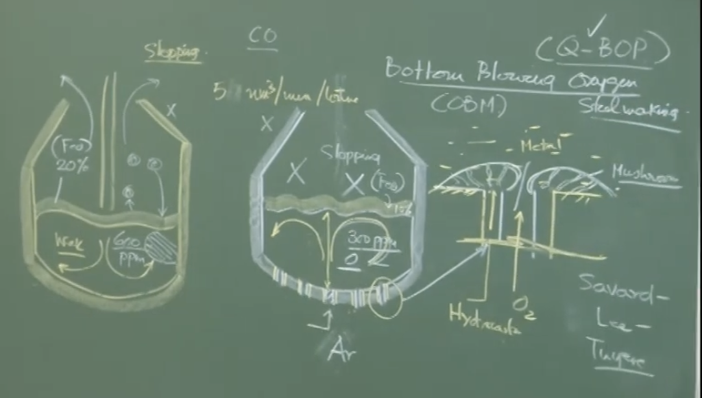

# Lecture Notes: Decarburization Kinetics and Bottom Blowing Oxygen Steelmaking

## 1. End-Point Control and Decarburization Kinetics

### Conceptual Explanation

Precise end-point control in oxygen steelmaking is critical due to the rapid nature of the process. High-quality steel and economic production are assured only if the target end-point chemistry (e.g., 0.1% or 0.01% Carbon) is hit perfectly without unnecessary over-blowing.

### Visual Extraction: Board Graphs


**Graph 1: Impurity Removal Curve (Carbon Concentration vs. Time)**

Plaintext

```
[%C]
4.3 |-\
    |  \
    |   \
    |    \
0.4 |     \---------
    |               \
    |                \ 
    +------|--------|-|------- Time (min)
           0       17 20
```

**Graph 2: Rate of Decarburization vs. Time**

Plaintext

```
-dC/dt
    |      _________
    |     /         \
    |    /           \
    |   /             \
    +--|-------------|-|------ Time (min)
       0             17 20
```

### Physical Interpretation of Decarburization

Decarburization is a multi-stage phenomenon. Initially, the rate increases as more oxygen is supplied. It then plateaus into a linear, steady-state period where the rate of oxygen supply perfectly matches the rate of carbon monoxide ($CO$) evolution. Finally, around 17 minutes, the curve tapers off into an exponential decay as the system runs out of carbon.

- **Mechanism:** Decarburization is **melt-phase transport controlled**, not chemical reaction controlled. The bottleneck is the physical transport/diffusion of dissolved carbon from the bulk liquid metal to the slag-metal interface.
    
- **Reaction at Interface:** $[C] + (FeO) \rightleftharpoons \{CO\} + Fe$
    
- **Equilibrium Condition:** Operating under specific steelmaking conditions, a generalized empirical relationship holds:
    
    $[\%C] \times (\%FeO) \approx 1.25$
    
    - _Example Calculation:_ If the slag contains $20\%$ FeO, the equilibrium carbon concentration is $C_{eq} = \frac{1.25}{20} = 0.0625\% \approx 0.05\%$ (or roughly $500 \text{ ppm}$).
        
- **Driving Force:** The driving force for the reaction is the concentration gradient: $([C] - [C_{eq}])$.
    

### Mathematical Derivation of the Tail-End Rate

**Important Remarks / Instructor Notes:** To accurately predict the end-point, one must model the tail end of the curve (17-20 minutes). Approximating this curve linearly ($\frac{\Delta C}{\Delta t}$) is mathematically incorrect and practically insufficient. The exact integrated exponential decay equation must be used.

The fundamental rate equation is given by:

$$-\frac{dC}{dt} = k([C] - [C_{eq}])$$

Integrating this from the onset of the tail-end period (e.g., $t = 17$ minutes, where initial concentration $C_{17} = 0.4\%$) yields the exact equation for end-point tracking:

$$\frac{[C] - [C_{eq}]}{C_{17} - [C_{eq}]} = \exp(-k(t - 17))$$

_Note: $k$ is an empirical mass transfer rate constant (units: $s^{-1}$) that varies heavily depending on vessel wear, lance age, and stirring intensity. It must be determined empirically by plotting $\ln([C])$ vs. $t$._

---

## 2. Gas Injection Devices in Steelmaking

### Conceptual Explanation

Gas injection is highly economical because a gas expands drastically at steelmaking temperatures (1 $\text{Nm}^3$ of gas expands to roughly 8 $\text{Nm}^3$ at 1600°C), providing massive specific stirring energy at a low cost.

### Visual Extraction: Gas Injection Devices

Plaintext

```
1. Lance           2. Tuyere          3. Porous Plug
   | |                | |               /   \  <-- Truncated cone
   | |                | |              /:::::\     (ceramic)
   | |                | |             /:::::::\
  (Top)             (Bottom)         (Micro-pores/Slits)
```

### Physical Interpretation

- **Lance:** Used for injecting top-blown large-volume gases at supersonic speeds.
    
- **Tuyere:** Used for injecting bottom-blown large-volume gases (e.g., Bessemer process).
    
- **Porous Plug:** Used when a small volume of gas (like Argon) is required strictly for stirring. It provides high flow resistance, diffusing the gas as fine bubbles.
    
- **Important Remarks:** While mechanical impellers (used in KR desulfurization) provide more intense stirring, gas stirring is much cheaper, requires less maintenance, and causes less contamination.
    

---

## 3. Bottom Blowing Oxygen Steelmaking (OBM / Q-BOP)

### Historical Problem & The Coaxial Tuyere Solution



In the 1930s, the Bessemer process failed to inject pure oxygen through bottom tuyeres because the intense localized heat melted both the tuyeres and the bottom refractory. The solution to making bottom-blowing viable was the invention of the **Savard-Lee Coaxial Tuyere**.

**Diagram: Coaxial Tuyere Cross-Section**

Plaintext

```
      [Top View]
       _______
     /         \
    /   _____   \    Outer Annulus: Hydrocarbon Gas (Propane)
   /  /       \  \       ↓
  |  |   O2    |  |  <-- Inner Pipe: Pure Oxygen
   \  \_______/  /
    \           /
      \_______/
```

- **Physical Interpretation:** Pure oxygen is blown through the center, while a hydrocarbon gas acts as a shroud. At 1600°C, the hydrocarbon undergoes "cracking" (dissociation). Because cracking is a highly **endothermic** reaction, it acts as a local coolant. This localized cooling solidifies a protective "mushroom" of metal over the tuyere, shielding the refractory.
    
- **Regional Nomenclature:** Known as **OBM** (Oxygen Bottom Maxhutte) in Europe and **Q-BOP** (Quiet Basic Oxygen Process) in North America.
    

### Kinetics vs. Top Blowing (LD Process)

- **Stirring Intensity:** Bottom blowing provides extreme agitation due to the direct momentum transfer of the gas and buoyancy-driven liquid circulation. The overall bath is inherently homogenous.
    
- **Approach to Equilibrium:** Due to unparalleled stirring, OBM systems operate much closer to thermodynamic equilibrium than LD converters.
    
    - _Slag FeO Content:_ ~10% (OBM) vs. ~20% (LD).
        
    - _Dissolved Oxygen:_ ~300 ppm (OBM) vs. ~600 ppm (LD).
        
- **Slopping:** Sporadic slopping (explosive ejection of metal and slag) is incredibly rare in OBM because the intense bath mixing prevents the pooling of unreacted, carbon-rich hot metal pockets.
    

### Limitations of Bottom Blowing

Despite higher yields and shorter blowing times, bottom blowing suffers from two fatal flaws:

1. **Hydrogen Pickup:** The cracking of the protective hydrocarbon gas introduces Hydrogen into the molten steel. The solubility is 28 ppm, and the steel regularly retains 4-5 ppm. High-quality steel (e.g., railway lines) strictly requires $<1$ ppm of Hydrogen to avoid catastrophic delayed cracking.
    
2. **Refractory Maintenance:** The bottom tuyere array requires far more frequent and expensive relining than top-blown LD vessels.
    
    

## 4. Conclusion & Outlook: Combined Blowing

To extract the benefits of bottom blowing (intense stirring, high yield, approach to equilibrium) while eliminating its flaws (hydrogen pickup, tuyere wear), modern plants overwhelmingly rely on **Combined Blowing (Bath Agitation Processes)**.

- **Mechanism:** Oxygen is blown from the top via a traditional lance, while inert Argon (comprising only 2-3% of total gas volume) is injected from the bottom using porous plugs strictly for stirring.
  
  
#  Audio V2


### **Part 1: Decarburization Kinetics & End-Point Control**

**Importance of End-Point Control**

- **End-point control** in oxygen steelmaking is critical because the process is very rapid.
    
- Precise control ensures high-quality steel and economic production.
    
- You cannot afford to do experiments for every heat; you must be able to predict the decarburization curve to hit diverse target chemistries (e.g., 0.1%, 0.12%, 0.17%, or 0.01% Carbon).
    

**The Impurity Removal Curve (Carbon vs. Time)**

- For a typical 20-minute blowing period, Carbon starts at roughly **4.3%**.
    
- The rate of decarburization ($-\frac{dC}{dt}$) has three distinct stages:
    
    1. **Increasing Rate:** Initially, as oxygen supply increases, more carbon gets removed.
        
    2. **Steady State:** The rate of oxygen supply exactly matches the rate of carbon monoxide ($CO$) evolution. The graph is a straight line ($-\frac{dC}{dt}$ is constant).
        
    3. **Decreasing Rate (The Tail End):** There is not much carbon left, creating a mismatch with the oxygen supply. The decarburization rate progressively falls (exponential decay) as a function of time. This curve does not necessarily go to zero; it stops at the target chemistry.
        

**Focusing on the Tail End (e.g., 17 to 20 minutes)**

- The most significant portion for simulating and predicting the end-point is the tail end (e.g., from **17 minutes** onwards).
    
- **Mechanism:** Decarburization is **melt-phase transport controlled** (a liquid-liquid mass transfer), _not_ chemical reaction controlled. The bottleneck is the transport of dissolved carbon from the bulk of the metal to the slag-metal interface.
    
- **Reaction at Interface:** $[C] + (FeO) \rightleftharpoons \{CO\} + Fe$
    
- **Equilibrium driving force:** The driving force for carbon to diffuse is the difference between the bulk concentration and equilibrium concentration: $C_{bulk} - C_{equilibrium}$
    
- **Empirical Relationship (Example):** Under specific oxygen steelmaking conditions, the equilibrium can be estimated as:
    
    **%C × %FeO in slag ≈ 1.25**
    
    - _Example:_ If FeO is 20%, then %C = 1.25 / 20 = **0.0625%** (roughly **500 ppm**). This is the equilibrium carbon content.
        

**The Rate Equation and Text Book Correction**

- The exact rate of decarburization is: $-\frac{dC}{dt} = k(C - C_{eq})$
    
- **Integrated Form:** By applying a coordinate transformation (e.g., setting $t=17$ minutes as the starting condition where $C_{17} = 0.4\%$), the integrated equation is:
    
    $$C - C_{eq} = (C_0 - C_{eq}) \exp(-kt)$$
    
- **Rate Constant ($k$):** Has the dimension of $s^{-1}$ (1/second). It is an empirical parameter that must be determined specifically for each plant/vessel by plotting $\ln(C)$ vs $t$ (the slope yields $k$). It varies based on vessel geometry, lance wear, and refractory erosion.
    
- **Instructor Note/Textbook Correction:** The professor explicitly noted a typographical error in their textbook. You **cannot** use a linear approximation ($\frac{\Delta C}{\Delta t}$) for this tail-end curve because it is an exponential decay. The textbook table showing concentration vs. time was arbitrarily constructed using a rate constant of $1 \text{ s}^{-1}$, which was implicitly omitted in the text. You must use the exact exponential rate equation for precise end-point estimation.
    

---

### **Part 2: Gas Injection & Stirring Methods**

**Why Gas Stirring?**

- Gas stirring is incredibly cheap and efficient.
    
- **Expansion rule:** 1 Normal cubic meter ($\text{Nm}^3$) of gas expands to as much as **8 $\text{Nm}^3$** under steelmaking conditions (at 1600°C) due to ideal gas behavior.
    
- Types of Gas Injection Devices (Consumables that require periodic replacement due to intense heat):
    
    1. **Lance:** Vertical tube used for top blowing (LD converter).
        
    2. **Tuyere:** Used for bottom blowing (e.g., Bessemer process).
        
    3. **Porous Plug:** A truncated, solid ceramic cone with micro-pores or vertical slits. Used when a **small volume** of gas (like Argon) is required strictly for stirring. It provides high resistance to flow.
        

**Impellers vs. Gas**

- Mechanical impellers (like those used in the **KR process for desulfurization** pretreatment) provide more intense stirring than gas but are expensive, wear out quickly, and can contaminate the steel. Gas is preferred for secondary steelmaking to avoid contamination.
    

---

### **Part 3: Bottom Blowing Oxygen Steelmaking (OBM / Q-BOP)**

**The Coaxial Tuyere Solution**

- _Historical failure:_ Between 1932-1935, attempts to blow pure oxygen through a single tuyere in a Bessemer converter failed. The exothermic reaction melted the tuyeres and local refractory instantly.
    
- _The Fix:_ The **Savard-Lee Coaxial Tuyere**.
    
    - **Inner pipe:** Carries pure oxygen.
        
    - **Outer pipe (annulus):** Carries a hydrocarbon gas (like propane).
        
- **How it works:** At high temperatures, the hydrocarbon gas undergoes "cracking" (dissociation). Cracking is a highly **endothermic** reaction (absorbs heat), which creates a local cooling effect. This cooling solidifies the molten metal into a protective **"mushroom"** shape over the tuyere, protecting both the tuyere and the refractory.
    
- **Nomenclature:**
    
    - **OBM:** Oxygen Bottom Maxhutte (European name).
        
    - **Q-BOP:** Quiet Basic Oxygen Process (American name – "Quiet" because it produces less external noise than top blowing).
        

**Kinetics: Top Blowing (LD) vs. Bottom Blowing (OBM/Q-BOP)**

- _Thermodynamics are identical_ (Si, S, P, Mn are all removed). The difference is entirely in the **kinetics** (stirring).
    
- **LD (Top Blowing):** Poor bulk stirring. Creates an emulsion phase via supersonic jet impingement. Prone to in-homogeneities.
    
- **Bottom Blowing:** No emulsion phase. Direct momentum exchange and buoyancy of the gas (flowing at rates like 50 $\text{Nm}^3$/min/ton) create extreme bath stirring and excellent slag-metal mixing.
    

**Advantages of Bottom Blowing**

1. **Operates Closer to Equilibrium:** Because the bath is so well stirred, it reaches thermodynamic equilibrium much better than LD.
    
    - _Slag FeO:_ ~10% (Bottom) vs. ~20% (Top).
        
    - _Dissolved Oxygen:_ ~300 ppm (Bottom) vs. ~600 ppm (Top).
        
2. **Higher Yield:** Less iron oxide loss into the slag.
    
3. **Less Deoxidizer Needed:** Lower dissolved oxygen means fewer deoxidizers are needed in secondary steelmaking.
    
4. **No Slopping:** "Slopping" (explosive ejection of gas/metal/slag, like opening a shaken coke bottle) happens in LD when unmixed, carbon-rich hot metal pockets suddenly react with oxygen. Because bottom-blown baths are perfectly homogeneous, slopping is extremely rare/non-existent.
    

**Disadvantages of Bottom Blowing**

1. **Refractory Maintenance:** The bottom tuyeres and lining still require much more frequent maintenance and vessel turn-down time than an LD converter.
    
2. **Hydrogen Pickup (Crucial Flaw):** The cracking of the hydrocarbon cooling gas introduces Hydrogen into the steel.
    
    - Solubility of H at 1600°C is **28 ppm**. The steel often retains 2 to 5 ppm.
        
    - Hydrogen is extremely dangerous as it causes delayed cracking (e.g., causing railway lines to crack in the winter).
        
    - Indian Railways strictly require vacuum degassing to bring Hydrogen to **< 1 ppm**. Bottom blowing cannot meet this requirement natively.
        

---

### **Part 4: Conclusion – Combined Blowing (Bath Agitation Process)**

- Because Top Blowing has poor stirring/yield and Bottom Blowing causes Hydrogen pickup/refractory wear, the modern industry standard is **Combined Blowing**.
    
- **Configuration:** * Oxygen is blown from the top via a lance.
    
    - A small amount of inert **Argon** (only 2% to 3% of total gas volume) is injected from the bottom via **Porous Plugs**.
        
- This achieves the extreme stirring and equilibrium benefits of bottom blowing without the hydrogen contamination or severe tuyere wear. The professor noted this will be discussed further in the next lecture.
    
