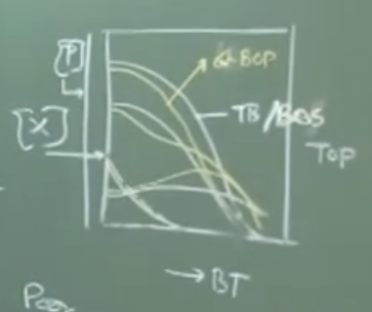
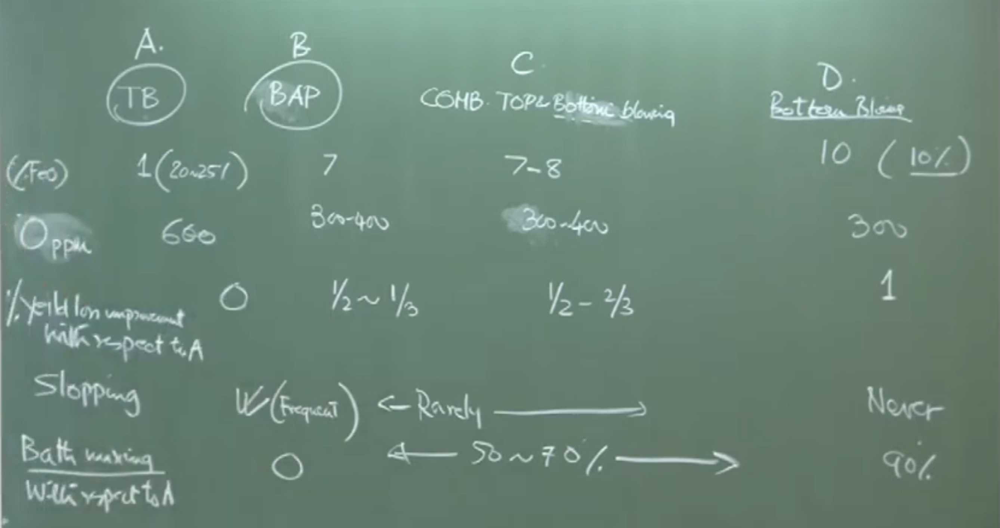

# Oxygen Steelmaking: Combination Blowing, Process Control, and Enhancements

## 1. Combination Blowing and Bath Agitation Processes

The pure top-blowing Basic Oxygen Furnace (BOF/LD process) suffers from a major hydrodynamic disadvantage: while reactions dominate aggressively in the top slag-metal phase, the bulk liquid metal at the bottom of the converter remains relatively unstirred  To resolve this, modern steelmaking introduces bottom blowing.

### Types of Bottom-Assisted Processes:

1. **Pure Bottom Blowing (BOS/OBM):** Oxygen is injected through the bottom via coaxial tuyeres.
    
2. **Combined Blowing:** Significant fractions of oxygen are blown from both the top lance and the bottom tuyeres.
    
3. **Bath Agitation Process:** Oxygen is blown from the top, while a very small volume (2-3% of total top gas) of inert gas (Argon) is injected through bottom porous plugs (usually 6, 8, or 12 plugs arranged concentrically) 
    

**Physical Interpretation:**

Argon does not react but provides deep bath stirring. As the bubbles rise, they induce bulk fluid motion, homogenizing the bath without generating extreme local temperatures at the bottom refractories (which happens when blowing oxygen from the bottom).

### Kinetics vs. Thermodynamics

Because vessel geometry and chemical inputs remain practically identical, the **thermodynamics** (the equilibrium states of decarburization, dephosphorization, etc.) are fundamentally unchanged. However, the **kinetics** (rate of reaction) are significantly accelerated due to enhanced mass transfer from the intense argon stirring 
#### Board Work: Elemental Removal Curves

_Instructor Note: The nature of metallic oxidation remains essentially the same, but the duration shrinks in bottom-assisted processes._


Plaintext

```
Concentration (%)
 4.5|   C (Carbon)
    |  \
 3.0|   \                 Mn
    |    \            . - - - .
    |     \         /           \
 1.0| Si   \      /               \
    | \     \   /                   \
    |   \    \/                       \
    |     \  / \                        \
 0.0|______/____\_________________________\____ Blow Time (mins)
           5         10         15         20

* Note 1: Phosphorus (P) follows a simultaneous continuous drop but on a much finer scale (e.g., dropping from 0.1% to 0.01%).
* Note 2: For bottom-stirred or bath agitation processes, these exact curves shift leftward, finishing 2-3 minutes faster.
```

---

## 2. Comparative Performance of Oxygen Steelmaking

A comparative matrix allows us to evaluate the efficiency of top blowing (A), bath agitation (B), combined blowing (C), and pure bottom blowing (D).

**Conceptual Explanation of Tap Carbon vs. Dissolved Oxygen:** As carbon drops, dissolved oxygen increases. Because bottom blowing drives the system closer to thermodynamic equilibrium, it leaves significantly less unreacted oxygen in the metal and less trapped iron oxide (FeO) in the slag at the same carbon level 
#### Board Work: Dissolved Oxygen at Tapping

Plaintext

```
Dissolved Oxygen (ppm)
 |
 |   (A) Top Blowing (0 Nm³/t/hr bottom gas)
 |      *
 |        *
 |          * ~600 ppm O
 |
 |               (B) Bath Agitation (0.1 Nm³/t/hr)
 |                 *
 |                   * ~350-400 ppm O
 |
 |                        (D) Bottom Blowing (5 Nm³/t/hr)
 |                           *
 |                             * ~300 ppm O
 |________________________________ Tap Carbon (%)
```

### Performance Matrix



| **Parameter**         | **(A) Top Blowing** | **(B) Bath Agitation** | **(D) Bottom Blowing**   |
| --------------------- | ------------------- | ---------------------- | ------------------------ |
| **Slag FeO Content**  | High (~20–25%)      | Intermediate           | Low (~10%)               |
| **Dissolved Oxygen**  | ~600 ppm            | ~350–400 ppm           | ~300 ppm                 |
| **Yield Loss**        | High (Baseline 0)   | Improved (~0.5%)       | Best (~1.0% improvement) |
| **Sloping Incidence** | Frequent            | Rare                   | Never                    |
| **Bath Mixing**       | Poor (Baseline)     | Good (50–70% better)   | Excellent (90% better)   |
|                       |                     |                        |                          |
|                       |                     |                        |                          |

**Important Remark:** Bath agitation (Process B) is heavily favored in modern plants because it delivers nearly the metallurgical benefits of bottom blowing while protecting bottom refractories from the extreme thermal wear caused by bottom-blown oxygen 

---

## 3. Process Control & Automation

Because converter environments are extremely hazardous and a complete blow is finished in just 15-20 minutes, manual adjustment relies on subjective observations (like flame color) and is prone to error. Automation is mandatory 

Once a blow starts, the operator only has **two independent variables** to control:

1. Lance Height
    
2. Oxygen Flow Rate
    

### Feedback and Instrumentation ]

To adjust those variables, control systems rely on heavy instrumentation:

- **Sub-lance:** A retractable probe that dips into the melt to dynamically measure temperature and carbon composition.
    
- **Off-gas analyzers:** Measure CO/CO₂ ratios exiting the mouth to calculate decarburization rates.
    
- **Accelerometers:** Attached to the vessel to measure vibrations caused by supersonic jet-metal interactions (indicates foaming/slag thickness).
    
- **Load cells & Thermocouples:** Measure system weight and refractory temperatures.
    

### Static vs. Dynamic Models

**1. Static Models (Offline / Charge Control)** 

Run before the heat begins, these use simple stoichiometric, material, and enthalpy balances to calculate the required inputs based on target outputs.

_Extracted Derivation Equations:_

$$ \text{Total Fe} = \text{Fe}_{\text{hot metal}} + \text{Fe}_{\text{scrap}} = \text{Fe}_{\text{steel}} + \text{Fe}_{\text{slag}} $$

To calculate lime requirements based on desired thermodynamic slag basicity ($V$):

$$ V = \frac{\% \text{CaO}}{\% \text{SiO}_2} \approx 3.5 $$

$$ \text{Weight of } \text{SiO}_2 = f(\text{Weight of Si in Hot Metal}) $$

$$ \text{Total Lime ($CaO$) Required} \approx 3.5 \times \text{Weight of } \text{SiO}_2 $$

**2. Dynamic Models (Online / Process Steering)** 

These utilize the real-time feedback loop from the sub-lance and off-gas analyzers to steer the blow trajectory. They calculate exactly when to raise the lance and cut the oxygen flow to perfectly hit the target tap carbon and endpoint temperature without over-oxidizing.

---

## 4. Enhancements in Converter Operation

Two major advancements have revolutionized the economic viability of the BOF process:

### A. Slag Splashing (Refractory Protection)

Lining life is a critical economic metric (ranging from 2,000 to >20,000 heats). Slag splashing is the primary method to reach the upper end of this range.

- **Mechanism:** After tapping the liquid steel, some liquid slag is intentionally left inside the converter. The top lance is lowered, and high-pressure **Nitrogen** (not oxygen) is blown into the vessel.
    
- **Physical Interpretation:** The jet impingement pushes the semi-fluid slag radially and up the converter walls. The high-temperature oxide slag sinters and coats the refractory bricks 
    
- **Benefit:** The coated slag acts as a sacrificial wear-layer for the next heat, delaying refractory exposure and dramatically multiplying the vessel's lifespan.
    

### B. Post-Combustion (Thermal Efficiency)

Normally, carbon leaves the steel bath as Carbon Monoxide (CO). However, immense chemical heat remains locked in that CO gas.

- **Reactions:** $C \to CO$ yields $\Delta H \approx 114 \text{ kJ/mol}$
    
    $CO \to CO_2$ yields $\Delta H \approx 395 \text{ kJ/mol}$ 
    
- **Mechanism:** Secondary "atmospheric injectors" pump oxygen into the upper cone of the converter to oxidize the rising CO into CO₂.
    
- **Benefit:** The massive release of sensible/chemical heat is convectively directed back down into the liquid bath.
    
- **Economic Impact:** The artificially raised bath temperature allows the operator to melt significantly more cold steel scrap per heat, effectively increasing overall metallic yield for a given volume of expensive liquid hot metal 


# Audio V2 

# Lecture 25: Oxygen Steelmaking – Combination Blowing, Process Control, and Enhancements

## 1. Introduction to Combination Blowing

The pure top-blown Basic Oxygen Furnace (BOF / LD process) has a major disadvantage: reactions dominate aggressively in the top slag-metal phase, but the bulk liquid metal at the bottom remains relatively unstirred.

To solve this, **Combined Blowing** and **Bath Agitation** processes were developed. They share characteristics of both top and bottom-blown systems.

- **Top Blowing:** Uses multi-hole water-cooled lances to inject oxygen.
    
- **Bottom Blowing:** * If blowing **Oxygen**, it requires **coaxial tuyeres** to protect the bottom.
    
    - If blowing **Inert Gas (Argon)**, it uses **porous plugs**.
        

### The Bath Agitation Process

This is a highly popular version of combination blowing.

- **Mechanism:** Oxygen is blown from the top lance, while a small amount of Argon is injected through the bottom porous plugs.
    
- **Volume:** The bottom argon volume is very low—only **2% to 3%** by volume of the top gas.
    
- **Plug Configurations:** Typically uses 6, 8, or 12 concentric porous plugs (located on one side or symmetrically across the central plane).
    
- **Advantage:** Argon solely provides deep bath stirring. It induces fluid motion to homogenize the bulk liquid without the intense localized heat generation that damages bottom refractories when oxygen is blown from the bottom.
    

---

## 2. Process Kinetics & Elemental Removal

Because the vessel geometry is identical across these variations, the **thermodynamics** (dephosphorization, desulphurization, decarburization) remain unchanged. However, the **kinetics** (rate of reaction) change significantly due to the stirring intensity.

- **Elemental Removal Curves:** The oxidation profiles for C, Si, Mn, and P are remarkably similar in shape for both top and bottom-assisted processes.
    
- **Time Shift:** The primary difference is the **duration of the blow**. In bottom-blowing/bath agitation, the enhanced kinetics reduce the total blow time by **2 to 3 minutes** compared to pure top blowing.
    
- _Note on Silicon:_ Almost all Silicon is completely oxidized and removed within the first 3 minutes of the blow.
    

---

## 3. The Crux of Modern Steelmaking: Economics & Quality

While blowing oxygen into carbon-saturated pig iron easily makes steel, the modern engineering challenges are:

1. **Economics:** Maximizing yield (e.g., you cannot afford to have 600 kg out of 950 kg of iron end up in the slag).
    
2. **Quality:** Meeting strict customer demands for cleanliness and microstructure.
    
    - _Historical Context:_ Decades ago, 150 $\mu$m to 200 $\mu$m inclusion sizes were acceptable.
        
    - _Modern Context:_ Today, inclusions must be no larger than **30 $\mu$m**, and the overall population of inclusions must be extremely low to prevent structural collapse (e.g., from hydrogen embrittlement).
        
3. **Environmental Pressure:** Reducing greenhouse gas emissions and improving the carbon footprint.
    

### Comparative Performance Matrix

If we grade the different oxygen steelmaking processes on various operational metrics (where Top Blowing is the baseline "A" and Bottom Blowing is the extreme "D"):

|**Parameter**|**Top Blowing (0 Nm³/t/hr bottom gas)**|**Bath Agitation (~0.1 Nm³/t/hr bottom gas)**|**Bottom Blowing (~5 Nm³/t/hr bottom gas)**|
|---|---|---|---|
|**FeO in Slag**|High (20–25%)|Intermediate|Low (~10%)|
|**Dissolved Oxygen**|~600 ppm|~350–400 ppm|~300 ppm|
|**Yield Loss Improvement**|0% (Baseline)|~0.5%|~1.0%|
|**Sloping Incidents**|Frequent|Rare|Never|
|**Bath Mixing Improvement**|0% (Baseline)|50–70% Better|90% Better|

_Conclusion:_ Due to the ideal balance of high yield, good mixing, and prolonged refractory life (no bottom oxygen damage), the **Bath Agitation Process** is currently the favored choice for modern steelmakers.

---

## 4. Process Control and Automation

LD Converters are massive (300 to 500 tons, 300 meters tall) and feature extremely hazardous environments (heat, dust, high radiation). The reactions are so fast (15-20 minutes total) that manual intervention is nearly impossible.

_Historical Note:_ On older Bessemer/BOF converters, experienced operators judged the bath's oxidation state purely by looking at the color of the flame (CO burning to $CO_2$) at the converter mouth. Today, exhaust hoods cover the mouth, and this subjective method is obsolete.

### Modern Control Equipment

- **Sub-lance:** A retractable probe that dips into the melt to measure temperature and carbon composition dynamically.
    
- **Off-gas analyzers:** Measure the exact composition of exiting gases.
    
- **Accelerometers:** Attached to the converter to measure vibrations caused by supersonic jet-metal interactions (indicates foaming and slag levels).
    
- **Load cells:** Measure the exact weight of materials.
    
- **Thermocouples (e.g., Tempcore):** Inserted to measure refractory heating.
    
- **Flow meters & Pressure gauges.**
    

### Static vs. Dynamic Models

Operators rely on highly automated models. Once the blow starts, the operator only has **two variables** to play with: **Lance Height** and **Oxygen Flow Rate**.

**1. Static Models (Offline / Charge Control):**

- Run _before_ the heat begins (offline in a laboratory/control room).
    
- Based strictly on **Material and Enthalpy (Heat) Balances**.
    
- Calculates exactly how much hot metal, scrap, and lime (CaO) to charge to reach a target temperature (e.g., 1600 °C) and a target composition.
    
- _Example:_ If thermodynamics dictate a slag basicity ($V$-ratio) of 3.5 is needed to remove Phosphorus, the static model calculates the total silicon in the hot metal, the resulting $SiO_2$ produced, and multiplies it by 3.5 to determine the exact kg of lime to add.
    
- _Limitation:_ It calculates totals but cannot dictate the blowing path/strategy.
    

**2. Dynamic Models (Online / Feedback Control):**

- Run _during_ the blow to steer the process.
    
- Uses a feedback loop from the sub-lance and off-gas analyzers.
    
- Predicts exactly when the target carbon is reached, telling the operator when to simultaneously cut the oxygen flow and retract the lance.
    

---

## 5. Major Furnace Enhancements

To make BOF steelmaking economically unbeatable, two major operational enhancements were developed over the last 30-40 years:

### A. Slag Splashing (Refractory Life Extension)

Refractory lining life dictates how often a converter must be taken offline for relining (historically every 2,000 heats, now up to 20,000 heats).

- **The Technique:** After tapping the metal, a small amount of liquid slag is left inside. The lance is lowered, and high-pressure **Nitrogen** (not oxygen) is blown into the vessel.
    
- **Mechanism:** The impinging nitrogen jet forces the semi-fluid oxide slag to flow radially and upward along the converter walls.
    
- **Result:** Because the refractory is slightly cooler, the high-temperature slag sinters and coats the bricks, providing a sacrificial protective layer for the next heat. This drastically reduces daily refractory consumption.
    

### B. Post-Combustion (Thermal Efficiency)

Normally, Carbon oxidizes to Carbon Monoxide ($C \to CO$), which yields about 114 kJ/mol of energy. However, converting that CO to Carbon Dioxide ($CO \to CO_2$) yields a massive 395 kJ/mol.

- **The Technique:** Secondary "atmospheric injectors" pump oxygen into the upper cone of the converter.
    
- **Mechanism:** This oxygen burns the rising CO gas into $CO_2$ inside the vessel.
    
- **Result:** The heat is convectively directed back down into the liquid bath (rather than radiating into the refractories).
    
- **Economic Benefit:** This extra heat allows the operator to charge **more cold scrap** steel into the melt (which is cheaper than hot metal), significantly improving the overall metallic yield.
    

---

_Instructor's closing thought: Because of these massive efficiencies and the sheer volume of integrated blast furnace/BOF systems, oxygen steelmaking will remain the dominant global technology for the foreseeable future. The next topics in the course will be Electric Arc Furnace (EAF) steelmaking, tapping, deoxidation, and ladle metallurgy._
