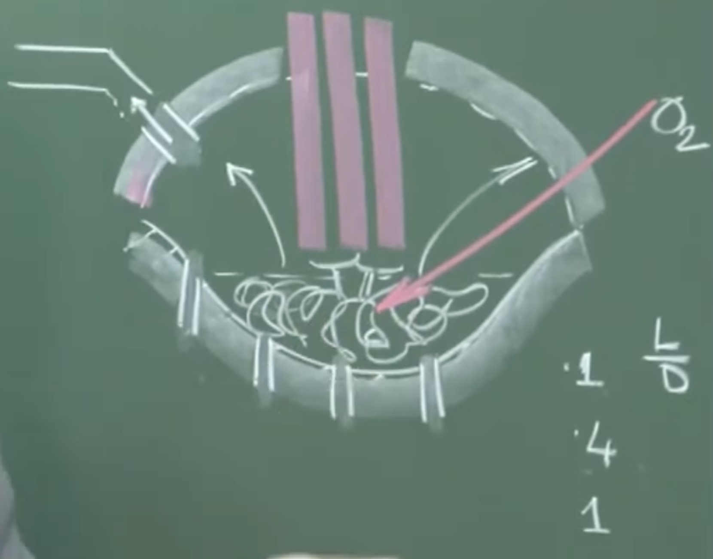
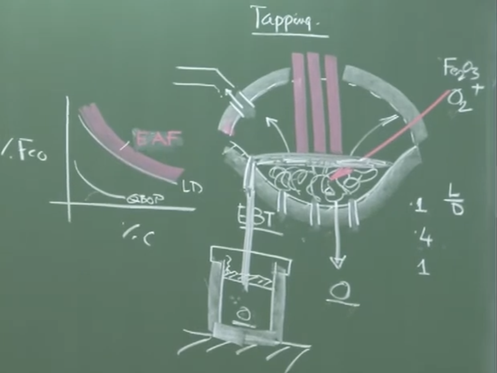

# Lecture 27: Electric Arc Furnace (EAF) Steelmaking & Refining

## 1. Energy Balance in EAF Steelmaking

### Board Work & Visual Extraction

**Energy Input:**

- **`60 - 65%`** : Electrical Energy (`~400 kWh/tonne` minimum requirement)
    
- **`35 - 40%`** : $\begin{cases} \text{Oxyfuel burners} \\ \text{Metalloid oxidation} \end{cases}$
    

**Energy Output:**

- **`50 - 55%`** : Crude Steel (Sensible heat of the molten metal)
    
- **`10%`** : Slag
    
- **`20%`** : Off gas
    
- **`15 - 20%`** : Cooling panels (Roof and wall heat losses)
    

### Conceptual Explanation & Instructor Remarks

- **Electrical Requirement**: The minimum electrical energy required just for melting the solid charge is around 350 to 400 kWh/tonne. An additional 150 to 300 kWh/tonne is required for the refining stage depending on furnace efficiency.
    
- **Metalloid Oxidation**: Heat is supplied chemically by oxidizing elements like Carbon (C) and Silicon (Si). Solid pig iron is often charged alongside Scrap and DRI (Direct Reduced Iron) to intentionally provide carbon and silicon, which generate exothermic heat upon oxidation.
    
- **Variability**: These percentages are representative. They can fluctuate by $\pm 10\%$ depending on furnace design (e.g., Quantum EAFs, scrap preheating technologies, and surface-area-to-volume ratio).
    

---

## 2. Furnace Geometry and Aspect Ratios

### Board Work & Visual Extraction

**Diagram: Furnace Cross-Sections & Aspect Ratios ($L/D$)**

The instructor drew a cross-section of a traditional, shallow EAF featuring a roof, 3 graphite electrodes penetrating the furnace, and an Eccentric Bottom Tapping (EBT) system.

**Aspect Ratio Comparison ($L/D$ = Depth of Metal / Maximum Vessel Diameter):**

- **EAF**: $\approx 0.1$ (Extremely shallow bath)
    
- **BOF (Basic Oxygen Furnace)**: $\approx 0.4$
    
- **Ladle**: $\approx 1.0$ (Deep cylindrical vessel)
    

### Conceptual Explanation

- **Why was the EAF traditionally shallow?** In the past, there were no bottom-stirring facilities. A deep bath would have resulted in poor heat and mass transfer. A large surface area (shallow depth) was necessary to facilitate reactions, borrowing concepts from the old Open-Hearth processes.
    
- **Modern Geometry Changes**: With the introduction of bottom argon stirring and top oxygen lancing, vigorous stirring can now be imparted mechanically. Consequently, a shallow bath is no longer a strict constraint.
    
- **The Conarc Process**: Many modern plants use a Conarc (Converter + Arc) geometry, where an oxygen blowing facility and electric arcing occur in the same shell. These modern EAF shells often resemble the deeper geometries of a BOF rather than the traditional shallow EAF.
    

---

## 3. The Refining Period and Slag Practices

Once the "meltdown" period finishes (duration $\approx 30-45$ minutes), the refining stage begins. Slag chemistry is manipulated based on the desired steel quality.

### Board Work & Visual Extraction

**Refining Practices:**

`1) Oxidising slag`

`2) Double Oxidising Slag X` _(Marked with an 'X' to denote it is uneconomical/obsolete)_

`3) Double slag practice (Ox - Redu).  

`4) Oxidising converted to a reducing slag`

Sulphur requires reducing and Phosphorus required Oxidising environment 

### Detailed Breakdown of Slag Practices (Merged Notes)

#### 1. Single Oxidising Slag

- **Application**: Used for standard plain carbon steel scrap.
    
- **Mechanism**: Lime and spar are added to make a basic synthetic slag. Oxygen (or iron oxide) is injected to drive out carbon (decarburization) and completely oxidize Silicon and Aluminum.
    
- **Constraint**: Because the basicity is kept moderate, it does not achieve high degrees of phosphorus removal.
    

#### 2. Double Oxidising Slag (Uneconomical)

- **Mechanism**: A first oxidizing slag is prepared to remove early impurities. It is then tapped (removed), and a _fresh_ highly basic oxidizing slag is created to forcefully eliminate phosphorus.
    
- **Physical Interpretation**: Dumping 2 to 4 tons of liquid slag at $1600^\circ\text{C}$ throws away an immense amount of electrically generated heat. Therefore, this practice is largely obsolete.
    

#### 3. Double Slag Practice (Oxidizing $\rightarrow$ Reducing)

- **Application**: Required for ultra-low Carbon, ultra-low Phosphorus, and ultra-low Sulfur steels.
    
- **Mechanism**:
    
    1. First, a basic _oxidizing_ slag eliminates C and P.
        
    2. The oxidizing slag is thoroughly tapped out, and oxygen lancing is shut off.
        
    3. A fresh _reducing_ basic slag (carbidic or aluminous) is added, combined with bottom argon stirring.
        
    4. The reducing environment effectively eliminates Sulfur.
        

#### 4. Oxidizing Converted to a Reducing Slag

- **Application**: Crucial for Alloy/Stainless Steelmaking where valuable partially oxidizable elements (like Chromium) are present in the scrap.
    
- **Mechanism**: During the initial oxidizing phase to remove Carbon, Chromium is unavoidably oxidized into the slag. Instead of removing the slag, reducing agents (calcium carbide, ferrosilicon, or aluminum shots) are added to reduce the oxygen potential of the slag.
    
- **Result**: Chromium oxide is reduced back into the liquid metal, recovering the valuable alloy.
    
- **Important Remark**: Phosphorus cannot be removed in this practice. The moment the slag is reduced, any captured phosphorus would revert back into the liquid steel.
    

---

## 4. Alloy Steelmaking & Ball Bearing Steel (HC vs LC Ferrochrome)

### Important Remarks / Instructor Notes

**Primary Rule:** The primary EAF vessel should _only_ be used for decarburization and dephosphorization. Alloying should **never** be done in the primary EAF because the slag is rich in FeO, meaning expensive alloying elements will just oxidize into the slag. EAF equilibrium is similar to an LD converter.

Alloying is done in the **Ladle** (Secondary Steelmaking) _after_ the steel is tapped via EBT (Eccentric Bottom Tapping) to ensure $< 0.1\%$ FeO carryover. The steel must be **deoxidized** (using Al for killed steel down to 10 ppm O, or Si for 100 ppm O) before alloying.

### Case Study: Ball Bearing Steel (HC FeCr vs. LC FeCr)

Ball bearing steel requires Chromium.

- **Low Carbon Ferrochrome (LC FeCr)**: Easy to use, does not add unwanted carbon, but is extremely expensive.
    
- **High Carbon Ferrochrome (HC FeCr)**: Cheaper, but adds high amounts of unwanted carbon back into the steel.
    

**Strategic Physical Chemistry**:

If a plant wants to save money by replacing 45-50% of LC FeCr with HC FeCr, they face a thermodynamic problem in an undeoxidized bath (~600 ppm O): Both C and Cr will want to oxidize.

To selectively oxidize the Carbon from the HC FeCr while keeping the Chromium in the melt, the following precise Ladle conditions are required:

1. **Higher Basicity Slag**: Chromium behaves as a basic oxide; a highly basic calcium oxide slag repels Chromium from entering the slag phase.
    
2. **Elevated Temperature**: Tapping at $+5^\circ\text{C}$ to $+10^\circ\text{C}$ higher temperature dynamically increases Carbon's affinity for Oxygen over Chromium's affinity.
    
3. **High Argon Stirring Rate**: Creates thousands of bubble-liquid interfaces, lowering the partial pressure of CO gas, thus forcefully driving the $C + O \rightarrow CO$ reaction forward.
    

---

## 5. Modern EAF Process Developments

To remain competitive with BOF steelmaking, the EAF has adopted several borrowed technologies:

- **Water Cooling Panels**: Extend roof and wall life.
    
- **Ultra High Power (UHP) Transformers**: Expedite melting times.
    
- **Foamy Slag Practice**: Envelopes the arc, protecting the roof from radiation and improving thermal efficiency.
    
- **Eccentric Bottom Tapping (EBT)**: Prevents slag entrainment during ladle transfer.
    
- **Post-Combustion**: Recovering chemical heat from CO evolving into the freeboard.
    
- **The Consteel Process**: Waste off-gases travel counter-current to the incoming scrap conveyor belt. Preheating a 60-ton scrap charge from $25^\circ\text{C}$ to $400^\circ\text{C}$ drastically reduces electrical consumption.
    
- **Twin Shell EAFs**: One shell preheats scrap while the other refines, with the electrode roof swinging between the two so electrodes never cool down.
    
- **Closed-Loop Process Control**: Water-cooled off-gas probes monitor exhaust temperature, CO, and CO₂ in real-time, feeding PLCs to automate corrective algorithms.
  
  
  # Audio V2 
  
# Lecture 27: Electric Arc Furnace (EAF) Steelmaking & Refining

## 1. Overview of EAF Steelmaking

- **Global Dominance**: The EAF route produces nearly 30–35% of the world's steel.
    
- **Charge Materials**: EAFs no longer just use scrap; they increasingly charge hot metal, DRI (Direct Reduced Iron), and solid pig iron depending on economic conditions.
    
- **Hybrid Steelmaking**: Getting popular to exploit market situations. A steelmaking unit might have both a Blast Furnace (BF) to Basic Oxygen Furnace (BOF) route and EAF technologies running in tandem.
    

## 2. Energy Balance in EAF

- **Energy Input**:
    
    - **60–65%** comes from Electrical Energy.
        
        - Bare minimum requirement for melting down: **350 to 400 kWh/ton**.
            
        - Additional requirement for refining and efficiency: **150 to 300 kWh/ton**.
            
    - **35–40%** comes from Chemical Energy (Oxy-fuel burners and metalloid oxidation).
        
        - Charging solid pig iron provides additional carbon and silicon, which burn exothermically to generate chemical heat.
            
- **Energy Output** (Approximate values, $\pm 10\%$ variation based on furnace design and hot metal proportion):
    
    - **50–55%**: Crude steel (retained as sensible heat).
        
    - **10%**: Slag.
        
    - **20%**: Off-gas.
        
    - **15–20%**: Cooling panels (water-cooled roof and walls).
        
 
## 3. Furnace Geometry and Aspect Ratios

- **Aspect Ratio (Depth of liquid metal / Vessel diameter)**:
    
    - **EAF**: Traditionally very shallow, ~0.1.
        
    - **BOF**: ~0.4.
        
    - **Ladle**: Deep vessel, ~1.0 (requires a freeboard space to prevent spilling during transport).
        
- **Evolution of EAF Geometry**:
    
    - Traditionally, EAFs were wide and shallow (saucer geometry) because, like Open Hearth furnaces, they lacked bottom stirring and relied on a large surface area for heat/mass transfer.
        
    - With modern bottom argon stirring and oxygen lancing, vigorous mechanical stirring is possible. Thus, EAFs can now adopt deeper geometries similar to BOF converters.
        
- **Conarc Process (Converter + Arc)**: A hybrid process where the same deep shell geometry is used for both oxygen blowing (converter mode) and electric arcing.
    

## 4. The Melting and Refining Process

- **Meltdown Period**: Can take 30 to 45 minutes. Electrodes are initially run at lower power to prevent sparking and roof damage, then increased to maximum throttle as the scrap melts and the bath level drops. Oxygen is blown during melting to provide chemical heat via iron and metalloid oxidation.
    
- **Refining Phase**: Starts after complete meltdown. Because scrap has low Si and P, EAF slag volume is generally small (unless hot metal is added). Slag must always be **basic** (requires lime addition).
    
  
### Four Distinct Slag Practices

1. **Single Oxidizing Slag**:
    
    - Used for plain carbon steel scrap.
        
    - Lime and a little fluorspar are added. $O_2$ or Iron Oxide is injected to drive out C, Si, and Al into the slag.
        
    - **Limitation**: Cannot achieve highly basic conditions (e.g., basicity of 3.5 or 4), so it is not ideal for high phosphorus removal.
        
2. **Double Oxidizing Slag**:
    
    - Used to remove high levels of both impurities and phosphorus.
        
    - Make an initial oxidizing slag $\rightarrow$ remove it $\rightarrow$ prepare a fresh, highly basic oxidizing slag to remove P.
        
    - **Limitation**: Rarely used today because tapping 2–4 tons of liquid slag at 1600°C causes massive electrical heat loss.
        
3. **Double Slag Practice (Oxidizing $\rightarrow$ Reducing)**:
    
    - Used for premium steels requiring ultra-low Carbon, Phosphorus, and Sulfur.
        
    - **Step 1**: Basic oxidizing slag removes C and P. Slag is fully tapped. Oxygen is shut off.
        
    - **Step 2**: Fresh, highly basic reducing/neutral slag (carbidic or aluminous, with practically zero FeO) is added with bottom argon stirring to remove S.
        
4. **Oxidizing Converted to a Reducing Slag**:
    
    - Crucial for stainless/alloy steelmaking where scrap contains valuable, partially oxidizable elements like Chromium (Cr).
        
    - During decarburization, Cr inadvertently oxidizes into the slag.
        
    - Instead of removing the slag, oxygen is shut off and reducing agents (calcium carbide, Al shots, or Si) are added. This reduces the Chromium oxide back into the metal bath.
        
    - **Limitation**: Phosphorus cannot be removed this way, as reducing the slag will cause P to revert back into the steel.
        

## 5. Alloy Steelmaking & Ladle Metallurgy

- **Rule of EAF**: The primary furnace should _only_ be used for decarburization and dephosphorization. It operates far from equilibrium and contains a highly oxidizing slag (rich in FeO).
    
- **Why not alloy in the EAF?**: If expensive alloys are added in the EAF, they will react with the FeO in the slag and be lost.
    
- **Tapping**: The steel is tapped into a ladle using EBT (Eccentric Bottom Tapping). Slag detection sensors trigger an alarm if slag enters, ensuring less than 0.1% FeO carryover into the ladle.
    
- **Deoxidation**: Steel leaves the EAF with 300 to 700 ppm dissolved oxygen. It must be deoxidized in the ladle using Al (brings O down to ~10 ppm for killed steel) or Si (brings O down to ~100 ppm) _before_ alloying additions are made.
    

## 6. Case Study: Ball Bearing Steel (Chromium Alloying)

- Ball bearing steel requires Chromium and Manganese.
    
- **Low Carbon (LC) Ferrochrome**: Easy to use in a deoxidized bath but extremely expensive (produced via costly carbothermic reduction).
    
- **High Carbon (HC) Ferrochrome**: Cheaper but introduces unwanted carbon into the steel.
    
- **Economic Optimization (Replacing LC with HC Ferrochrome)**:
    
    - If you add HC Ferrochrome to a bath with dissolved oxygen (~600 ppm), both C and Cr will try to oxidize.
        
    - To preferentially oxidize the Carbon (forming CO) and save the Chromium, the following Ladle parameters must be carefully controlled:
        
        1. **Higher Basicity**: Cr acts as a basic oxide; a highly basic CaO slag prevents Cr from entering the slag phase.
            
        2. **Higher Temperature**: Tapping at 5–10°C higher temperature increases Carbon's thermodynamic affinity for Oxygen over Chromium's.
            
        3. **Higher Argon Stirring**: Increases the number of bubbles in the ladle, which lowers the partial pressure of CO and speeds up the slag-metal reaction, driving C oxidation.
            

## 7. Modern EAF Developments (Borrowed from BOF)

To remain competitive with BOF steelmaking, EAFs have adopted:

- **Water Cooling Panels**: Protect the roof and furnace walls.
    
- **UHP (Ultra High Power)** transformers to expedite melting.
    
- **Bottom Argon Stirring** to improve kinetics and approach equilibrium.
    
- **Foamy Slag Practice**: Envelopes the arc, protecting electrodes and increasing thermal efficiency.
    
- **EBT (Eccentric Bottom Tapping)**: Prevents slag carryover.
    
- **Post-Combustion**: Recovers 30–35% of heat from off-gases.
    
- **Consteel Process**: Waste off-gas flows counter-current to the incoming scrap on a conveyor belt, preheating scrap from 25°C to 400°C and massively saving electrical energy.
    
- **Twin Shell EAF**: Uses two alternating shells. One shell preheats scrap while the other refines. The roof/electrodes swing between them so they never cool down.
    
- **Closed-Loop Process Control**: Water-cooled off-gas probes continuously measure temperature, CO, and $CO_2$. This data is fed into PLCs to automatically suggest corrective actions.
    
- **Endless Strip Casting**: Coupling the EAF directly to endless strip casting makes it highly competitive with the traditional BF-BOF route.
    
