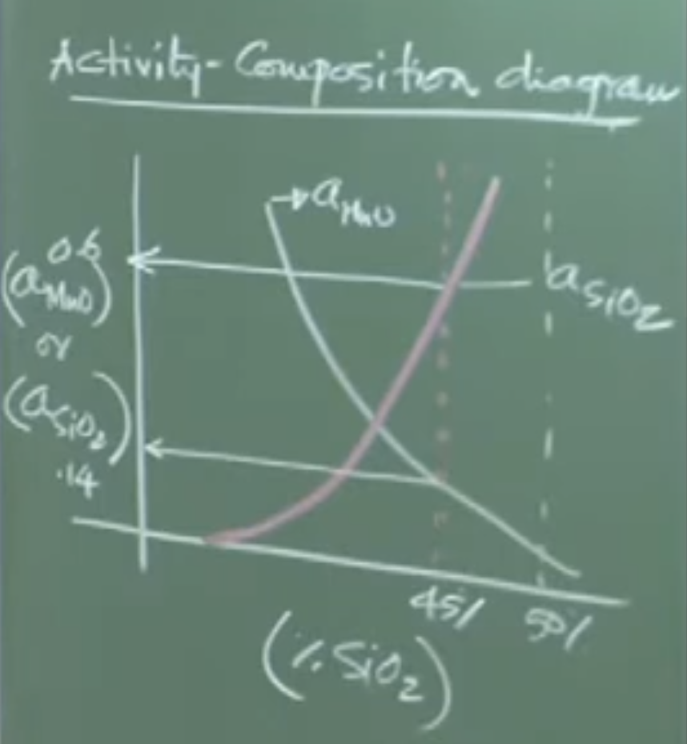
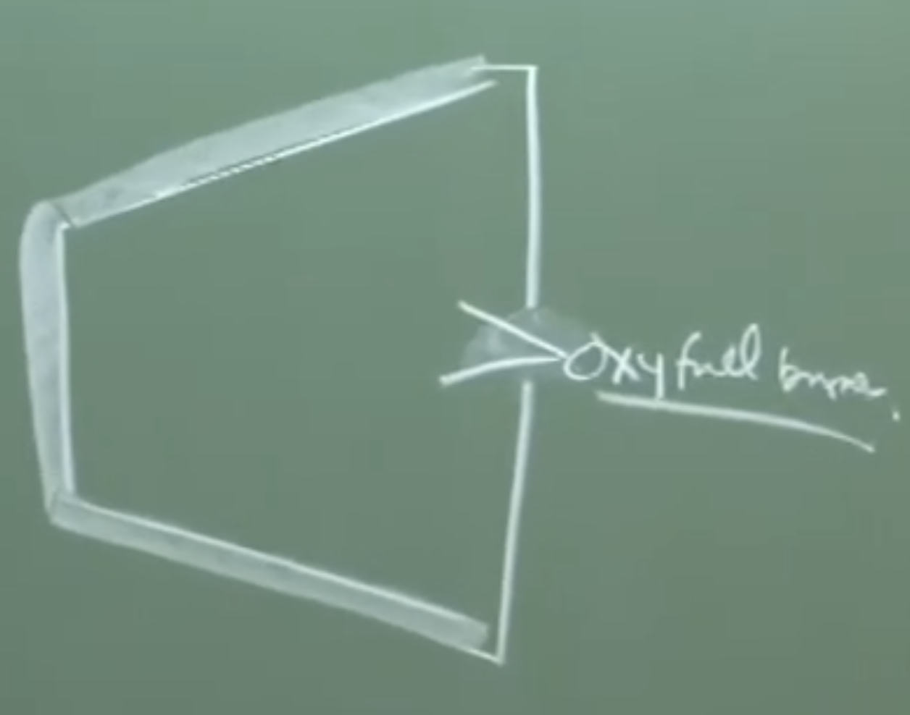
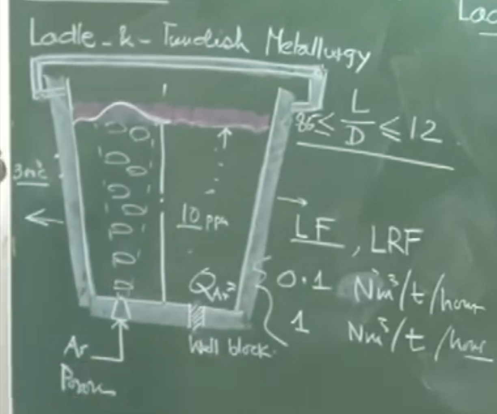
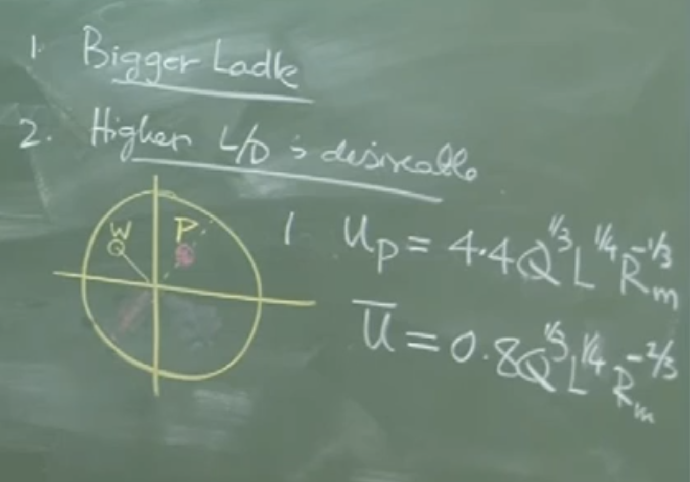
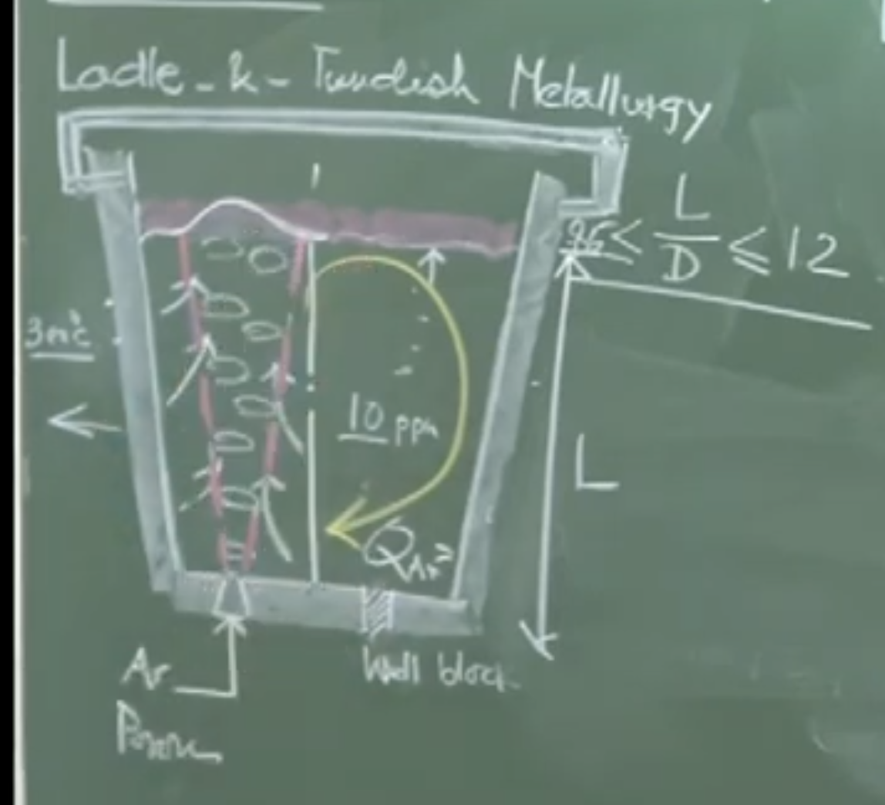
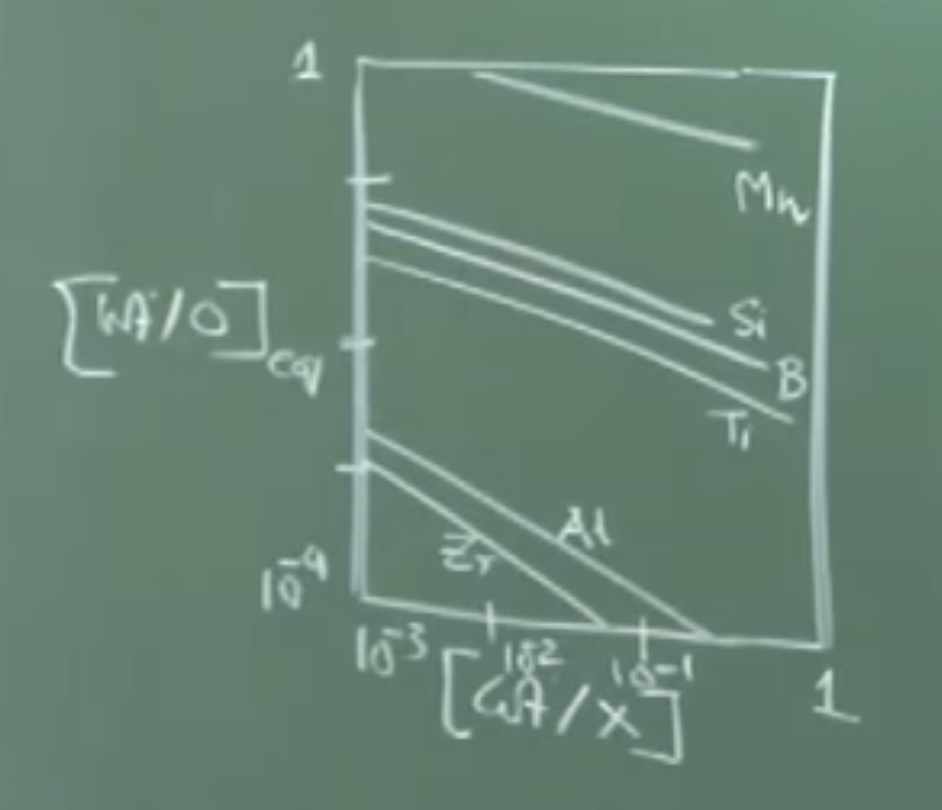

# Lecture 30: Deoxidation Calculations & Introduction to Ladle Metallurgy

## 1. Complex Deoxidation: Sample Calculation

To understand the partitioning of deoxidizers between the dissolved state in the metal and the floating oxide product, a complete material and thermodynamic balance is required.

### Problem Statement & Given Data

- **Ladle Capacity:** 60 Ton (60,000 kg) 
    
- **Initial Oxygen ($O_i$):** 700 ppm
    
- **Desired Final Oxygen ($O_f$):** 100 ppm
    
- **Deoxidizer Used:** Silico-manganese (Si-Mn)
    
- **Deoxidation Product Chemistry:** $45\% \text{ SiO}_2$ and $55\% \text{ MnO}$
    
- **Operating Temperature:** 1600°C
    

**Objective:** Determine the amount of deoxidizer needed, the quantity dissolved in the steel, and the mass of the resulting deoxidation product.

### Step 1: Oxygen Material Balance

First, determine the total mass of oxygen that must be removed from the bath 

- Total Initial Oxygen = $60,000 \text{ kg} \times (700 \times 10^{-6}) = 42 \text{ kg}$
    
- Total Final Oxygen = $60,000 \text{ kg} \times (100 \times 10^{-6}) = 6 \text{ kg}$
    
- **Oxygen to be eliminated ($\Delta O$):** $42 - 6 = 36 \text{ kg}$
    

This 36 kg of oxygen will react with Si and Mn and entirely float up into the deoxidation product.

### Step 2: Thermodynamic Equilibrium (Dissolved Elements)

To find out how much Si and Mn stay dissolved in the steel to remain in equilibrium with 100 ppm of oxygen, we use the equilibrium constants. Because the product is a complex oxide ($MnO-SiO_2$), the activities of the individual oxides are not equal to 1.

**Board Work / Activity-Composition Diagram:**

Using a standard Activity-Composition phase diagram for the $MnO-SiO_2$ system at 1600°C :

- At $45\% \text{ SiO}_2$, the activity of silica ($a_{SiO_2}$) $\approx 0.6$
    
- At $55\% \text{ MnO}$, the activity of manganese oxide ($a_{MnO}$) $\approx 0.2$
    

**Silicon Equilibrium:**

$$[\text{Si}] + 2[\text{O}] = (\text{SiO}_2)$$

$$K_{eq} = \frac{(a_{SiO_2})}{[\text{wt\% Si}][\text{wt\% O}_f]^2} = 4.2 \times 10^5$$

Solving for $[\text{wt\% Si}]$ using $a_{SiO_2} = 0.6$ and $[\text{wt\% O}] = 0.01$:

$$[\text{wt\% Si}] = 0.14\%$$

_Total dissolved Si mass_ = $60,000 \text{ kg} \times 0.0014 \approx 80 \text{ kg}$ 

**Manganese Equilibrium:**

$$[\text{Mn}] + [\text{O}] = \text{MnO}(s)$$

$$K_{eq} = \frac{a_{MnO}}{[\text{wt\% Mn}][\text{wt\% O}]} = 2.4 \times 10^2$$

Solving for $[\text{wt\% Mn}]$ using $a_{MnO} = 0.2$ (from diagram): 

$$[\text{wt\% Mn}] = 0.58\%$$

_Total dissolved Mn mass_ = $60,000 \text{ kg} \times 0.0058 \approx 360 \text{ kg}$ 

### Step 3: Deoxidation Product Material Balance

Let the total mass of the deoxidation product be $W$ kg. The oxygen tied up in this product must equal the 36 kg we eliminated.

- Molar mass of $SiO_2 \approx 60 \text{ g/mol}$ (contains 32g Oxygen)
    
- Molar mass of $MnO \approx 71 \text{ g/mol}$ (contains 16g Oxygen)
    

Mass of oxygen in the slag product:

$$\left[W \times 0.55 \times \left(\frac{16}{71}\right)\right] + \left[W \times 0.45 \times \left(\frac{32}{60}\right)\right] = 36 \text{ kg}$$

$$W(0.124 + 0.24) = 36 \text{ kg}$$

$$W \approx 100 \text{ kg}$$

From the 100 kg of deoxidation product, we extract the mass of the metals trapped within it:

- **Mn in product:** $100 \times 0.55 \times (\frac{55}{71}) \approx 45 \text{ kg}$ 
    
- **Si in product:** $100 \times 0.45 \times (\frac{28}{60}) \approx 28 \text{ kg}$
    

### Step 4: Total Deoxidizer Alloy Requirement

Summing the dissolved metals and the metals lost to the product:

- **Total Mn Required:** $360 \text{ (dissolved)} + 45 \text{ (product)} = 405 \text{ kg}$
    
- **Total Si Required:** $80 \text{ (dissolved)} + 28 \text{ (product)} = 108 \text{ kg}$
    
- **Total Alloy Mass to Add:** $405 + 108 = 513 \text{ kg}$
    

**Important Remarks / Instructor Notes:**

The ratio of Mn to Si to be added to the ladle is approximately 405:108, which simplifies roughly to an 80:20 chemistry ratio. In real industrial practice, operators typically add 5% to 10% more alloy than calculated to account for oxidative losses to any $FeO$ carryover slag present in the ladle.

---

## 2. Introduction to Ladle Metallurgy (Secondary Steelmaking)

Once the crude steel is tapped into the ladle from the primary furnace (BOF/EAF), it fundamentally meets coarse composition requirements but lacks the strict quality and cleanliness needed for critical applications . The subsequent 70 to 80 minutes of processing in the ladle is termed **Ladle Metallurgy**.

### Need for Subsequent Processing

1. **Nitrogen and Hydrogen Contamination:** Occurs heavily during tapping due to the ambient air-melt interaction. Moisture is exceptionally problematic in EAF operations due to water-cooled electrodes.
    
2. **Temperature Drop:** Tapping operations take 10-15 minutes, causing significant radiative heat loss, dropping the melt temperature by 60 to 70°C.
    
3. **Inclusion Removal:** Deoxidation products generated during tapping are often smaller than 30-40 microns and require extended dwell times and active stirring to float out.
    

### Physical Features of the Ladle

- **Geometry:** Marginally tapered vessel lined with basic refractories (magnesite, tar-bonded dolomite, high alumina). The length-to-diameter ($L/D$) ratio usually varies closely around 0.85 .
    
    
	    Ladle being preheated using oxyfuel burner tilted position 
	    
	
- **Thermal Cycle:** Ladles cannot accept molten metal while cold. They are preheated horizontally with oxy-fuel burners to an internal surface temperature of ~1200°C prior to tapping . A ladle's refractory typically survives 70 to 120 heats before requiring relining.
    
- **Bottom Pouring (Well Block):** Ladles are not tilted to empty. They are drained via a bottom nozzle controlled by a slide-gate valve. **Free-opening** is crucial: the sealing powder must flow freely when the gate slides open. If it sinters, oxygen lancing is required to break it, which ruins steel cleanliness .
    
- **Porous Plug:** Replaced every 7 to 10 heats. Located off-center (typically at the mid-bath radius) to maximize asymmetric stirring loops.
    
- **Ladle Cover & Synthetic Slag:** A physical lid and a top synthetic slag layer are utilized to heavily restrict heat loss and stop atmospheric reoxidation .

**Conceptual Explanation - The Synthetic Slag Layer:**

The slag used in Ladle Metallurgy is strictly "synthetic" meaning it must contain zero iron oxide ($FeO$) carryover. Its primary functions are thermal insulation, chemical protection from the atmosphere, and acting as a thermodynamic sink to absorb floating non-metallic inclusions.

---

## 3. Fluid Flow, Heat, and Mass Transfer in Ladles

### Argon Stirring Mechanics

Because chemical activity and reactivity need to be carefully controlled, inert Argon gas is injected through the bottom porous plug.

**Physical Interpretation:**

The actual gas volume experienced by the melt is drastically higher than the injected "Normal" volume. An injection at 25°C ($298 \text{K}$) expands by a factor of over 5x when contacting the 1600°C ($1873 \text{K}$) steel.

- **Flow Rates:** Ranges from a gentle $0.1 \text{ Nm}^3 / \text{ton} \cdot \text{hr}$ (for simple thermal homogenization) to an intense $1.0 \text{ Nm}^3 / \text{ton} \cdot \text{hr}$ (for aggressive alloying and degassing).
    

### Velocity Scales and Stirring Efficiency

The system is entirely driven by buoyancy (potential energy). The mean speed of liquid recirculation ($U$) is dependent on the gas flow rate ($Q$), liquid depth ($L$), and mean vessel radius ($R$).

**Board Work / Flow Equations:**
$$ u_p = 4.4 \cdot  Q^{1/3} \cdot L^{1/4} \cdot R^{-1/3}_m  $$ (Board) 
_$u_p$ is m/s and 4.4 dimensional const Q is $m^3/s$ 

$$ u_{avg} =0.8 \cdot  Q^{1/3} \cdot L^{1/4} \cdot R^{-2/3}_m $$
$$U \propto Q^{1/3} \cdot L^{1/4} \cdot R^{-1/3}$$

_Where:_

- $Q$ is the actual expanded volumetric gas flow rate ($\text{m}^3/\text{s}$).
    
- $L$ is the depth of the liquid.
    
- $R$ is the radius of the ladle.

**Important Remarks:**

This equation confirms that for a given specific gas flow rate, a **taller and narrower ladle (higher L/D ratio) provides far superior stirring efficiency** . The negative exponent on $R$ means that wider (fatter) ladles dissipate the stirring energy too broadly, weakening the overall circulation speed.

### Heating in the Ladle Refining Furnace (LRF)

If left unattended, a covered ladle loses heat at about 5-10 $kW/m^2$ (resulting in a temperature drop of $0.3 - 0.6$ °C/min depending on ladle size) . To combat this, the ladle is moved to a Ladle Refining Furnace (LRF) station.

 Large Ladle Temperature Drop: **0.3 to 0.4°C per minute**.
 Small Ladle Temperature Drop: **0.6 to 0.65°C per minute**. 
      
      
- Three graphite electrodes are lowered through the roof.
    
- Arc heating applies thermal energy at a rate of $+3.5$ to $+4.5$ °C/min.
    
- **Critical Requirement:** Continuous argon stirring is mandatory during arc heating. Without it, the upper layer of the melt would superheat, causing aggressive thermal gradients, while the bottom melt remains cold
  
  if uncovered ladle its $100kW/m^2$
# V2: Audio: 

### **1. Deoxidation of Steel: Core Concepts**

- **Importance:** Deoxidation is an extremely important step that profoundly impacts both the economics of steelmaking and the quality/cleanliness of the final product.
    
- **Deoxidation Products:** These form due to nucleation and growth. It is critical to ensure that deoxidation products do not remain entrapped in the steel.
    
- **Size & Floatation:** Products with a size range of **less than 30–40 microns** are extremely difficult to eliminate in ladles because they require enormously long times to float to the surface.
    
- **Compromise:** Waiting too long for floatation causes continuous heat loss from the vessel and a loss of production time.

- **Equilibrium Plot (Log-Log Scale):** * Plotted as **Weight % Deoxidant vs. Weight % Oxygen** on a logarithmic scale.
    
    - Yields a straight line (e.g., $Al^2$ becomes 2 log Al, $O^3$ becomes 3 log O).
        
    - The axes typically range from $10^{-3}$ to 1.
        
    - **Strongest to Weakest Deoxidants:** Zirconium (strongest) -> Titanium -> Boron -> Silicon -> Manganese (weakest).
        

### **2. Deoxidizer Partitioning**

- During deoxidation, the added deoxidizer gets partitioned into two places:
    
    1. **Dissolved in the bath** (stays inside the metal).
        
    2. **Reacts with oxygen** to form an oxide (deoxidation product) that floats up.
        
- The **largest chunk** of the deoxidizer actually remains sitting in the metal itself.
    
- This remaining chunk is **largest for Manganese** and **smallest for Aluminum** for a given oxygen content.
    

### **3. Sample Calculation: Complex Deoxidation**

- **Ladle Capacity:** 60 tons (60,000 kg).
    
- **Initial Oxygen:** 700 ppm (typically ranges from 400 to 600 ppm depending on carbon content).
    
- **Final Desired Oxygen:** * **100 ppm:** Achievable using Silicon or Silico-Manganese.
    
    - **10–20 ppm:** Requires Aluminum.
        
- **"Killed Steel":** Steel with very low oxygen content where there is no scope for further reaction with oxygen.
    
- **Oxygen Removal Calculation:** * 60,000 kg with 700 ppm (42 kg O) going to 100 ppm (6 kg O).
    
    - Total oxygen removed = **36 kg**. All 36 kg goes entirely into the deoxidation product.
        
- **Deoxidation Product Chemistry:** **45% SiO₂** and **55% MnO** (a 1:1 molecular ratio).
    
- **Thermodynamics & Activity:** * Operating temperature: **1600°C**.
    
    - Because it is a complex deoxidation (multiple oxides forming a mixture), an **Activity-Composition Phase Diagram** is required to find the activities of SiO₂ and MnO. (Unlike simple deoxidation with pure alumina, where activity = 1).
        
    - From the diagram: Activity of SiO₂ = **0.6**, Activity of MnO = **0.2** (corrected from 0.14).
        
    - Equilibrium Constant (K) for Si ($Si + 2O \rightarrow SiO_2$) = **$4.2 \times 10^5$**.
        
    - Equilibrium Constant (K) for Mn ($Mn + O \rightarrow MnO$) = **$2.4 \times 10^2$**.
        
    - Results in ~0.14% dissolved Si (approx 80 kg) and ~0.58% dissolved Mn (approx 360 kg).
        
- **Total Deoxidizer Required:** After mass balancing the 36 kg of removed oxygen, ~100 kg of deoxidation product forms.
    
    - Total Mn required = 360 kg (dissolved) + 45 kg (in slag) = **405 kg**.
        
    - Total Si required = 80 kg (dissolved) + 28 kg (in slag) = **108 kg**.
        
    - Alloy ratio: Roughly 80:20 (Manganese to Silicon).
        
- **Industrial Practice:** Operators typically add **5% to 10% extra deoxidizer** to account for losses due to iron oxide carryover slag from the ladle.
    

### **4. Ladle Metallurgy (Secondary Steelmaking)**

- **Terminology:** The professor prefers the term **"Ladle Metallurgy"** over "Secondary Steelmaking" because "secondary" sounds derogatory, completely ignoring the massive value addition this step provides.
    
- **Need for Further Refining:**
    
    - During 10–15 minutes of tapping, temperatures drop heavily (**60 to 70°C**) due to radiation losses (at 1873 K).
        
    - Ambient air-melt interaction causes contamination by dissolved **Nitrogen**.
        
    - Electric Arc Furnaces (EAF) use water-cooled electrodes, increasing moisture in the environment and causing **Hydrogen** contamination.
        
- **Processing Time:** Takes an additional **70 to 80 minutes** in the Ladle Refining Furnace (LRF).
    
- **Primary Objectives:** 1. Temperature adjustment (compensating for drops).
    
    2. Composition adjustment (trimming Si, S, O, N, H).
    
    3. Cleanliness improvement (inclusion floatation via calcium injection, etc.).
    

### **5. Ladle Construction & Features**

- **Geometry:** Marginally tapered vessels.
    
- **Refractories:** Lined with basic refractories (e.g., tar-bonded magnesite, high alumina bricks). Wall temperature without metal sits around **300°C**.
    
- **Recycling Cycle:** A ladle's refractory typically lasts **70 to 120 heats**.
    
- **Preheating:** Newly lined ladles are placed horizontally and heated with an **oxy-fuel burner** for several hours until the inside surface reaches about **1200°C**. Molten metal cannot be poured into a cold ladle.
    
- **Ladle Cover & Slag Layer:** * A physical ladle cover cuts off the atmosphere.
    
    - A synthetic slag layer sits on top. It must contain **minimal to no iron oxide carryover**.
        
    - Functions of slag: Limits radiation heat loss, blocks atmospheric air (preventing **reoxidation**, since oxygen outside is 0.21 atm and inside is 10 ppm), and absorbs floating non-metallic inclusions.
        
- **Bottom Pouring (Well Block):** * Ladles are never tilted to pour. They use a bottom weld block fitted with **slide gate valves**.
    
    - **Free Opening:** The well block is sealed with a refractory powder. When the slide gate opens, the powder must fall out freely so metal can flow. If the powder sinters (welds) to the wall, the ladle won't free open.
        
    - If free opening fails (happens 1 or 2 times out of 100), operators must use oxygen lancing, which severely jeopardizes steel quality.
        

### **6. Stirring and Gas Injection**

- **Porous Plug:** Every ladle has a replaceable porous refractory plug at the bottom (lasts **7 to 10 heats**).
    
    - Location: **Mid-bath radius position** (never exactly in the center). Some large ladles use dual diametrically opposite plugs.
        
    - Purpose: Injects inert Argon gas to create a toroidal, buoyancy-driven current to ensure thermal and material homogeneity.
        
- **Argon Flow Rates:** Ranges from **$0.1 \ Nm^3/\text{ton/hr}$** (gentle stirring) up to **$1.0 \ Nm^3/\text{ton/hr}$** (intense stirring).
    
- **Gas Expansion:** Argon is measured at "Normal" conditions (298 K, 1 atm). At 1600°C, the gas undergoes a roughly **5x volume expansion**. (The steel "sees" 3 to 4 times more gas volume than injected, even after adjusting for ferrostatic pressure).
    
- **Stirring Efficiency:** * A bigger ladle is more advantageous for stirring.
    
    - A higher liquid depth (Higher L/D ratio) provides deeper plume rise and better circulation.
        
    - Vessel geometry matters: For the same flow rate, a wider ("fatter") ladle results in a less intense flow.
        

### **7. Temperature Loss and Arc Heating**

- **Heat Loss Rates:**
    
    - **Uncovered Ladle:** Exposed to the environment, loses heat at a rate of up to **$100 \ kW/m^2$**.
        
    - **Covered Ladle (with Slag):** Refractory surface temp is ~300°C, and heat flux is reduced to **$5 \text{ to } 10 \ kW/m^2$**.
        
    - Large Ladle Temperature Drop: **0.3 to 0.4°C per minute**.
        
    - Small Ladle Temperature Drop: **0.6 to 0.65°C per minute**.
        
    - Over a 70-minute processing period, a ladle will lose 21°C to 42°C naturally (on top of the 70°C lost during tapping).
        
- **Ladle Refining Furnace (LRF) Heating:**
    
    - Heating must be done using **Electric Arc Heating** (3 electrodes through the cover). Chemical heating (adding Al and blowing oxygen) makes "dirty steel" and is unacceptable for quality grades.
        
    - Arc heating rate: **+3.5 to 4.5°C per minute**.
        
    - **Mandatory Stirring:** During arc heating, argon stirring must be active. Without it, the top melt becomes superheated while the bottom remains cold. Stirring ensures thermal homogenization and efficient heat transfer from the arc to the bulk melt.

