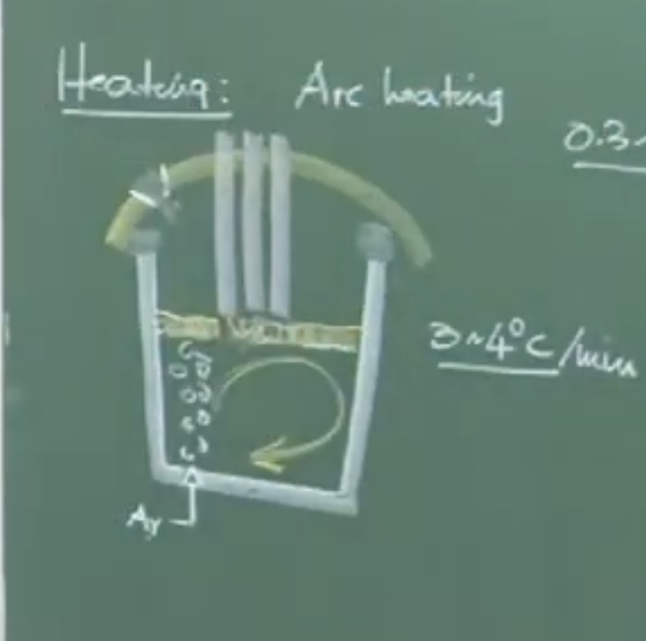
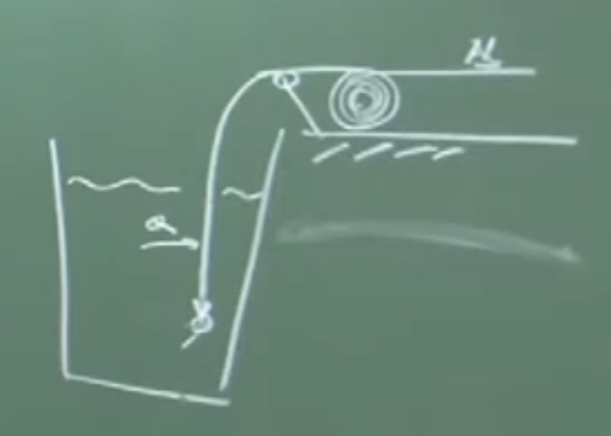
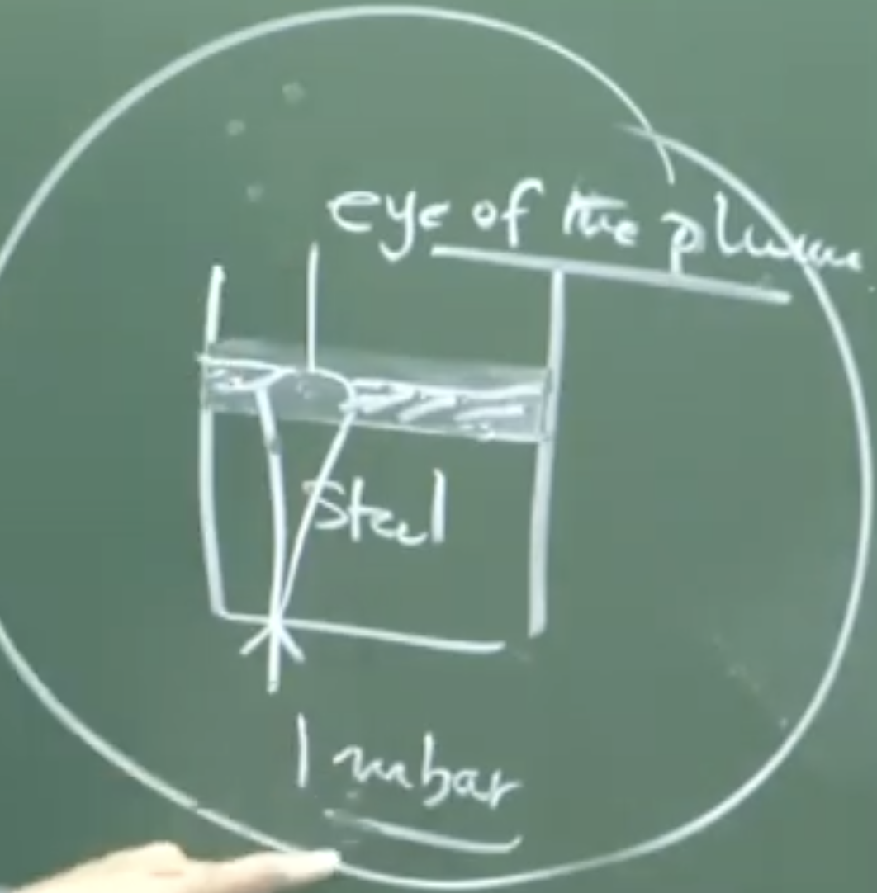
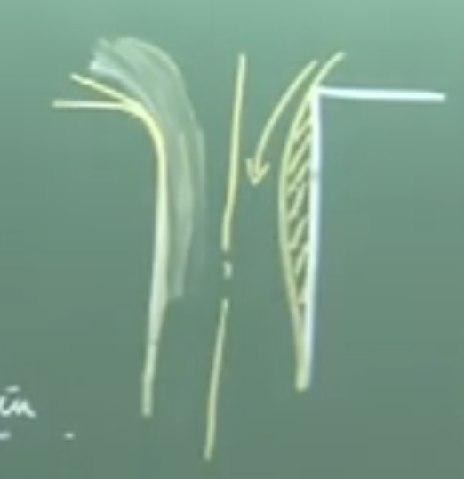
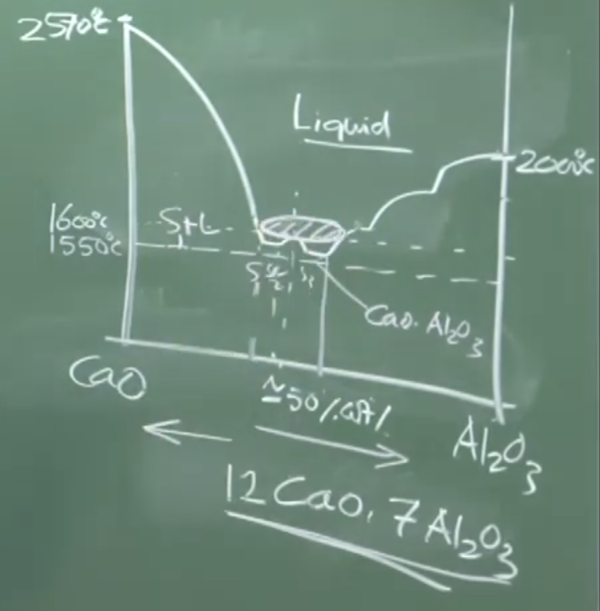
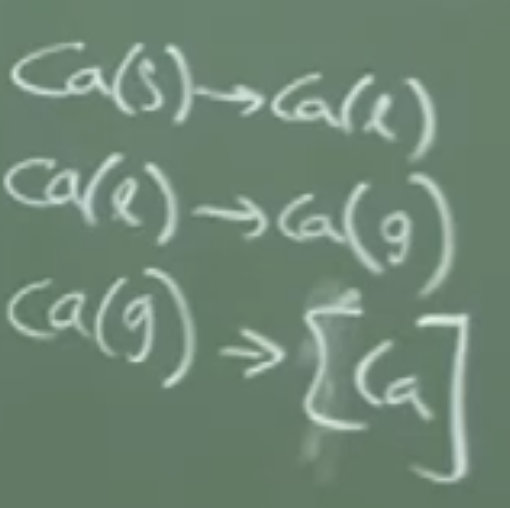
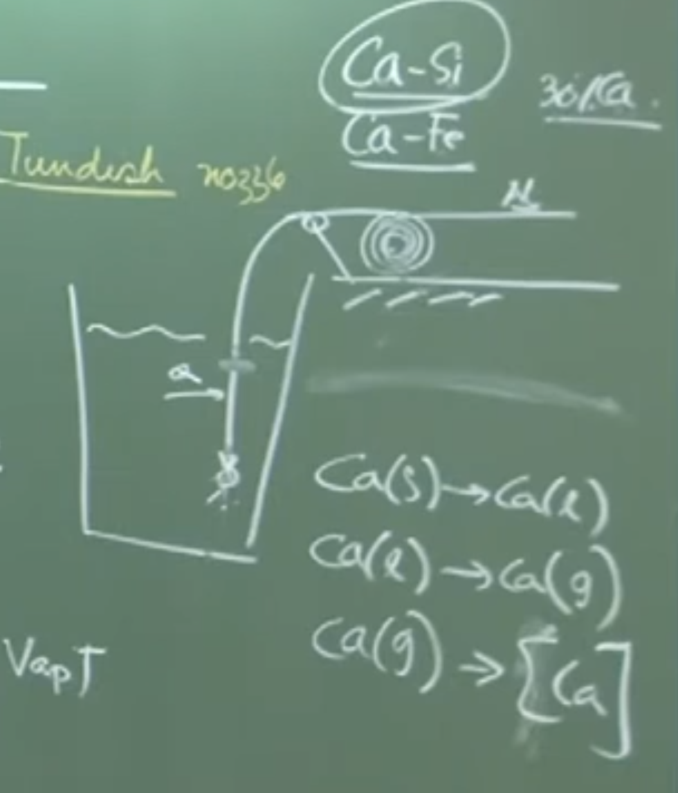
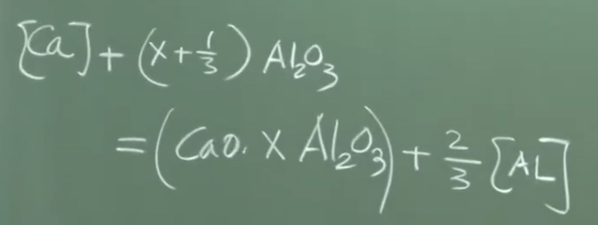

# **LECTURE 31: Ladle Metallurgy – Heating, Wire Injection, and Vacuum Degassing**

## **1. Heating of Molten Steel in Ladle**

### **Conceptual Explanation & Justification** 

During the tapping process, molten steel loses roughly 60°C to 70°C. Secondary treatment in the ladle requires an additional 70 to 80 minutes. Therefore, the steel must be actively reheated to compensate for the continuous heat loss downstream (0.3 to 0.7°C/min drop) and prevent the viscosity from rising or the melt from partially solidifying.

- **Why Not Chemical Heating?** Exothermic chemical heating (e.g., adding aluminum and oxygen in a thermite-like reaction) is avoided because it generates massive amounts of deoxidation products (like $Al_2O_3$), re-contaminating the refined steel.
    
- **Arc Heating Procedure:** The Ladle Refining Furnace (LRF) relies heavily on 3-phase AC Arc heating, similar to a primary electric arc furnace. At a heating rate of 3–4°C per minute, a 25–30 minute treatment brings the melt to a target LRF exit temperature of ~1620°C.
    

### **Board Work: LRF Schematic & Electrode Position** 
Plaintext

```
               [ Robotic Arm ]
                      |
             [ 3 AC Electrodes ]
       _______________V_________________   <-- Ladle Cover 
      |       |       |       |         |
      |   [ Slag Layer (Insulator) ]    | 
      |               _                 |  <-- Slag Eye (Exposed Melt)
      |              (_)                |
      |             ( o )               |  <-- Argon Bubbles / Plume
      |    Melt    (  o  )     Melt     |
      |           (   o   )             |
      |__________(____o____)____________|
                      |
                [ Porous Plug ]
```


### **Important Remarks / Instructor Notes:**

- **Electrode Hunting Phenomenon** : The porous plug utilized for Argon purging is explicitly located **outside the pitch circle diameter** of the three electrodes. If placed directly underneath them, the rising argon gas and spattered metal droplets would violently attack the electrodes, causing excessive wear and carbon dissolution into the melt.
    

---

## **2. Cored Wire Injection (Aluminum & Calcium)**



Once the temperature is jacked up, minute chemistry adjustments are performed via cored wire injection, a mechanical process feeding kilometers of wire deep into the bath. 

### **Aluminum Wire Injection**

- **Physical Interpretation:** Adjusting oxygen ppm at this stage via lumps of pure aluminum is highly ineffective. Aluminum has a low density relative to steel; lumps would float, dissolve into the slag ($FeO$), or burn off in atmospheric oxygen. 
    
- **Wire Feeding Mechanism:** Solid aluminum wire is injected at several meters per minute. The speed is mathematically pre-calculated to ensure the wire penetrates deeply and achieves subsurface melting, adjusting the dissolved oxygen concentrations to precise limits (e.g., exactly 10 ppm). 
    

### **The Inclusion Problem & Nozzle Clogging**

In low carbon aluminum-killed (LCA) steels, the deep deoxidation required produces heavy amounts of solid alumina ($Al_2O_3$).

- **Nature of Inclusions:** Alumina and Spinels (e.g., magnesium aluminate) are extremely hard, solid, non-deformable endogenous inclusions.
    
- **Nozzle Clogging Phenomenon** : When molten steel flows from the ladle to the tundish, solid $Al_2O_3$ inclusions are drawn to the refractory walls (due to similar chemical affinity). The inclusions adhere, sinter, and drastically reduce the cross-sectional flow area at the vena contracta, causing fatal choking of the casting nozzle.
    
- **Ideal Countermeasure:** Liquid deoxidation products (like Manganese Silicate) are highly deformable, easily coalesce, grow larger, and rapidly float out of the melt (per Stokes' Law). We must, therefore, engineer the solid $Al_2O_3$ into a liquid.
    

---

## **3. Calcium Injection and Inclusion Modification**

To solve the clogging issue, calcium is injected to physically modify the solid alumina inclusions into liquid calcium aluminates. 

### **Board Work: CaO - Al₂O₃ Phase Diagram Analysis** 

Plaintext

```
  Temp (°C)
  2570 |  (Solid CaO)
       |
  2000 |                                       (Solid Al2O3)
       |
  1600 |----------[ Operating Window ]------------- <-- Steelmaking Temp
  1550 |----------[ Liquid Phase: C12A7 ]----------
       |
       |______________________|_____________________
      0%                    ~52%                   100%  
      CaO               (Weight Ratio)             Al2O3
```

### **Formulas and Chemistry**

The targeted reaction requires a meticulous dosage to hit the eutectic point of the system:

$$CaO + xAl_2O_3 \rightarrow CaO \cdot xAl_2O_3$$

- **Target Liquid Phase ($C_{12}A_7$)**: The desired liquid phase at a steelmaking temperature of ~1600°C is $12CaO \cdot 7Al_2O_3$, achievable at roughly 52 weight % CaO. If the dosage is missed (over or under-injected), high-melting solid calcium aluminate phases will precipitate instead. 
    

### **Thermodynamic Challenges of Calcium:**

- **Vaporization:** Calcium melts at 839°C and instantly vaporizes at 1500°C. Since the steel is at 1600°C, Calcium becomes a gas and escapes the melt in < 1 second.
    
- **Practical Solutions:** Pure calcium is never injected. It is injected as heavy alloys like **CaSi (Calcium Silicide)** or **CaFe (Calcium Iron)** to increase density and drive it downwards. Even then, calcium solubility is maxed at 300 ppm, and the injection recovery rate is dismal (9% to 23%).
    

---

## **4. Vacuum Degassing for Hydrogen and Nitrogen Removal**

The final active stage before casting is subjecting the ladle to a profound vacuum to remove dissolved Nitrogen and Hydrogen. 

### **Physical Interpretation: Reverse Sieverts' Law** 

By exposing the steel bath to a highly evacuated atmosphere of roughly 1 millibar ($10^{-3}$ bar), the partial pressures of hydrogen and nitrogen approach zero. The equilibrium of dissolution is reversed, pulling gas out of the melt:

_these rxn take place at melt / vaccum interface_ hence if melt not exposed no rxn 

$$[N]_{dissolved} \rightarrow \frac{1}{2} N_2 (g)$$

$$[H]_{dissolved} \rightarrow \frac{1}{2} H_2 (g)$$

_as in fig eye exposes melt with vaccum_

### **Board Work: Kinetics of Degassing** 

Degassing is exclusively a heterogeneous mass-transfer controlled process occurring at the melt-gas interface.

$$\frac{dC_N}{dt} = - \left( \frac{k_m \cdot A}{V} \right) \cdot (C_N - C_{N, surface})$$

**Variables Extracted:**

- $C_N$: Bulk dissolved nitrogen concentration.
    
- $C_{N, surface}$: Nitrogen at the interface (Assumed $\approx 0$ due to vacuum).
    
- $k_m$: Mass transfer coefficient (dictated by argon stirring velocity).
    
- $A$: Interfacial area exposed to vacuum.
    
- $V$: Volume of the ladle.
  
	$k =  \left( \frac{k_m \cdot A}{V} \right)$
    

### **Important Remarks / Instructor Notes:**

- **The Slag Eye Necessity**: Argon purging from the bottom plug is heavily maintained during vacuum degassing. This pushes the thick slag layer aside, creating a visible "eye" that directly exposes bare liquid metal to the vacuum. Without this exposed area ($A$), the kinetic reactions hit a barrier and halt entirely, regardless of thermodynamics.
    
- **Tank vs. Circulation Degassing**: Tank degassing puts the entire ladle into a depressurized vessel. Circulation degassing draws steel upward into a specialized vacuum chamber. The governing equations remain identical; only the kinetic parameters (like interfacial area $A$ and mass transfer coefficient $k_m$) differ.


# Audio v2: 

# LECTURE 31: Ladle Metallurgy (Secondary Steelmaking)

## 1. Introduction and The Need for Heating in the Ladle

- **Context:** Primary steelmaking (Oxygen and Electric Arc Furnace) and deoxidation kinetics are complete. The steel is moving to Ladle Metallurgy for inclusion modification, alloying, and vacuum degassing.
    
- **The Heat Loss Problem:** * During tapping from the primary furnace, the steel loses **60 to 70 °C**.
    
    - Ladle treatment requires an extra **70 to 80 minutes**.
        
    - Temperature drops at a rate of **0.3 to 0.7 °C per minute** depending on ladle size, slag cover, physical cover, and refractory quality.
        
- **Risks of Heat Loss:** If uncorrected, the metal may chill, its viscosity will increase, and it may partially solidify in the ladle (highly undesirable).
    
- **Why Chemical Heating is Avoided:** * Chemical heating uses Aluminum and Oxygen (similar to the **aluminum thermite process**).
    
    - While exothermic (releases heat), it generates solid oxidation products ($Al_2O_3$) that contaminate the already refined steel.
        

## 2. Arc Heating (Ladle Refining Furnace - LRF)

- **Process:** The ladle sits on a rail and is dragged to the **LRF (Ladle Refining Furnace)** station.
    
- **Equipment:** * A water-cooled roof attached to a robotic arm is lowered over the ladle.
    
    - Uses **three AC electrodes** to strike an arc, identical to primary electric arc furnace heating.
        
- **Heating Parameters:** * Heating rate: **3 to 4 °C per minute**.
    
    - Duration: **20 to 30 minutes** is sufficient to compensate for tapping heat loss and jack up the temperature.
        
    - Target LRF Out-Temperature: **1620 °C**.
        
- **Argon Purging (Stirring):**
    
    - Argon gas is blown continuously through a porous plug at the bottom.
        
    - **Purpose:** Distributes heat advected from the arc, ensuring a thermally homogeneous melt (prevents lighter hot fluid from staying at the top and cooler fluid at the bottom).
        
- **Electrode Hunting & Plug Placement:**
    
    - The porous plug is placed **outside the pitch circle diameter** of the three electrodes.
        
    - If placed directly underneath, the violent rising argon plume and spattering would cause direct interaction with the electrodes, leading to rapid wear and carbon dissolution into the melt—a phenomenon known in the industry as **electrode hunting**.
        
- **Freeboard and Off-gas:** The ladle must have adequate "freeboard" (empty space above the melt) to prevent spattering from causing hood jamming. A gas cleaning apparatus/hood extracts dust and argon gas.
    
- **Additions:** Shoots are available in the roof to add alloying elements (like lead or ferrochrome) without exposing the deoxidized bath (which sits at roughly **10 ppm oxygen** for aluminum-killed steel) to the atmosphere.
    

## 3. Cored Wire Injection (Aluminum and Calcium)

- **Mechanism:** Solid wire is fed from a massive, motorized roll through a guiding pulley into the melt at a calculated speed of **several meters per minute**.
    
- **Why Wire Feeding instead of Lumps?**
    
    - During tapping, intense stirring easily melts Al lumps. In the LRF, convection is weaker.
        
    - Pure Aluminum has a low density relative to steel. Lumps would float on the free surface, react with $FeO$ in the slag, or burn in atmospheric oxygen.
        
    - Wire injection ensures **subsurface melting**.
        
- **Calculations & Safety:** The speed must be precisely calculated based on the wire diameter so it melts **3 to 5 feet** below the bath surface. If injected too fast, the solid wire will strike the ladle floor, rebound, and potentially cause fatal accidents.
    
- **Aluminum Wire Application:** Used for minute oxygen adjustments.
    
    - _Example:_ If the target is 10 ppm oxygen but the bath has 14 ppm, wire is injected to precisely remove the extra **4 ppm**.
        

## 4. Inclusions and The Nozzle Clogging Problem

- **Deoxidation Products:** * Silicon/Manganese deoxidation yields **Manganese Silicate**, which can be **liquid** (e.g., 45 wt% $SiO_2$, 55 wt% $MnO$). Liquid inclusions coalesce into larger blobs and float out easily (rising velocity scales with the square of the radius via **Stokes' Law**).
    
    - Aluminum deoxidation yields pure **Alumina ($Al_2O_3$)**, which is **solid**.
        
- **Types of Inclusions:**
    
    - **Endogenous:** Formed chemically within the steel (e.g., deoxidation products).
        
    - **Exogenous:** Formed from outside sources (e.g., **MgO** from refractory erosion/dissolution, or **Sodium/Potassium oxides** from continuous casting mold powders).
        
    - Identifiable via **SEM-EDS** (Scanning Electron Microscope with Energy Dispersive Spectroscopy).
        
    - Size: Usually 50 to 70 microns. Nothing over 100 microns remains suspended.
        
    - **Spinels:** Double oxides (e.g., Magnesium Aluminate) which are solid and non-deformable.
        
    - _Note:_ Manganese sulfide inclusions are liquid at steelmaking temps and highly deformable during hot rolling.
        
- **Impurities from Alloys:** Ferrosilicon contains 4-5 ppm Calcium; Silicomanganese contains Magnesium.
    
- **Nozzle Clogging:** * Relevant in **LCA (Low Carbon Aluminum-killed) steel**. Low carbon inherently means high equilibrium oxygen (~400 ppm), requiring massive aluminum additions, which generates massive amounts of solid $Al_2O_3$.
    
    - Solid alumina inclusions have a chemical affinity for the refractory wall.
        
    - During casting (ladle to tundish), steel flows through a nozzle. At the sharp corners, a virtually stagnant area called the **vena contracta** forms.
	        
	        
	    
	    _as in fig right side sharp corner stagnent, net area flowing less solid deposition _
	    
    - Inclusions continuously sinter and deposit here, reducing the flow area until the nozzle is completely choked.
        

## 5. Calcium Injection (Inclusion Engineering)

- **Objective:** Convert solid $Al_2O_3$ inclusions into liquid calcium aluminate inclusions to stop nozzle clogging.
    
- **Thermodynamics & Phase Diagram ($CaO - Al_2O_3$):**
	

		
    - 100% $CaO$ melting point: **~2570 °C**.
        
    - 100% $Al_2O_3$ melting point: **~2000 °C**.
        
    - Steelmaking temperature: **1600 °C** (rock bottom is 1500-1550 °C).
        
    - The exact "liquid window" at 1600 °C occurs at roughly **52 wt% CaO**.
        
    - This ideal liquid composition corresponds to **$12CaO \cdot 7Al_2O_3$**, abbreviated in industry as **C12A7**.
        
- **Challenges of Calcium:**
    
    - Melting point: **839 °C**.
        
    - Vaporization point: **1500 °C**.
        
    - Because steel is 1600 °C, injected calcium instantly becomes a **gas**.
        
    - The bubbles escape the melt in under **1 second**, leading to extremely poor recovery rates of only **9% to 23%**.
        
        
    - Maximum solubility of Calcium in steel at 1600 °C is very low: **300 ppm**. (For comparison: Oxygen ~2300 ppm, Nitrogen ~470 ppm, Hydrogen ~28 ppm).
        
- **Ca Injection Materials:** Pure calcium is never used because it vaporizes immediately. It is injected as alloys with roughly **30 wt% Calcium**:
    
    - **CaSi** (Calcium Silicide - "cassi")
        
    - **CaFe** (Calcium Iron - "caffe")
        
    - Silicon and Iron dilute the calcium and increase the physical density of the wire so it drives down into the melt rather than vaporizing at the surface.
        
        
	    _as in the fig, pure Ca surface vaporize decreasing efficiency and very less recovery and its expensive but alloying drives down melt_
	        
- **Holding Period:** After injection, the bath requires a holding time of **5 to 7 minutes** to allow the liquid C12A7 inclusions to coalesce and float out, producing ultra-clean steel.
    
    

## 6. Vacuum Degassing

- **Purpose:** Remove dissolved Nitrogen (from furnace tapping) and dissolved Hydrogen (from the arc furnace, usually 5-7 ppm). Target nitrogen is often **10 ppm** (down from ~40 ppm).
    
- **Principle (Converse of Sieverts' Law):** By exposing the melt to a vacuum pressure of roughly **1 millibar ($10^{-3}$ bar)**, the partial pressures of $N_2$ and $H_2$ in the atmosphere above the steel are essentially zero. This thermodynamically drives the diatomic gases out of the metal.
    
- **The Slag Eye (Crucial Kinetic Factor):**
    
    - Argon purging pushes the physical slag layer apart, creating an exposed surface of bare liquid metal called the **"eye"**.
        
    - Degassing is a heterogeneous reaction occurring _only_ at the **melt-gas interface**.
        
    - If argon stops, the slag covers the eye. The metal no longer "sees" the vacuum, creating a kinetic barrier, and degassing stops immediately regardless of the vacuum pressure.
        
- **Kinetics Equation:** Mass transfer controlled process.
    
    - $\frac{dC_N}{dt} = - (\frac{k_m \cdot A}{V}) (C_N - C_s)$
        
    - $C_N$: Bulk concentration of Nitrogen.
        
    - $C_s$: Surface concentration (approaches 0 in vacuum).
        
    - $k_m$: Mass transfer coefficient (dependent on fluid velocity/stirring).
        
    - $A$: Interfacial area.
        
    - $V$: Volume of the ladle.
        
- **Processing Time:** Total time is **25 to 30 minutes**.
    
    - First 15 minutes: Depressurizing the chamber via vacuum/diffusion pumps.
        
    - Last 15 minutes: Actual treatment time.
        
- **Types of Degassing:** 
	  **Tank Degassing:** The entire ladle is placed inside a massive vacuum tank, covered, and depressurized.
    
    - **Circulation Degassing:** Steel is sucked up into a separate vacuum vessel.
        
    - _Note:_ The thermodynamics and equations for both are identical. The difference is the kinetic rate constants (Circulation degassing provides a much larger interfacial area $A$, changing the rate).