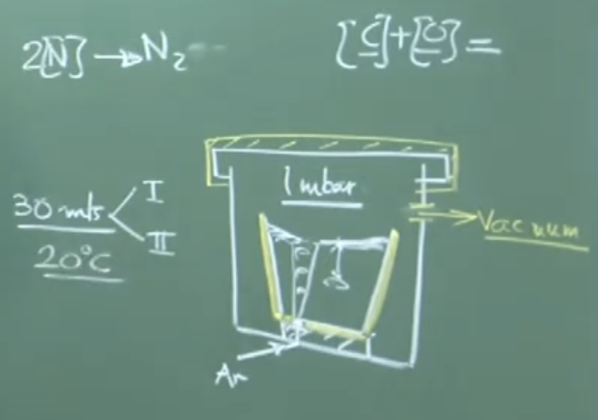
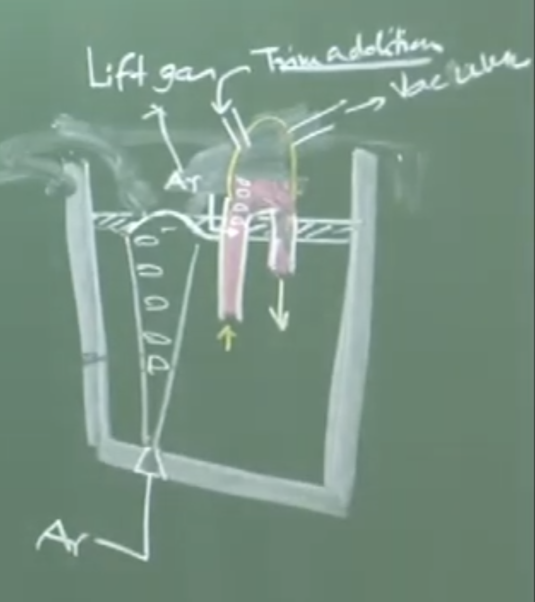
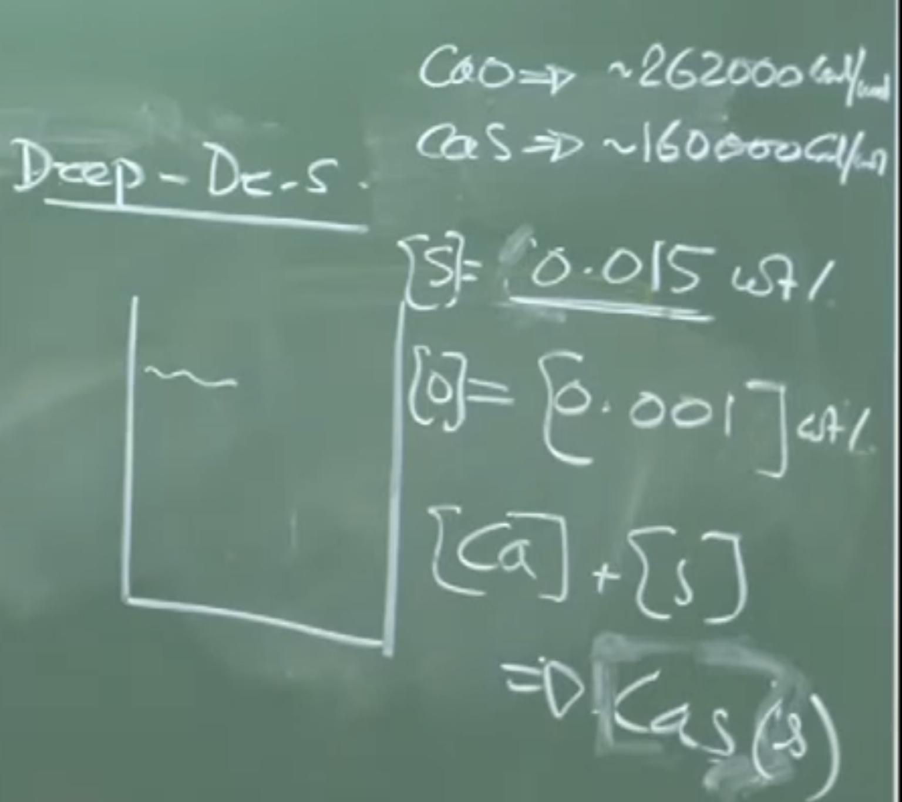
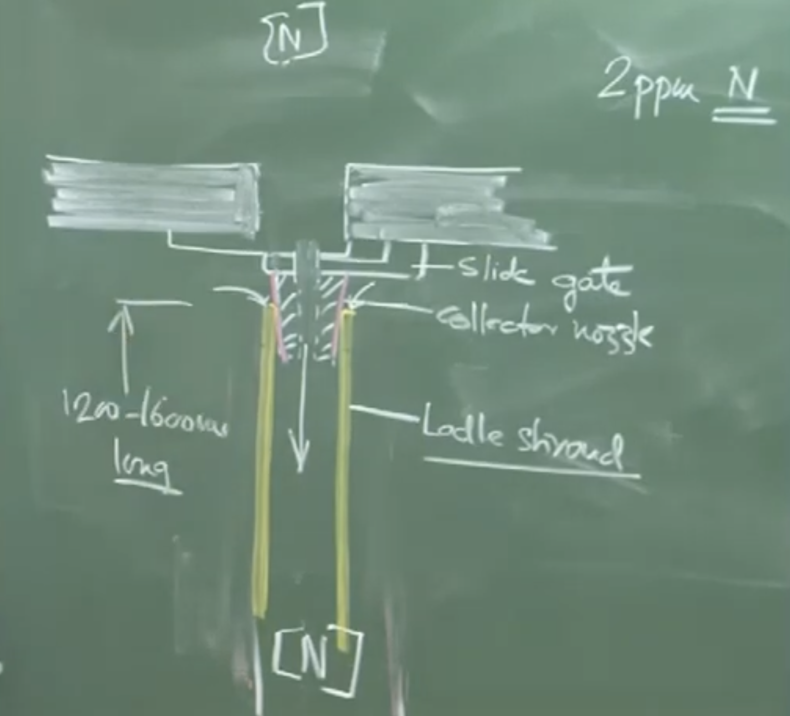

# LECTURE 32: Advanced Degassing Methods and Teeming Operations

## 1. Kinetics and Thermodynamics of Vacuum Degassing

### Conceptual Explanation

The degassing process involves establishing a highly reduced pressure environment (typically around $1 \text{ mbar}$) to drive out dissolved gases like hydrogen, nitrogen, and carbon monoxide. The total processing time for degassing (usually around 30 minutes) consists of two distinct periods:

1. **Pressure Establishment Period:** It takes approximately 10 to 15 minutes for the high-efficiency diffusion pumps to pump down the chamber to the target $1 \text{ mbar}$ pressure.
    
2. **Processing Period:** Once the target pressure is reached, the kinetic rate equations for degassing dictate the remaining time required to bring the gas concentrations down to acceptable levels.
    

During this time, the system re-establishes equilibrium according to the following heterogeneous interface reactions:

- **Dehydrogenation:** $2[\text{H}] \rightleftharpoons \text{H}_{2(g)}$
    
- **Denitrogenation:** $2[\text{N}] \rightleftharpoons \text{N}_{2(g)}$
    
- **Deoxidation/Decarburization:** $[\text{C}] + [\text{O}] \rightleftharpoons \text{CO}_{(g)}$
    
    _(Note: CO bubble evolution can be sporadic as the $1 \text{ atm}$ pressure assumption is no longer valid; bubbles nucleate under reduced pressure + ferrostatic head)._
    

### Physical Interpretation

Because degassing is a melt-phase mass transport-controlled process, stirring is mandatory. Stirring exposes the melt directly to the vacuum by parting the slag layer, creating a vastly expanded interfacial surface area (far greater than the simple planar cross-section of the ladle) for gas exchange.

---

## 2. Industrial Vacuum Degassing Methods

The instructor outlines two primary degassing systems utilized in the industry, selected based on ladle capacity and target hydrogen levels.

### Board Work Extraction

> **Degassing Methods**
> 
> 1. Tank degasser $\rightarrow$ Smaller ladles $< 100 \text{ T}$
>     
> 2. Circulation degasser (RH) $\rightarrow$ Larger ladles
>     
> 
> _Processing Parameters:_ > Time: $30 \text{ mts.}$
> 
> Temp Drop: $\sim 20^\circ \text{C}$

### 2.1. The Tank Degasser

**System Description:**

The ladle (equipped with a porous plug at the bottom for argon gas injection) is hoisted by a crane and placed entirely inside a massive, sealable vacuum tank. Once sealed, diffusion pumps evacuate the atmosphere.

**ASCII Diagram of Tank Degasser Board Work**


```
      To Vacuum Extraction
           ^
       ____|____
      /         \  <- Sealed Vacuum Tank Lid
     |           |
     |  |-----|  |
     |  |Slag |  | <- Ladle (< 100 Tons)
     |  |Metal|  |
     |  |  o  |  | <- Expanding Argon Bubbles
     |  |__o__|  |
     |     |     | <- Argon Gas Line
     |_________ _|
```

**Important Remarks / Instructor Notes:**

- **Argon Flow Rate:** A very small flow rate ($\sim 0.1 \text{ Nm}^3/\text{hr}/\text{ton}$, known as "rinsing") is sufficient. Under vacuum, the atmospheric pressure component vanishes, and the bubbles are subjected _only_ to the ferrostatic head. This causes massive volumetric expansion of the argon bubbles, resulting in intense stirring without needing high gas input.
    
- **Performance:** Can reduce hydrogen from $5-6 \text{ ppm}$ down to $1.2 - 1.5 \text{ ppm}$ in 30 minutes. It is cost-effective but generally limited to smaller ladles and standard cleanliness requirements.
    

### 2.2. The Circulation Degasser (RH Type)

**System Description:**

Used for large ladles and for producing ultra-low hydrogen steels (e.g., $< 1 \text{ ppm}$ H). Instead of putting the entire ladle in a vacuum, a refractory structure called a "snorkel" with two legs (an up-leg and a down-leg) is partially immersed into the melt.

**ASCII Diagram of Circulation (RH) Degasser Board Work**



```
       Trim Additions
            |     To Vacuum Pumps
            v        ^
        _________    |
       /         \___|
      |  Vacuum   |
      |  Chamber  |
       \   ___   /
        | |   | |
 Up-leg | |   | | Down-leg
        | |   | |
    Ar->|o|   | |
        |o|   | |
------- |o| - | | -------  <- Slag layer
 \      |o|   | |      /
  \     |_|   |_|     /
   \                 /
    \  Liquid Melt  /
     \_____________/
```

**Physical Interpretation of the RH Loop:**

Argon is injected into the **up-leg** as a "lift gas." The argon bubbles reduce the bulk density of the liquid in that leg, causing buoyancy forces to drive the molten steel upward into the vacuum chamber. Once exposed to the high vacuum (with zero slag coverage, maximizing surface area), the steel degasses instantly. The denser, degassed steel then flows back down into the ladle via the **down-leg**, creating a continuous circulatory loop.

**Important Remarks / Instructor Notes:**

- **Circulation Rate:** The operator calculates the time required for the _entire volume_ of the ladle to pass through the snorkel once. However, to achieve ultra-low gas levels, the steel must be circulated $4\times$ to $6\times$ through the loop.
    
- **Temperature Drop:** Both methods incur a temperature drop of approximately $20 - 25^\circ \text{C}$ due to radiation losses and the endothermic nature of gas expansion/desorption. This deficit must be anticipated and compensated for upstream in the Ladle Refining Furnace (LRF).
    
 
---

## 3. The Holding Period Prior to Casting

Once vacuum degassing is complete, no further active metallurgical interventions (like gas stirring) are performed. The argon is shut off, and the ladle enters a "Holding Period."

### Conceptual Explanation

The holding period typically lasts **6 to 10 minutes**. The melt sits perfectly still beneath a protective slag cover. The primary objective is to allow emulsified slag droplets to separate and solid oxide inclusions to float up to the slag-metal interface due to buoyancy.

### Tracking Cleanliness (Insoluble Elements)

Cleanliness is actively monitored via spectroscopy by evaluating the "insoluble" component of deoxidizers (like Aluminum, Calcium, and Magnesium).

**Equations / Metrics:**

$$[\text{Al}]_{\text{Total}} = [\text{Al}]_{\text{Soluble}} + [\text{Al}]_{\text{Insoluble}}$$

- $[\text{Al}]_{\text{Soluble}}$: The active, dissolved aluminum in the matrix (Constant during holding).
    
- $[\text{Al}]_{\text{Insoluble}}$: Aluminum tied up as solid inclusions (e.g., $\text{Al}_2\text{O}_3$). This value _decreases_ during holding as inclusions float out.
    

**Important Remarks / Instructor Notes:**

By sampling the steel over time and tracking $\sum X_{\text{insoluble}}$ (where $X$ is Ca, Mg, Al), operators can quantitatively verify how "clean" the steel has become before giving the green light for casting. The melt will lose an additional $\sim 6^\circ \text{C}$ during a 10-minute hold.

---

## 4. Deep Desulphurization (Ladle Desulphurization)

_Note: Chronologically in the plant, this process occurs **before** Vacuum Degassing and Calcium Injection._

### Conceptual Explanation

If sulfur is not removed, it will completely jeopardize downstream inclusion modification (Calcium treatment). Calcium has a high thermodynamic affinity for oxygen, but in heavily deoxidized steel (where $[\text{O}]$ is as low as $10 \text{ ppm}$ but $[\text{S}]$ might be $300 \text{ ppm}$), the Calcium will preferentially attack the abundant Sulfur.


**Thermodynamic Warning:** Instead of modifying alumina inclusions to form liquid calcium aluminates ($12\text{CaO}\cdot 7\text{Al}_2\text{O}_3$), the injected calcium forms solid Calcium Sulphide (CaS), severely dirtying the steel matrix.

### Process Mechanics

To execute deep desulphurization, solid lime ($\text{CaO}$) powder is injected alongside a massive, intense argon gas flow (up to $1 \text{ Nm}^3/\text{ton}/\text{hour}$—ten times the rate of standard rinsing).

**The Chemical Reaction:**

$$3\text{CaO}_{(s)} + 3[\text{S}] + 2[\text{Al}] \rightarrow 3\text{CaS}_{(slag)} + \text{Al}_2\text{O}_{3(slag)}$$

**Physical Interpretation:**

The reaction strictly requires a heavily reducing environment, provided by the high dissolved $[\text{Al}]$ content. The intense argon bubbling provides the necessary mass-transfer coefficient and interfacial area for the solid CaO powder to react with the liquid melt and pull sulfur into the slag phase. With dual porous plugs, $[\text{S}]$ can be driven below $10 \text{ ppm}$.

---

## 5. Teeming Operations and Molten Steel Transfer

### Terminology Distinction

- **Tapping:** Emptying the primary furnace into a ladle. (Oxygen pickup from the air is not a major concern because the steel has not yet been deoxidized).
    
- **Teeming:** Emptying the fully refined ladle into the casting mold or tundish. (Oxygen/Nitrogen pickup from the air is **catastrophic** because the steel is highly refined, degassed, and deoxidized).
    

### Mechanism of Teeming

To transfer metal without atmospheric exposure, ladles utilize a **Slide Gate Valve** and a **Ladle Shroud**.

1. **Slide Gate Valve:** Consists of two overlapping refractory plates with apertures. By sliding the plates relative to one another, the operator adjusts the size of the hole. As the depth of the metal in the ladle decreases, the ferrostatic head drops. According to **Bernoulli's Equation**, the aperture must be widened progressively to maintain a constant volumetric outflow rate.
    
2. **Ladle Shroud:** A long refractory tube ($1.2 \text{ to } 1.6 \text{ meters}$ for continuous casting) attached directly beneath the slide gate via a collector nozzle. It physically physically bridges the ladle to the mold/tundish, keeping the stream entirely enclosed.
    

### Evaluating Shroud Integrity

Because the slide gate and shroud are two separate ceramic pieces, the joint is never mathematically perfect. The high-velocity molten metal stream creates a localized low-pressure zone (venturi effect), which can suck atmospheric air into the joint.

**Important Remarks / Instructor Notes:**

Operators assess the integrity of the shroud joint by measuring the Nitrogen pickup ($\Delta \text{N}$):

$$\Delta \text{N} = [\text{N}]_{\text{Shroud Exit}} - [\text{N}]_{\text{Ladle Holding}}$$

Since atmospheric air is the _only_ source of nitrogen at this stage, any increase indicates a leak. A perfect seal yields $0 \text{ ppm}$ pickup, but practically, the global "best practice" standard is a pickup of $\leq 2 \text{ ppm}$. Higher values indicate detrimental reoxidation is occurring inside the shroud tube.


# Audio : v2

### **1. Kinetics and Thermodynamics of Vacuum Degassing**
Vacuum degassing removes dissolved gases (Hydrogen, Nitrogen, Carbon Monoxide) from molten steel. 
* **Rate-Limiting Step:** The degassing process is predominantly controlled by **melt phase transport**.
* **Processing Phases (Total ~30 mins):**
    1.  **Pressure Establishment Period:** Takes about **10 to 15 minutes** to reach the target pressure of **1 millibar (mbar)** using highly efficient diffusion pumps. 
    2.  **Processing Period:** The kinetic rate equation applies during this phase, driven by the attainment of the 1 mbar pressure. 
* **Interfacial Area & Stirring:** Degassing is a heterogeneous chemical reaction requiring exposure of the melt to a vacuum. Slag must be separated to expose the melt. The effective interfacial area is far greater than the planar area of the ladle due to the intense agitation/stirring of the bath surfaces.
* **Temperature Drop:** Vacuum processing causes a significant temperature drop, typically **20°C to 25°C** (for a 60-ton ladle). To compensate for this (and drops during wire feeding, desulphurization, and transit), the metal is superheated in the Ladle Refining Furnace (LRF) to around **1600°C to 1620°C** to ensure it reaches the continuous caster at the target **1570°C to 1580°C**.

---

### **2. Tank Degassing (For Smaller Ladles)**

* **Application:** Generally used for smaller ladles (**< 100 tons**). It has lower capital costs.
* **Mechanism:** The entire ladle, equipped with porous plugs for gas bubbling, is placed inside a huge, sealed container (tank) connected to vacuum pumps.
* **Argon Flow Rate:** Requires a very small flow rate—known as **argon rinsing**—around **0.1 Nm³/hr/ton**. Because the external pressure is reduced from 1 atm to virtually zero, the bubbles are only subjected to the ferrostatic head. This causes massive volumetric expansion of the argon, creating intense stirring without needing high gas input.
* **Performance:** Routinely reduces hydrogen from **5 to 6 ppm** down to **1.2 to 1.5 ppm** in 30 minutes.

---

### **3. Circulation Degassing / RH Degasser (For Larger Ladles & Ultra-Low Hydrogen)**

* **Application:** Used for larger ladles and when **ultra-low hydrogen** levels (< 1 ppm, typically **0.7 to 0.8 ppm**, which is close to equilibrium) are required.
* **Structure:** Uses a refractory structure called a **snorkel** with two legs: an **up-leg** and a **down-leg**. 
* **Mechanism:** * **Lift Gas:** Argon is injected into the up-leg. The bubbles reduce the liquid's density, creating buoyancy that pushes the molten metal into the vacuum chamber.
    * In the vacuum chamber, there is **no slag coverage**, ensuring intense agitation and highly efficient exposure to the vacuum.
    * The degassed metal flows back down the down-leg, creating a circulatory loop.
* **Circulation Rate:** The processing time must ensure the entire volume of steel passes through the snorkel. For high-efficiency degassing, the melt may need to circulate **4 to 6 times** the duration calculated for a single volumetric pass.

---

### **4. Deep Desulphurization (Ladle Desulphurization)**
*Critical Note: This process is performed **BEFORE** Vacuum Degassing (VD) and Calcium Injection.*
* **Why before Calcium Injection?** Calcium has a high affinity for oxygen, but if sulfur is abundant (e.g., 150-300 ppm S vs. 10 ppm O), the injected calcium will preferentially react with dissolved sulfur to form solid Calcium Sulphide (CaS) inclusions, making the steel dirty.
* **Goal of Calcium Treatment:** To modify solid alumina inclusions into liquid calcium aluminates (e.g., $12\text{CaO}\cdot 7\text{Al}_2\text{O}_3$). This requires lowering sulfur first.
* **Desulphurization Mechanism:** * Inject **solid lime ($\text{CaO}$) powder**.
    * **Reaction:** $3\text{CaO} + 3[\text{S}] + 2[\text{Al}] \rightarrow 3\text{CaS} + \text{Al}_2\text{O}_3$
    * This requires a heavily reducing environment, provided by a high dissolved aluminum content (low oxygen).
* **Argon Flow Rate:** Requires an extremely high argon flow rate of **1 Nm³/ton/hr** (10 times the rinsing rate) to provide massive interfacial area and a large mass transfer coefficient to mix the CaO powder thoroughly.
* **Results:** Can bring sulfur levels below **30 ppm** (single plug) or even below **10 ppm** (dual plug).

---

### **5. The Holding Period (Post-Degassing)**
According to typical Japanese practice, once vacuum degassing is finished, the argon plugs are removed, and the ladle is allowed to stand quietly before casting.
* **Duration:** Typically **6 to 10 minutes**.
* **Purpose:** Allows emulsified slag droplets to separate and inclusions (like alumina, $\text{Al}_2\text{O}_3$) to float up and be assimilated into the overlying slag phase.
* **Temperature Drop:** Accounts for about a **6°C** drop for a 10-minute hold in a large ladle.
* **Tracking Cleanliness (Insoluble Elements):**
    * Total Aluminum in the melt has two components: $[\text{Al}]_{\text{Total}} = [\text{Al}]_{\text{Soluble}} + [\text{Al}]_{\text{Insoluble}}$
    * **Soluble Aluminum** is dissolved in the steel and remains constant during holding.
    * **Insoluble Aluminum** is tied up in solid oxides ($\text{Al}_2\text{O}_3$). As inclusions float out, this value decreases. 
    * By using spectroscopy to measure Total and Soluble Aluminum, operators calculate Insoluble Aluminum to monitor how clean the steel is becoming. (This can also be tracked as $\sum X_{\text{insoluble}}$ for Ca, Mg, and Al).

---

### **6. Teeming Operations and Casting Transfer**
* **Terminology:**
    * **Tapping:** Emptying a furnace into a ladle (oxygen pickup from the atmosphere is not a major issue here because the melt already contains oxygen).
    * **Teeming:** Emptying a ladle into a mold/tundish. Here, the steel is highly refined, deoxidized, and degassed. Oxygen and nitrogen pickup from the atmosphere is catastrophic.

**The Slide Gate Valve:**

* Located at the bottom of the ladle. Consists of two overlapping refractory plates with holes.
* **Operation:** Sliding the plates controls the size of the aperture.
* **Fluid Dynamics:** Based on **Bernoulli's Equation**, as the depth of the liquid metal decreases, the volumetric flow rate drops. To maintain a **constant outflow rate**, a feedback control mechanism gradually opens the slide gate wider as the bath depth drops.

**The Ladle Shroud (Collector Nozzle):**

* **Purpose:** A refractory tube that prevents open-air pouring, physically shielding the molten stream from the atmosphere.
* **Dimensions:** Typically **1.2 to 1.6 meters (1200-1600 mm)** long for continuous casting.
* **Nitrogen Pickup & Shroud Integrity:**
    * The joint between the collector nozzle and the ladle shroud is two pieces of refractory and is rarely perfect.
    * The high-velocity metal creates a low-pressure region, potentially sucking in atmospheric air.
    * **Measurement:** Operators check for **Nitrogen absorption ($\Delta$N)** at the shroud exit. Since atmospheric air is the only source of nitrogen here, any increase indicates a leak.
    * **Benchmarks:** 0 ppm pickup is nearly impossible. The global best practice is **~2 ppm nitrogen pickup**. A pickup of 20 ppm indicates a severe leak resulting in a two-phase flow (bubbles inside the shroud) and significant reoxidation.
* **Temperature Drop:** Radiation loss through the shroud wall (surface temp ~800°C-900°C) causes a minor temperature drop of **1.8°C to 2°C** during transit.
