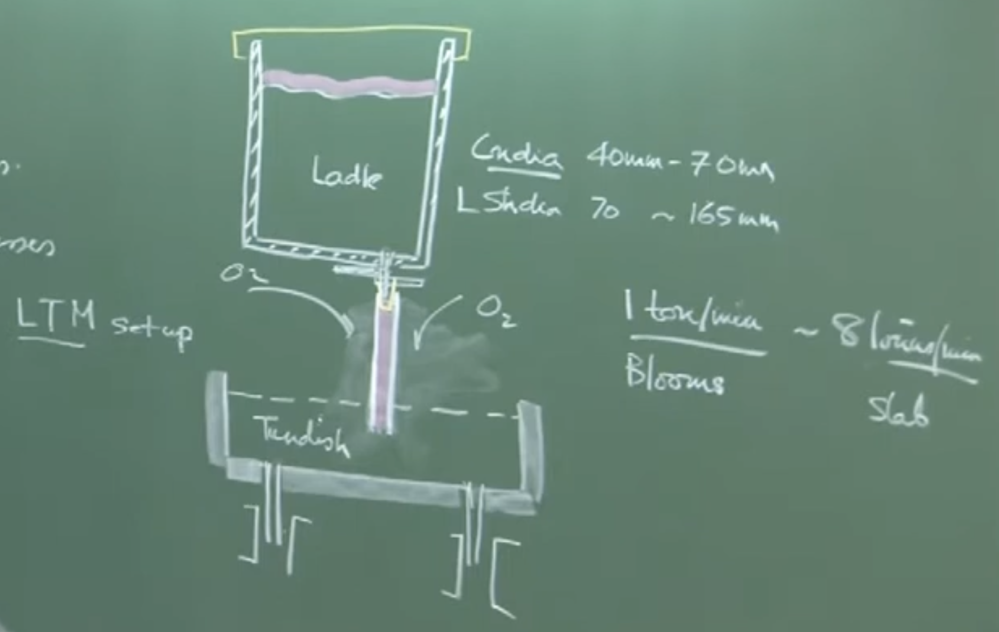
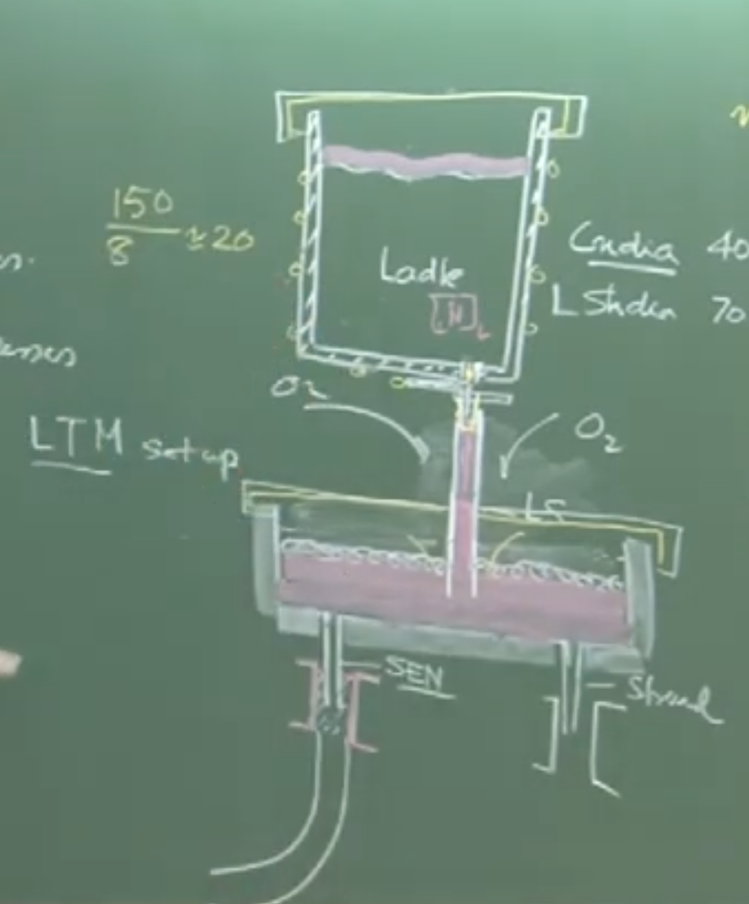
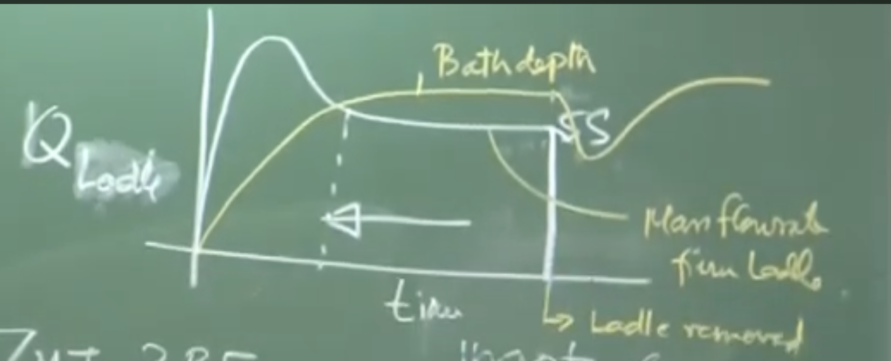
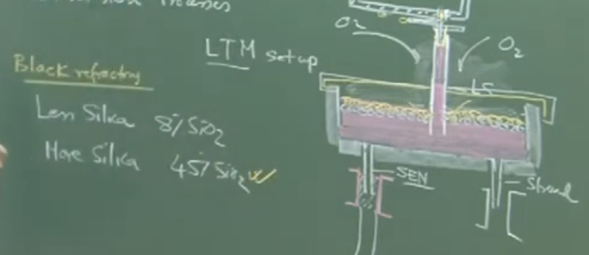
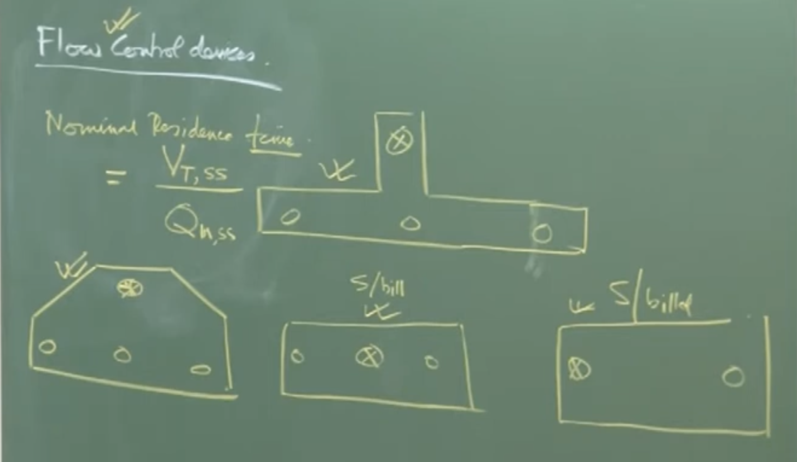
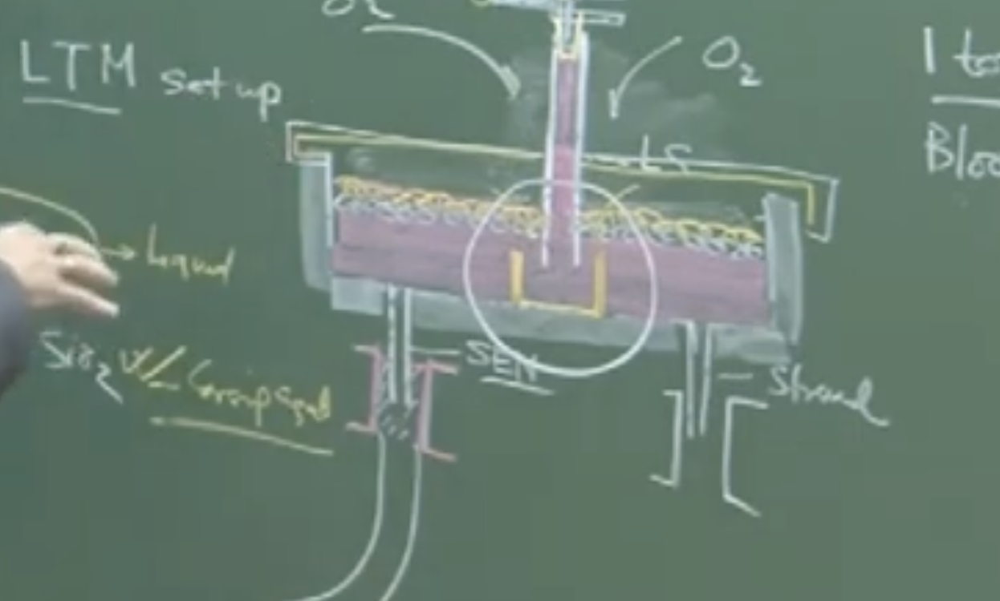

# **Lecture Notes: Transfer and Conversion Processes in Steelmaking**

## **1. Introduction and Context**

**Conceptual Explanation (Audio):** In primary and secondary steelmaking (ladle metallurgy), the focus is on decarburization and adjusting the composition and cleanliness of the steel to meet customer requirements. Once these metallurgical adjustments are completed, the molten steel must be converted into a solidified product. This involves two major logistical steps:

1. **Transfer Processes:** Moving molten steel from the ladle to the casting mold.
    
2. **Conversion Processes:** Converting liquid steel into solidified shapes (ingots, blooms, billets, or slabs).
    

---

## **2. Transfer Processes (Ladle $\rightarrow$ Tundish $\rightarrow$ Mold)**

### **A. System Architecture**

To maintain the quality and cleanliness achieved during ladle metallurgy, the transfer of steel must be strictly protected from the environment.

**Visual Extraction (Board Work Reconstruction):**



```
       [ LADLE ]   <-- Contains ~150 tons of clean, molten steel
          |
         ===       <-- Slide Gate (Controls mass flow rate)
          |        <-- Collector Nozzle (Diameter: 40 mm - 70 mm)
         [|]       <-- Ladle Shroud (Diameter: 70 mm - 165 mm)
  ________|________
 |  _ _ _ _ _ _ _  | <-- Tundish Cover (Prevents heat loss)
 | |             | |
 | |   TUNDISH   | | <-- Buffer vessel
 |_|_____________|_|
          ||
         [||]      <-- Submerged Entry Nozzle (SEN)
        |    |
        |MOLD|     <-- Water-cooled continuous casting mold
        |    |
        |    |     <-- Solidified product (Slab/Bloom/Billet)
```

### **B. The Importance of Shrouding**

- **Physical Interpretation (Audio):** Without a Ladle Shroud, liquid steel exits as a "free jet". A free jet entrains massive amounts of surrounding atmospheric air due to low-pressure regions created by the fast-moving fluid (Venturi effect).
    
- **Consequences of Open Pouring:**
    
    1. **Severe Reoxidation:** Dissolved aluminum ($[Al]$) in the "killed" steel reacts violently with ingested oxygen, forming non-metallic $Al_2O_3$ inclusions.
        
    2. **Heat Loss:** Extensive thermal radiation to the surroundings.
        
    3. **Nitrogen Pickup:** If the nitrogen level jumps by $2$ ppm, small air bubbles are present in the shroud. A jump of $20-30$ ppm indicates severe air aspiration (a "severely constrained jet" where the fluid separates from the shroud walls).
        

---

## **3. Thermodynamics of Transfer Processes**

The instructor performs two mass-energy balances on the board to model temperature drops during steel transfer.

### **A. Heat Loss Across the Ladle Shroud (Steady-State)**

To calculate the drop in temperature of the molten steel as it passes through the shroud pipe.

**Visual Extraction (Board Derivation):**

Plaintext

```
         ↓ m_dot, T₁ (Inlet)
      +-------+
      |       |  ---> q (Radiation Heat Flux)
  2R  |       |
      |   L   |  Area (A) = 2πRL
      |       |
      +-------+
         ↓ m_dot, T₂ (Outlet)
```

**Equations & Assumptions:**

1. **Energy Balance:**
    
    $\dot{m} C_p \Delta T = q \times A$
    
    _Where:_
    
    - $\dot{m}$ = Mass flow rate of steel
        
    - $C_p$ = Specific heat capacity of steel ($\approx 700 \text{ J/kg}\cdot\text{K}$)
        
    - $\Delta T$ = Temperature drop ($T_1 - T_2$)
        
    - $A$ = Outer surface area of the shroud ($2 \pi R_{ext} L$)
        
2. **Radiation Heat Flux ($q$):**
    
    $q \approx \sigma \varepsilon (\theta_s^4 - \theta_a^4)$
    
    _Where:_
    
    - $\sigma$ = Stefan-Boltzmann constant
        
    - $\varepsilon$ = Emissivity of the "black refractory" (magnesia-alumina-graphite)
        
    - $\theta_s$ = Surface temperature of the shroud ($\approx 1200 \text{ K}$)
        
    - $\theta_a$ = Ambient temperature
        

**Important Remarks / Instructor Notes:**

- Based on these equations, the temperature drop ($\Delta T$) across the shroud is extremely small, typically around **$2^\circ \text{C}$**.
    

### **B. Heat Loss in the Ladle (Holding Period)**

Molten steel sits in the ladle for extended periods (e.g., up to 60 minutes for a 60-ton ladle casting at 1 ton/min).

**Equations:**

$m_{steel} C_p \frac{dT}{dt} = \sum_{i} Q_i A_i$

_Where:_

- $\frac{dT}{dt}$ = Rate of temperature drop over time.
    
- $Q_i A_i$ represents the sum of heat losses across different boundaries (top surface, sidewalls, bottom).
    

**Typical Heat Fluxes ($Q_i$):**

- **Top Surface (thin slag, no lid):** $\approx 100 \text{ kW/m}^2$
    
- **Ladle Sidewalls:** $\approx 5 - 10 \text{ kW/m}^2$
    

**Physical Interpretation:**

- Because heat is lost continuously, the first batch of steel entering the tundish is much hotter than the last batch.
    
- This causes the latter steel to become more viscous, causing flow issues.
    
- **Solution:** Extensive use of physical covers on both the ladle and the tundish to minimize $\sum Q_i A_i$, conserving heat and drastically reducing electrical power consumption upstream in the Electric Arc Furnace (EAF).
    

---

## **4. Conversion Processes: Ingot vs. Continuous Casting**

|**Feature**|**Ingot Casting (Batch)**|**Continuous Casting (Sequence)**|
|---|---|---|
|**Throughput**|Low. Suitable for niche, special steels.|Extremely high. 1 to 8 tons/minute.|
|**Logistics**|Cumbersome. A 3.5 MTPA blast furnace would require maintaining $\sim 1,000$ ingot molds daily.|Highly efficient. One ladle follows another seamlessly ("Sequence Casting").|
|**Quality**|Generally lower defects, very clean.|High quality, provided reoxidation is controlled.|
|**Geometry**|Discrete ingots.|Continuous lengths cut periodically (Slabs, Blooms, Billets).|

---

## **5. Tundish Metallurgy**



The tundish acts as a buffer and distributor. A single tundish can feature anywhere from 1 strand (slab) up to 16 strands (billets).

### **A. Startup Dynamics and Reoxidation**

- **The Threat:** When a ladle is opened into an empty, pre-heated tundish, the tundish is initially filled with atmospheric air. The first steel acts like an open stream, causing severe reoxidation.
    
- **The Solution (Flushing):** The tundish must be flushed with Argon gas for 10-15 minutes prior to casting to displace oxygen.

	

- **Flow Rate Throttling:** Initially, the slide gate is opened rapidly to submerge the shroud tip as fast as possible, choking off air entrainment. Once submerged, the flow is throttled back to a steady state ($\dot{Q}_{in} = \dot{Q}_{out}$).
    

### **B. Tundish Powders (Slag Cover)**



To protect the exposed surface of the steel in the tundish, dual-purpose powders are applied:

1. **Top Layer (Insulator):** High silica ($\approx 45-50\% \text{ SiO}_2$). Acts as a thermal blanket.
    
2. **Bottom Layer (Active Slag):** Melts to form a liquid phase that absorbs rising non-metallic inclusions. 
    
    - **Crucial Chemical Constraint:** This layer must be **low in silica** ($\approx 8\% \text{ SiO}_2$).
        
    - _Reaction Risk:_ If high-silica slag contacts aluminum-killed steel, a forward reaction occurs:
        
        $3(SiO_2)_{slag} + 4[Al]_{steel} \rightleftharpoons 3[Si]_{steel} + 2(Al_2O_3)_{inclusion}$
        
    - This generates fresh alumina inclusions, ruining steel cleanliness.
        

_Sequence casting : if more demand then multiple ladle_

### **C. Flow Control Devices (Tundish Furniture)**

The Nominal Residence Time ($t_{res}$) of steel in the tundish is:

$t_{res} = \frac{V_{tundish,ss}}{\dot{Q}_{steady-state}}$ (Typically 8 to 16 minutes)


To maximize inclusion removal during this time, internal refractory "furniture" is used:


1. **Pouring Box / Turbo Stop:** Placed directly under the ladle shroud. It absorbs the kinetic energy of the incoming jet, prevents refractory damage, and heavily damps turbulence through surface friction (serrated edges). It also prevents "short-circuiting" (where steel immediately exits the tundish without spending time inside).
    
2. **Dams and Weirs:** Deflect the fluid flow upward toward the surface. This "surface-directed flow" drastically decreases the distance an inclusion must rise to be absorbed by the liquid slag.
    

### **D. Tracking Reoxidation**

**Exam/Field Check:** To determine if reoxidation has successfully been prevented, one can monitor the **soluble aluminum ($[Al]$)** content. If:

$[Al]_{ladle} \approx [Al]_{steady-state \ tundish} \approx [Al]_{final \ product}$

Then no significant reoxidation has occurred. (Note: The first slab/bloom is always downgraded due to startup turbulence and is never sold as a prime product).


# Audio v2: 

# **Transfer and Conversion Processes in Steelmaking**

## **1. Introduction**
After primary and secondary (ladle metallurgy) steelmaking, the liquid steel's composition and cleanliness meet customer requirements. The next steps involve:
* **Transfer Processes:** Moving molten steel from the ladle to the casting mold.
* **Conversion Processes:** Converting liquid steel into a solidified product (because liquid steel is never supplied directly to a customer).

## **2. The Transfer Process & Shrouding**
Molten steel is transferred from the ladle to the **tundish** (a buffer vessel that distributes metal into multiple molds downstream).

### **Equipment Dimensions & Specifications**
* **Slide Gate Plate:** Controls the flow rate of the molten metal from the ladle.
* **Collector Nozzle:** Diameter ranges from **40 mm** to **70 mm**.
* **Ladle Shroud:** Mounted onto the collector nozzle. Diameter ranges from **70 mm** to **165 mm**.
* **Submerged Entry Nozzle (SEN):** Protects the transfer of steel from the tundish into the continuous casting mold.

### **The Danger of Open Jets**
* Without a ladle shroud, the metal flows as a **free jet** (an open stream).
* Free jets are susceptible to massive temperature loss and **reoxidation** due to the entrainment of atmospheric oxygen.
* The molten steel is "killed" (contains dissolved aluminum), which eagerly reacts with any ingested oxygen to form harmful inclusions ($Al_2O_3$).

### **Air Ingression & Joint Dynamics**
* The connection between the collector nozzle and the ladle shroud is a **cup and cone mechanical joint**.
* Because fluid flows at high rates (**1 to 8 tons per minute**), low-pressure regions are created inside the shroud.
* If the joint is not perfectly sealed, atmospheric air is sucked in (a phenomenon termed **air ingression**).
* **Measuring Air Ingression (Nitrogen Pickup):**
    * **Low Aspiration:** Air bubbles are distributed in the fluid. Nitrogen pickup from ladle to tundish is roughly **2 ppm**.
    * **Severe Aspiration:** The metal flow becomes a **severely constrained jet** (separated from the shroud walls), leaving empty space filled with entrained gas. Nitrogen pickup spikes to **20 to 30 ppm**.

## **3. Heat Loss & Thermodynamics**

### **Heat Loss in the Ladle Shroud**
* The steady-state energy balance for the shroud is:
    $\dot{m} C_p \Delta T = q \times A$
    *(Where $\dot{m}$ is mass flow rate, $C_p$ is specific heat, $\Delta T$ is temperature drop, $q$ is heat flux, and $A$ is surface area ($2 \pi r l$)).*
* Shrouds are typically made of magnesia-alumina and contain graphite. They appear black and are categorized in the industry as **black refractories**.
* The shroud surface temperature reaches roughly **1200 K**.
* Despite radiation, the actual temperature drop of the fast-moving steel inside the shroud is very small, approximately **2°C**.

### **Heat Loss During Ladle Holding**
* The governing equation for holding heat loss is:
    $m C_p \frac{dT}{dt} = \sum (q \times A)$
* A ladle holding **60 to 150 tons** of steel might sit for **20 to 60 minutes** depending on the casting rate.
* **Heat Flux Values:**
    * Exposed top surface (thin slag): ~**100 kW/m²**.
    * Ladle side walls: **5 to 10 kW/m²**.
* **Consequence:** The first metal poured is hotter than the last metal. The cooler, last metal becomes highly viscous and resistant to flow.
* **Solution:** Extensive use of physical covers on both ladles and tundishes minimizes heat loss, which conserves energy and directly reduces the electrical power required in the upstream Electric Arc Furnace (EAF).

## **4. Conversion Processes: Ingot vs. Continuous Casting**

### **Ingot Casting (Batch Process)**
* Used today exclusively for **niche products** requiring highly specific qualities (fewer chances of defects).
* Technologically and logistically non-viable for massive modern production.
* *Example:* A 7 million ton plant (producing **10,000 tons/day**) using 10-ton molds would require maintaining **1,000 ingot molds daily**, which takes up too much space and effort.

### **Continuous Casting (Sequence Casting)**
* A rapid, steady-state process. Multiple ladles are cast one after the other in a "single hit" or **sequence casting** operation (e.g., up to 20–25 ladles over two days).
* Throughput is high: casting at **5 tons/min** yields **300 tons/hour** or roughly **7,000 tons/day**.
* **Product Types:**
    * **Flat Products:** Slabs (large cross-section, requires fewer strands).
    * **Long Products:** Blooms and Billets (small cross-section, requires many strands to maintain mass throughput). A tundish can have anywhere from 1 strand up to **16 strands** (typically seen in China/India for billets).

## **5. Tundish Metallurgy**

The tundish is not just a buffer; it is the final reactor where steel cleanliness can be improved.

### **Startup Dynamics**
* When the ladle is first opened, the pre-heated tundish is full of atmospheric air.
* The initial flow causes massive air entrainment until the ladle shroud tip is fully submerged.
* **Flushing:** To prevent this initial reoxidation, the empty tundish is flushed with **Argon gas** for **10 to 15 minutes** before casting begins to drive out atmospheric oxygen.
* Because of initial turbulence, the first slab or bloom produced is never sold as a prime product; it is always downgraded.
* To stabilize the system rapidly, the slide gate is opened wide initially (high flow rate) to submerge the shroud tip quickly, then throttled back to a steady-state flow rate.

### **Tundish Powders and Slag**
Two types of powders are added to the surface of the molten steel in the tundish:
1.  **Top Layer (Insulator):** Contains **45% to 50% silica ($SiO_2$)**. This acts as a thermal blanket (tundish covering compound).
2.  **Bottom Layer (Inclusion-Absorbing Slag):** Melts into a liquid and sits directly in contact with the steel. It must contain **low silica (~8% $SiO_2$)**. (A popular commercial name is *Spartak*).
    * **Critical Danger:** If the bottom slag contains too much silica, a forward reaction occurs with the aluminum-killed steel:
        $3(SiO_2)_{slag} + 4[Al]_{steel} \rightarrow 3[Si]_{steel} + 2(Al_2O_3)_{inclusion}$
    * This reaction generates fresh alumina inclusions, heavily contaminating the steel.

### **Fluid Flow & Flow Control Devices (Tundish Furniture)**
* **Nominal Residence Time:** The theoretical time fluid spends in the tundish. Calculated as:
    $t_{res} = \frac{V_{steady\_state}}{Q_{in}}$
    * Slab tundish (e.g., 37-ton capacity at 3 tons/min) = **~12 minutes**.
    * Bloom tundish = **8 to 16 minutes**.
* **Bare Tundish Problem:** Ppouring directly into an empty tundish causes **short-circuiting** (fluid hits the bottom and exits immediately without spending time inside).
* **Flow Control Devices (Refractory Artifacts):**
    * **Pouring Box / Turbo Stop:** Placed directly under the shroud. It protects the tundish bottom from erosion and dampens high turbulence. Its surfaces are **serrated** (like a golf ball) to increase solid-liquid frictional forces, significantly slowing down the flow.
    * **Dams and Weirs:** Deflect fluid upward to create a **surface-directed flow**. This reduces the distance inclusions have to rise, helping them float into the absorbing slag faster.

### **Evaluating Cleanliness**
To check if reoxidation was successfully avoided, steelmakers monitor the **soluble (dissolved) aluminum** content. 
* If $[Al]_{ladle} \approx [Al]_{tundish} \approx [Al]_{final\_product}$ (after the first downgraded slab), it indicates zero reoxidation occurred during the transfer.