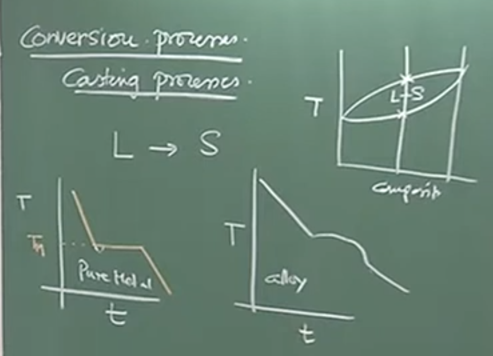
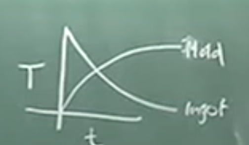
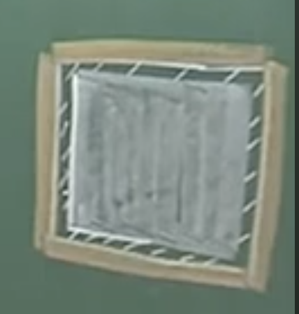
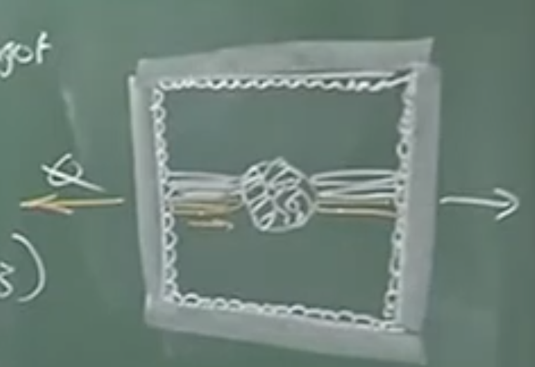
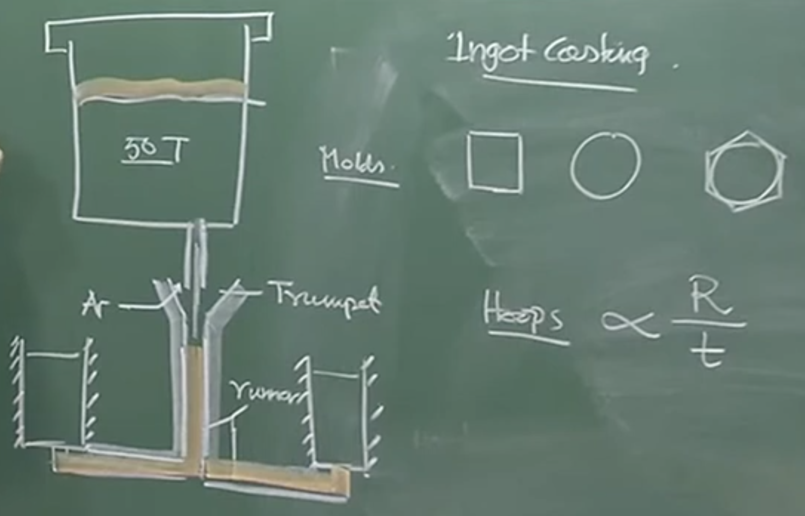
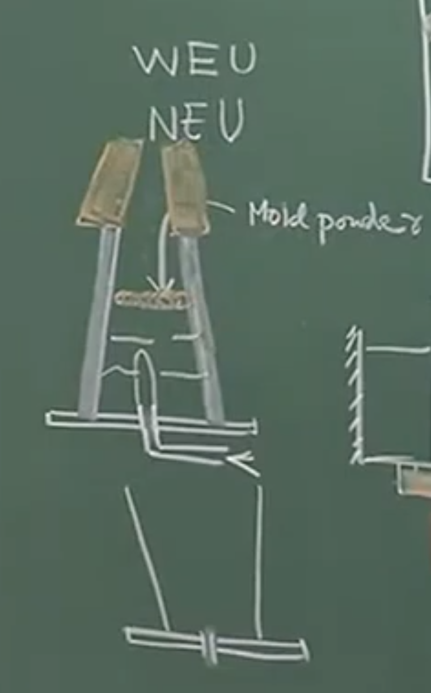

# Lecture Notes: Tundish Processing and Steel Casting Processes

## 1. Processing of Molten Steel in the Tundish (Continued)

### Conceptual Explanation

The tundish is often loosely visualized as a simple buffer or distributor vessel designed to route molten steel from the ladle into continuous casting molds. However, it cannot be regarded as an inert reactor. It is a **reacting flow system** where unwarranted chemical interactions take place, significantly influencing the final steel quality.

### Physical Interpretation: Reoxidation Mechanisms

Even if no chemical additions are made in the tundish, two simultaneous inclusion-related phenomena occur: the floatation of existing inclusions and the generation of new inclusions via **reoxidation**.

The instructor defines two major pathways for reoxidation in the tundish:

**A. Atmospheric Reoxidation (Air Ingression)**

$$O_2 \rightarrow 2[O]$$

$$3[O] + 2[Al] \rightarrow \langle Al_2O_3 \rangle$$

_same rxn can be form Mg and Ca as are most reactive_

During initial filling or via air sucked into the shroud/collector nozzle joint, oxygen dissolves into the steel. This disturbs the aluminum-oxygen equilibrium that was previously stabilized at the ladle lifting station after Vacuum Degassing (VD), causing soluble aluminum to precipitate as insoluble alumina inclusions.

**B. Slag-Metal Reoxidation**

$$4[Al] + 3(SiO_2) \rightarrow 2\langle Al_2O_3 \rangle + 3[Si]$$

Dissolved aluminum ($[Al]$) reacts with silica ($(SiO_2)$) present in the tundish powder/slag.

_Note: While written for aluminum, identical interactions can occur with dissolved calcium and magnesium, forming complex double-oxide inclusions._

### Board Work: Inclusion Mass Balance

To evaluate tundish performance, an inclusion balance between the input (Ladle/VD) and the output (Bloom/Billet) is performed. In aluminum-killed steels, "inclusions" are synonymous with **insoluble aluminum ($Al_{\text{insol}}$)**.

The baseline mass balance is:

$$\text{Inclusions in bloom} = \text{Original inclusions (VD)} + \text{Inclusions generated} - \text{Inclusions floated out}$$

Translating this into measurable aluminum fractions:

- $\text{Original inclusions} = Al_{\text{insol, VD}}$
    
- $\text{Inclusions in bloom} = Al_{\text{insol, bloom}}$
    
- $\text{Inclusions generated} = \Delta Al_{\text{sol}}$ (The drop in soluble aluminum between inlet and outlet, as dissolved Al turns into $Al_2O_3$).
    

Rearranging to solve for the inclusions floated out in the tundish:

$$\text{Inclusions floated} = \Delta Al_{\text{sol}} + (Al_{\text{insol, VD}} - Al_{\text{insol, bloom}})$$

Let $\Delta Al_{\text{insol}} = Al_{\text{insol, VD}} - Al_{\text{insol, bloom}}$. The formula simplifies to:

$$\text{Inclusions floated} = \Delta Al_{\text{sol}} + \Delta Al_{\text{insol}}$$

To determine the **fraction** of inclusions successfully removed by the tundish:

$$\text{Fraction Floated} = \frac{\Delta Al_{\text{sol}} + \Delta Al_{\text{insol}}}{\Delta Al_{\text{sol}} + Al_{\text{insol, VD}}}$$

### Important Remarks / Instructor Notes

- **The Denominator:** The denominator represents the _total_ inclusions handled by the system (the sum of the original inclusions from the VD station and the new inclusions generated due to reoxidation).
    
- **Plant Logistics:** Simulation of these phenomena (nucleation, growth, collision) is extremely difficult. Using the analytical fraction above allows operators to perform on-site evaluations of tundish geometry, liquid depth, flow modifiers, and argon shielding efficiency. A low fractional removal means reoxidation is dominating the system.
    

---

## 2. Transformation of Liquid to Solid Steel

### Conceptual Explanation

The conversion process translates refined liquid steel into a solid artifact. However, casting is _not_ the end of steel processing; thermo-mechanical processing (solid-state processing) follows casting to control grain size, texture, and final mechanical properties.

### Board Work: Solidification Cooling Curves

**Pure Metal Cooling Curve**



```
 Temperature (T)
   |
   | \
   |  \
Tm |- -\_ _ _ _ _ _ _ _ Isothermal Plateau (Latent Heat)
   |    \      
   |     \ 
   |      \
   |_____________________ Time (t)
```

- **Physical Interpretation:** A pure metal solidifies at a singular characteristic temperature ($T_m$, e.g., 1539°C for Fe). The curve shows a slight downward dip (undercooling) required to provide the thermodynamic driving force to stabilize critical nuclei, after which latent heat raises the temperature back to $T_m$ until solidification is complete.
    

**Alloy Cooling Curve (Steel)**

Plaintext

```
 Temperature (T)
   |
   | \
T_L|- -\ _ _ _ Liquidus
   |    \
   |     \ (Liquid + Solid Region)
T_S|- - - \_ _ Solidus
   |        \
   |         \
   |_____________________ Time (t)
```

- **Physical Interpretation:** Steel is an alloy. Alloys melt and solidify over a _range_ of temperatures bounded by the Liquidus ($T_L$) and Solidus ($T_S$).
    
- In the Fe-C system, as Carbon content increases, the liquidus line slopes downward (depression of freezing point). Lighter, high-carbon metal (e.g., hot metal) melts at lower temperatures compared to pure iron scrap.
    

### Important Remarks / Instructor Notes

- **Equivalent Carbon:** For complex alloy steels containing elements like Si, Mn, and Ti, an empirically derived "Equivalent Carbon" coefficient is calculated to determine the effective melting/liquidus temperature of that specific alloy on the standard phase diagram.
    

---

## 3. Casting Modalities and Solidification Dynamics

### Mold Types and Heat Extraction

- **Continuous Casting:** Utilizes **water-cooled copper molds**. Due to a very short dwell time (less than a minute), extremely rapid thermal extraction is required. Only a solid shell forms in the mold, enclosing a liquid core that solidifies later.
    
- **Ingot Casting:** Utilizes massive **cast iron molds** operating at room temperature. The mold mass acts as a heat sink. The process is slow; an ingot may take 8-10 hours to completely solidify.
    


### Physical Interpretation: The Air Gap and Mold Powder

During solidification, metal undergoes volumetric shrinkage. This causes the cooling casting to detach from the expanding mold wall, creating a gap.

- **The Problem:** The gap fills with air, which is a very poor thermal conductor and drastically impedes heat transfer.

	

- **The Solution:** Low-melting-point oxide **mold powders** are used. The powder melts, flows into the gap, drives out the air, and substantially lowers the thermal resistance between the shell and the mold, expediting solidification.
    

---

## 4. Ingot Macrostructure and Defects

### Board Work: Ingot Cross-Section



```
  ___________________________  <- Mold Wall
 | ::: ::: ::: ::: ::: ::: :::| <- Chill Zone (Equiaxed, Fine)
 | :::|||||||||||||||||||||:::| 
 | :::||||||          |||||:::| <- Columnar Zone (Directional)
 | :::|||||   ****** ||||:::| 
 | :::||||   ******** |||:::| <- Equiaxed Zone (Coarse, Random)
 | :::|||||   ****** ||||:::| 
 | :::||||||          |||||:::| 
 | :::|||||||||||||||||||||:::|
 |____________________________|
```

### Conceptual Explanation

When poured into a metallic mold, the ingot develops three distinct structural zones:

1. **Chill Zone:** Forms instantly on the cold mold wall. The extreme supercooling produces an enormous number of nucleation sites, creating a thin layer of fine, randomly oriented, spherical grains.
    
2. **Columnar Zone:** Grains grow inward, strictly parallel to the direction of heat extraction (perpendicular to the mold wall). They exhibit strongly directional properties.
    
3. **Equiaxed Zone:** During columnar growth, solute elements are rejected into the remaining liquid core. This alters the local composition, lowering the freezing temperature of the liquid ahead of the advancing solid interface—a phenomenon known as **Constitutional Supercooling**. This triggers fresh nucleation in the melt, producing large, equiaxed grains in the core.
    

### Defects & Mitigation

- **Coring / Micro-segregation:** The first solid to freeze is highly pure, while the last liquid to freeze in the center is highly enriched in solutes/impurities. This composition gradient (coring) is resolved by high-temperature homogenization (soaking), which accelerates solid-state diffusion.
    
- **Cracking in Round Molds:** At ~1500°C, the strength of the thin, newly-formed steel shell is extremely low. If round ingots are cast, large hoop stresses (proportional to radius, inversely proportional to shell thickness) develop, tearing the shell. Hence, polygonal (e.g., 12-sided dodecahedron) molds are preferred over perfectly round ones for large ingots.
    

---

## 5. Ingot Teeming Operations

### Board Work: Bottom Teeming Setup

Plaintext

```
           [ Ladle ] (Contains Liquid Steel + Slag Cover)
              |
              V
        [ Trumpet ]  <-- Ar gas injected to prevent oxidation
              |
    =====================  (Runner)
    |                   |
 [Mold 1]            [Mold 2]  <-- Wide-end-up or Narrow-end-up
   / \                 / \
  Spigot              Spigot
```

### Physical Interpretation

- **Teeming Mechanics:** Steel is poured down a refractory-lined "trumpet," travels horizontally through a runner, and flows vertically upwards into multiple ingot molds via bottom "spigots." This creates a fountain-like fill that minimizes splash and oxidation.
    
- **The Hot Top:** A refractory-lined, highly insulating hatch placed atop the ingot mold. Because it prevents heat loss, the metal inside the hot top remains liquid far longer than the rest of the ingot. As the ingot solidifies and shrinks, this reservoir gravity-feeds liquid steel downward to fill **shrinkage cavities (pipe)**, pulling inclusions up into the discardable top section.
  
  
# Audio v2: 
# Comprehensive Lecture Notes: Tundish Processing & Casting Operations

## 1. Tundish Processing: Beyond a Buffer Vessel

While often loosely considered a simple buffer vessel to distribute molten metal to molds, the tundish is actually a **reacting flow system**. It operates under **steady-state conditions** when the net inflow rate matches the net outflow rate.

Considerable unwarranted chemical reactions occur here, which heavily influence final steel quality.

### Reoxidation Mechanisms in the Tundish

Reoxidation is the major chemical reaction in the tundish. There are two primary routes:

1. **Atmospheric Oxygen Dissolution (Air Ingression):** * Occurs during the initial filling of an unflushed tundish or through the shroud/collector nozzle joint.
    
    - Dissolved oxygen disturbs the **Aluminum-Oxygen equilibrium** established earlier at the Vacuum Degassing (VD) ladle lifting station.
        
    - This generates insoluble **alumina ($Al_2O_3$) inclusions**.
        
    - _Note:_ The same reaction can occur with dissolved **magnesium** or **calcium**, forming complex double-oxide inclusions.
        
2. **Slag-Metal Interaction:** * Dissolved aluminum reacts with **silica ($SiO_2$)** present in the tundish powder/slag.
    
    - Reaction: Dissolved $Al$ + $SiO_2$ $\rightarrow$ $Al_2O_3$ + Dissolved $Si$.
        

### Inclusion Mass Balance and Flotation

Two simultaneous phenomena occur in the tundish: **generation** of new inclusions (via reoxidation) and **flotation** (removal) of existing/new inclusions. Because exact physics (nucleation, growth, collision) are complex, plants use mathematical mass balances to evaluate tundish performance.

- **Insoluble Aluminum:** In aluminum-killed steel, "inclusions" are synonymous with **insoluble aluminum ($Al_{insol}$)**.
    
- **Soluble Aluminum:** Inclusions generated in the tundish are measured by the drop in **soluble aluminum ($\Delta Al_{sol}$)** between the tundish inlet and outlet. For every 2 moles of soluble Al that vanish, 1 mole of $Al_2O_3$ is generated.
    

**The Mass Balance Equation:**

> Inclusions in Bloom = Original Inclusions (at VD) + Inclusions Generated ($\Delta Al_{sol}$) - Inclusions Floated Out

By transposing, you can calculate the exact amount of inclusions floated out:

> **Inclusions Floated** = $\Delta Al_{sol} + (Al_{insol, VD} - Al_{insol, Bloom})$

**Evaluating Tundish Performance:**

To find the fraction of inclusions successfully removed, divide the inclusions floated by the **total inclusions** (Original VD Inclusions + Generated Inclusions).

- If this fraction is low, it means reoxidation is dominating (e.g., poor shroud sealing, heavy air ingression) or the tundish flow modifiers/furniture are inadequate.
    
- **Argon Flushing:** Used at the shroud-collector nozzle joint (typically a mix of 80% Argon, 20% Air) to provide a shielding scar and minimize oxygen dissolution.
    

---

## 2. Solidification and Casting Fundamentals

Transfer operations between the ladle and tundish (teeming) warrant minimal slag-metal interactions and minimum air ingression. Casting is the process of converting liquid steel to a solid, but it is **not the end of steelmaking**; thermo-mechanical treatments later define the final microstructure and texture.

### Pure Metals vs. Alloys

- **Pure Metals (e.g., pure iron at 1539°C):** Solidify at a single characteristic melting temperature. The cooling curve dips slightly below the melting point to provide the impetus for critical nuclei to become stable (undercooling), then shoots back up and maintains an isothermal plateau.
    
- **Alloys (e.g., Carbon Steel):** Solidify over a **range of temperatures** bounded by a **Liquidus** and **Solidus** line, where liquid and solid phases coexist.
    
    - As Carbon percentage increases, the liquidus slopes downward (depression in melting point).
        
    - Higher carbon steel is less dense (lighter) and melts at lower temperatures. (e.g., Pure iron scrap sinks in a BOF, while carbon-rich hot metal floats).
        

### Equivalent Carbon

For alloy steels containing elements like **Silicon (Si), Manganese (Mn), and Titanium (Ti)**, an empirically determined **Equivalent Carbon** coefficient is calculated. This value is used on the phase diagram to predict the exact melting temperature of the specific alloy.

---

## 3. Continuous Casting vs. Ingot Casting

### Continuous Casting

- **Mold Material:** Water-cooled **Copper** molds.
    
- **Characteristics:** High thermal conductivity is required because the dwell/residence time is extremely short (less than a minute).
    
- **Output:** Creates a partially solidified casting with a strong solid shell and a liquid core. It has a very rapid rate of heat transfer (e.g., 100 tons can be cast in 10 hours).
    

### Ingot Casting

- **Mold Material:** Massive **Cast Iron** molds used at room temperature.
    
- **Characteristics:** The mold mass acts as a heat sink. The cooling process is slow; a 10-ton ingot takes about 5 hours to strip and 8–10 hours to completely solidify.
    
- **Plant Logistics Example:** A 7-million-ton plant producing 10,000 tons of hot metal daily requires about 1,000 molds (10 tons each) cycling every 24 hours to cool back to room temp.
    

### The Air Gap and Mold Powder

As liquid metal solidifies, it undergoes **shrinkage** and detaches from the mold wall, creating a gap. Simultaneously, the mold absorbs heat and expands.

- This gap fills with **air**, which is a poor thermal conductor and creates huge resistance to heat flow.
    
- **Solution:** A low-melting-point **Mold Powder** is added to the top. It melts, creeps down into the gap, drives out the air, and substantially increases the rate of heat conduction between the shell and the mold wall.
    

---

## 4. Ingot Macrostructure and Defects

When molten metal hits a metallic mold, three distinct grain structures form:

1. **Chilled Zone:** Forms immediately against the cold mold wall. Characterized by massive supercooling, providing enormous nucleation sites. Results in tiny, spherical, equiaxed crystals with no directional properties.
    
2. **Columnar Zone:** Grows inward from the chilled layer. Grains are elongated and grow in the reverse direction of heat extraction. They possess strong directional properties.
    
3. **Equiaxed Zone (Core):** As columnar grains grow, they reject solute elements into the remaining liquid core. This solute-rich liquid undergoes **constitutional supercooling**, creating multiple new nucleation sites and forming coarse, equiaxed grains in the center.
    

### Coring Defect (Micro-segregation)

According to equilibrium diagrams, the first crystal to solidify is pure, while the last liquid to solidify (the core) becomes highly impure. This extreme concentration gradient is called **coring**.

- **Remedy:** The ingot is heated up (homogenization/soaking). Higher temperatures increase the diffusion coefficient, allowing diffusion fluxes to smooth out the concentration gradients.
    

---

## 5. Ingot Teeming Operations

Ingot molds can be square, hexagonal, circular, or dodecahedron (12-sided).


### The Problem with Round Molds

Large round ingots are rarely cast. During the initial stages of solidification, the steel shell is very thin and weak (at ~1500°C). **Hoop stress** is directly proportional to the radius and inversely proportional to the thickness. This massive stress easily cracks round ingots. Instead, 12-sided (dodecahedron) molds are used to circumvent this stress, and are later worked into circular shapes.

### Bottom Pouring Setup

- Molten metal flows from the ladle down a vertical refractory-lined **Trumpet** (often flushed with Argon).
    
- It travels horizontally through a **Runner**.
    
- It enters the bottom of the ingot mold (which can be **wide-end-up** or **narrow-end-up**) through a **Spigot**, creating a fountain effect to gently fill the mold.
    
- _Example:_ A 50-ton ladle can simultaneously fill two 25-ton ingot molds in about 20-30 minutes. The refractory must be high quality to withstand severe hydrodynamic shear stresses in the runner.
    

### The Hot Top


A detachable, refractory-lined insulating section placed at the top of the ingot mold.

- **Purpose:** Because it is an insulator (not a metal heat-sink), the heat flux is negligibly small, keeping the steel inside it molten for a prolonged period.
    
- As the main ingot solidifies and shrinks, this liquid reservoir feeds downward to fill **shrinkage cavities (pipe defects)**. It also acts as a trap where floating inclusions and junk accumulate, allowing the defective top to simply be cut off and discarded later.